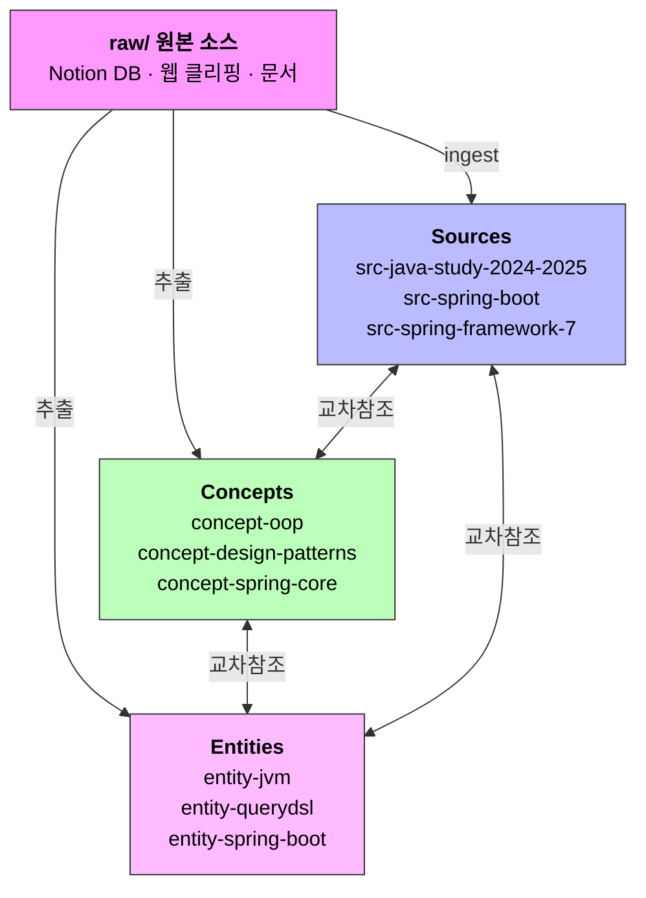
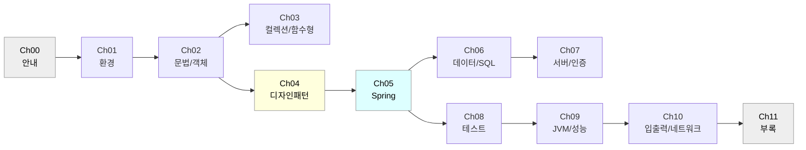

# Won's Wiki

LLM이 유지·관리하는 개인 지식 위키(Second Brain)입니다.

## 구축 과정

이 위키는 Claude Code + Notion MCP를 활용하여 다음 과정으로 만들어졌습니다.

### 1. 위키 스키마 설계
- `CLAUDE.md`에 위키 운영 규칙 정의 (페이지 유형, 워크플로, 교차 참조 규칙)
- `raw/` (불변 원본), `wiki/` (LLM 관리 페이지) 구조 설계
- Obsidian 호환 `[[파일명]]` 링크 체계 채택

### 2. Notion 데이터베이스 연결 및 수집
- Notion MCP 서버 연결 → `[2024-2025] Java 스터디 자료` DB 접근
- 91개 페이지를 챕터별(Ch00~Ch11)로 fetch → 마크다운 변환
- 병렬 에이전트 활용으로 대량 API 호출 처리
- 최종 91/91 (100%) 수집 완료

### 3. Wiki Ingest
- 소스 요약 페이지 생성 (`src-java-study-2024-2025`)
- 핵심 개념 추출 → concept/entity 페이지 생성 (OOP, 디자인패턴, Spring Core, JVM, Querydsl)
- `index.md`, `log.md` 자동 업데이트

### 4. Lint 및 정비
- 깨진 링크 수정, 고아 파일 정리, 양방향 교차참조 보강
- Spring Boot ↔ Java 스터디 연결 등 누락된 링크 추가

## 디렉터리 구조

```
my-wiki/
├── README.md          # 이 파일
├── CLAUDE.md          # 위키 스키마·규칙
├── raw/               # 원본 소스 (불변, 주제별 디렉터리)
│   ├── java-study/           # Notion Java 스터디 (12챕터, 91페이지)
│   ├── spring/               # Spring Boot·Framework·Guide·Reference (7개)
│   ├── harness-engineering/  # 하네스 엔지니어링 키트 + PDF/DOCX + 변환본
│   ├── kakaopay-ddd/         # DDD 구축기
│   ├── llm-wiki-pattern/     # LLM 위키 패턴
│   ├── my-links/             # Notion 북마크 DB
│   ├── claude-design/        # Claude Design 영상 자막
│   └── assets/               # 이미지·첨부
├── wiki/              # LLM이 생성·유지하는 위키 페이지
│   ├── index.md       # 위키 전체 목록
│   ├── log.md         # 작업 기록
│   ├── src-*.md       # 소스 요약
│   ├── concept-*.md   # 개념 정리
│   ├── entity-*.md    # 엔티티
│   └── guide-*.md     # 가이드
└── .obsidian/         # Obsidian 설정
```

> raw 구조 규칙: 모든 원본은 `raw/<주제>/` 디렉터리에 둔다. PDF/DOCX는 같은 디렉터리에 `.md` 변환본을 동봉한다. 자세한 규칙은 `CLAUDE.md` 참조.

## 현재 규모

| 구분 | 수량 |
|------|------|
| raw/ 원본 소스 | 16개 파일 |
| wiki/ 페이지 | 29개 |
| Java 스터디 페이지 | 91/91 (100%) |
| 교차 참조 링크 | 위키 전체 양방향 연결 |

## 주요 위키 페이지

### Sources
- `src-java-study-2024-2025` — Java 스터디 자료 전체 요약 (12챕터)
- `src-spring-boot` — Spring Boot 공식 소개
- `src-spring-framework-7` — Spring Framework 7.0 릴리스 노트
- `src-llm-wiki-pattern` — LLM 위키 구축 패턴
- `src-claude-design-review` — Claude Design 리뷰

### Core Concepts
- `concept-oop` — 객체지향 4원칙 (캡슐화, 상속, 다형성, 추상화)
- `concept-design-patterns` — 디자인 패턴 8종 비교표
- `concept-spring-core` — IoC, DI, Bean, MVC, AOP

### Key Entities
- `entity-jvm` — JVM 구조, 메모리 관리, GC 튜닝
- `entity-querydsl` — 동적 쿼리 조합 패턴
- `entity-spring-boot` / `entity-spring-framework`

## 사용법

### Obsidian으로 열기
이 저장소를 클론한 뒤 Obsidian에서 Vault로 열면 그래프 뷰, 역방향 링크, 검색이 바로 동작합니다.

### LLM과 함께 사용
`CLAUDE.md`의 스키마를 따라 새 소스를 `raw/`에 추가하면, LLM이 ingest → wiki 페이지 생성 → index/log 업데이트를 수행합니다.

### 사이트로 빌드 & 배포 (MkDocs Material + Firebase Hosting)

위키를 외부 공개용 정적 사이트로 빌드합니다. 자세한 셋업은 [`guide-deploy-mkdocs-firebase`](wiki/guide-deploy-mkdocs-firebase.md) 참고.

```bash
# 1) 빌드 (wiki/ → docs/ 복사 + [[wikilink]] 변환 + mkdocs build)
bash scripts/build-site.sh
# → site/ 디렉터리 생성

# 2) 로컬 프리뷰
.venv/bin/mkdocs serve
# → http://127.0.0.1:8000

# 3) Firebase 배포
firebase deploy --only hosting
# → https://<프로젝트>.web.app
```

**중요**: `mkdocs serve`는 `docs/`만 watch합니다. `wiki/`를 수정한 뒤에는 **반드시 `bash scripts/build-site.sh`를 다시 돌려야** 변경이 반영됩니다.

선택적 자동화 — `wiki/` 변경 시 자동 빌드:

```bash
# 별도 터미널에서 (fswatch 설치: brew install fswatch)
fswatch -o wiki/ | xargs -n1 -I{} bash scripts/build-site.sh
```

## 빠른 시작

```bash
# 1. 클론
git clone git@github.com:goodjwon/my-wiki.git
cd my-wiki

# 2. Obsidian으로 열기
# Obsidian > Open folder as vault > my-wiki 선택

# 3. Claude Code로 위키 운영
claude   # Claude Code CLI 실행

# 새 소스 추가 (raw/<주제>/ 에 파일 넣고)
> raw/<주제>/새파일.md 를 ingest 해줘

# 위키 질의
> Spring Security와 JWT의 관계를 설명해줘

# 정비
> lint 해줘

# 커밋 & 푸시
> commit push 해줘
```

## 지식 구조



**구조 설명**:
- **`raw/`** (원본): Notion DB·웹 클리핑·문서가 들어오는 입구. 불변.
- **세 갈래 변환**: raw에서 LLM이 ① **Sources**(원본 1개 요약), ② **Concepts**(개념·원칙), ③ **Entities**(인물·도구)를 추출.
- **교차참조 그물망**: Sources ↔ Concepts ↔ Entities가 양방향으로 엮여 하나의 지식 그래프를 형성. 한 페이지를 읽다가 관련 페이지로 자유롭게 이동 가능.

### 페이지 유형별 역할

| 유형 | 역할 | 예시 |
|------|------|------|
| `source` | 원본 1개의 요약 | `src-java-study-2024-2025` |
| `entity` | 인물·도구·기술 | `entity-jvm`, `entity-querydsl` |
| `concept` | 개념·원칙·패턴 | `concept-oop`, `concept-design-patterns` |
| `synthesis` | 여러 소스 종합 분석 | _(예정)_ |
| `comparison` | 비교·대조 | _(예정)_ |

### Java 스터디 챕터 맵



## 기술 스택

- **위키 엔진**: Claude Code (Opus 4.6) + CLAUDE.md 스키마
- **데이터 소스**: Notion MCP (API 연동)
- **뷰어**: Obsidian (로컬 마크다운)
- **버전 관리**: Git + GitHub
