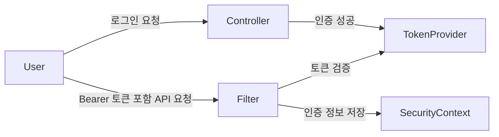

# 7. 서버와인증
원본: Notion 데이터베이스 "[2024-2025]java 스터디 자료"

---

## 7.0 Tomcat 실행과 설정

#### 개요

이 문서는 Java 웹 애플리케이션이 어떤 서버 위에서 실행되는지 이해하기 위한 Tomcat 입문 가이드입니다. Spring Boot를 주로 쓰는 요즘에도 Tomcat을 따로 배우는 이유는 단순합니다. **내장 톰캣이 대신해 주는 일이 무엇인지 알아야 서버 실행, 포트, 배포, 로그, JVM 옵션을 한 번에 이해할 수 있기 때문**입니다.

이 장은 인증 문서보다 앞에 두는 것이 자연스럽습니다. 인증도 결국 HTTP 요청이 Tomcat 같은 서블릿 컨테이너를 통과해 필터 체인과 애플리케이션 코드로 들어오는 흐름 위에서 동작하기 때문입니다.

#### 1. 웹 서버와 WAS를 먼저 구분해야 한다

입문 단계에서 자주 섞이는 개념이 웹 서버와 WAS입니다.

- 웹 서버: 정적 파일 전달, 리버스 프록시, TLS 종료 같은 역할에 강합니다.
- WAS: 애플리케이션 코드를 실행하고 동적 요청을 처리합니다.
Tomcat은 흔히 WAS라고 부르지만, 더 정확히는 **서블릿 컨테이너를 중심으로 Java 웹 애플리케이션을 실행하는 서버**로 이해하는 편이 좋습니다. 핵심은 Tomcat이 HTTP 요청을 받아 서블릿 스펙에 맞는 실행 흐름으로 연결해 준다는 점입니다.

#### 2. Tomcat이 실제로 해 주는 일

Tomcat을 공부할 때는 설치 방법보다 역할을 먼저 잡아야 합니다.

Tomcat은 대략 아래 일을 합니다.

- HTTP 연결을 받아 요청을 해석합니다.
- 요청과 응답 객체를 준비합니다.
- 서블릿과 필터를 로딩하고 생명주기를 관리합니다.
- 여러 요청을 스레드 기반으로 처리합니다.
- 애플리케이션을 컨텍스트 경로 아래에 배포합니다.
- 로그와 에러를 서버 수준에서 남깁니다.
즉, Spring MVC나 Spring Security도 결국 Tomcat이 열어 준 요청 처리 파이프라인 위에서 돌아갑니다.

현재 `day_by_spring` 저장소 기준으로는 이 흐름을 아래처럼 더 구체적으로 볼 수 있습니다.

```plain text
HTTP 요청
  ↓
내장 Tomcat
  ↓
Spring Security Filter Chain
  ↓
JwtAuthenticationFilter
  ↓
Controller / Service
```

이 연결을 먼저 이해해야 뒤 문서의 `AuthenticationManager`, `SecurityContextHolder`, Bearer 토큰 흐름이 덜 추상적으로 읽힙니다.

#### 3. Spring Boot에서는 왜 Tomcat을 덜 의식하게 되는가

Spring Boot의 서블릿 웹 애플리케이션은 보통 내장 톰캣으로 실행됩니다. 그래서 개발자는 별도 톰캣을 설치하지 않고도 `java -jar`나 `spring-boot:run`으로 애플리케이션을 바로 띄울 수 있습니다.

하지만 이 편의성 때문에 오히려 아래 개념이 흐려지기 쉽습니다.

- 포트 8080은 어디서 열리는가
- 요청은 어떤 서버가 먼저 받는가
- WAR 배포와 JAR 실행은 무엇이 다른가
- JVM 옵션은 어디에 붙는가
- 로그와 컨텍스트 경로는 누가 관리하는가
외장 톰캣을 한 번이라도 이해해 두면, 내장 톰캣이 이 과정을 얼마나 많이 감춰주고 있는지 명확해집니다.

#### 4. 내장 Tomcat과 외장 Tomcat의 차이

##### 4.1 내장 Tomcat

내장 톰캣은 애플리케이션 안에 서버가 함께 포함되는 방식입니다.

```bash
./mvnw spring-boot:run -Dspring-boot.run.profiles=h2
```

```plain text
예상 결과
현재 저장소 기준 기본 실습 환경인 `h2` 프로파일로 애플리케이션이 실행되고,
내장 Tomcat이 요청을 받은 뒤 Spring Security 필터 체인과 애플리케이션 코드로 요청을 넘긴다.
```

또는 패키징 후 아래처럼 실행합니다.

```bash
java -jar app.jar
```

이 방식의 장점은 배포와 실행이 단순하다는 점입니다. 서버 설치보다 애플리케이션 실행에 집중할 수 있습니다.

##### 4.2 외장 Tomcat

외장 톰캣은 애플리케이션을 WAR 형태로 만들고, 이미 설치된 Tomcat 서버에 배포하는 방식입니다.

이 방식의 장점은 여러 애플리케이션을 같은 서버에 배포하거나, 전통적인 운영 환경에서 서버와 애플리케이션을 분리해 관리할 수 있다는 점입니다. 대신 배포 구조와 서버 설정을 별도로 관리해야 합니다.

#### 5. `CATALINA_HOME`과 `CATALINA_BASE`를 구분해야 한다

Tomcat 공식 문서를 따라가다 보면 `CATALINA_HOME`과 `CATALINA_BASE`가 나옵니다. 이 둘을 같은 것으로만 이해하면 운영 구조를 놓치기 쉽습니다.

- `CATALINA_HOME`: Tomcat 바이너리와 기본 설치 구조
- `CATALINA_BASE`: 실행 인스턴스별 설정, 로그, 배포 대상 같은 런타임 구조
작은 실습 환경에서는 둘을 같게 두어도 동작합니다. 하지만 운영에서는 Tomcat 설치본은 공통으로 두고, 인스턴스별 설정과 로그는 `CATALINA_BASE`로 분리하는 편이 더 유연합니다.

#### 6. 설치보다 중요한 실행 구조

Tomcat 설치 자체는 복잡하지 않습니다. 공식 배포판을 풀고, Java가 준비된 상태에서 `bin` 스크립트로 실행하면 됩니다.

macOS 또는 Linux에서는 보통 아래 스크립트를 사용합니다.

```bash
$CATALINA_HOME/bin/startup.sh
$CATALINA_HOME/bin/shutdown.sh
```

Windows에서는 `startup.bat`, `shutdown.bat`를 사용합니다.

실습 수준에서는 `http://localhost:8080` 접속으로 확인하면 충분합니다. 다만 여기서 중요한 건 "페이지가 뜬다"보다 **어떤 프로세스가 어떤 포트를 열고 있는지**를 이해하는 것입니다.

#### 7. 가장 자주 만지는 설정 세 가지

##### 7.1 포트

Tomcat은 기본적으로 8080 포트를 많이 사용합니다. 외장 톰캣에서는 `conf/server.xml`의 Connector 설정을 통해 포트를 바꿀 수 있습니다.

```xml
<Connector port="9090" protocol="HTTP/1.1"
           connectionTimeout="20000"
           redirectPort="8443" />
```

포트 충돌이 나면 서버가 시작되지 않을 수 있으므로, 먼저 어떤 프로세스가 그 포트를 쓰는지 확인해야 합니다.

```bash
lsof -i :8080
```

##### 7.2 JVM 옵션

Tomcat도 결국 Java 프로세스이므로 JVM 옵션이 중요합니다. 다만 `startup.sh`를 직접 고치기보다, 공식 문서가 권장하는 방식처럼 `setenv.sh` 또는 `setenv.bat`로 분리하는 편이 관리에 유리합니다.

```bash
export JAVA_OPTS="$JAVA_OPTS -Xms512m -Xmx1024m"
```

이 방식이 좋은 이유는 Tomcat 기본 스크립트를 건드리지 않고 환경별 설정만 따로 관리할 수 있기 때문입니다.

##### 7.3 로그

실행 실패 원인은 대개 로그에 먼저 남습니다. Tomcat이 안 뜨거나 배포가 실패하면 브라우저보다 로그를 먼저 보는 습관이 중요합니다.

```bash
tail -f $CATALINA_BASE/logs/catalina.out
```

#### 8. Spring Boot에서는 무엇이 달라지는가

Spring Boot에서는 위 설정 상당 부분을 애플리케이션 레벨에서 다룹니다.

예를 들어 포트는 보통 `application.yml`에서 바꿉니다.

```yaml
server:
  port: 9090
```

컨텍스트 경로도 마찬가지입니다.

```yaml
server:
  servlet:
    context-path: /api
```

즉, 외장 톰캣에서는 서버 설정 파일 중심으로 다루던 항목을, 내장 톰캣 환경에서는 애플리케이션 설정으로 더 자주 다루게 됩니다. 이 차이를 이해해야 운영 환경을 바꿔도 덜 헷갈립니다.

#### 9. WAR 배포가 왜 필요한지 이해하기

전통적인 Java 웹 애플리케이션에서는 WAR 패키징 후 외장 톰캣에 배포하는 방식이 일반적이었습니다. Spring Boot도 필요하면 여전히 이 방식을 지원합니다.

이 흐름에서 핵심은 아래입니다.

- 실행 주체가 `java -jar`가 아니라 외장 Tomcat이다.
- 애플리케이션은 독립 실행형 JAR이 아니라 배포 대상 WAR이다.
- 컨테이너가 애플리케이션을 로딩하고 시작한다.
이 차이를 이해하면 내장 톰캣 기반 프로젝트와 전통적인 엔터프라이즈 배포 구조를 비교하기 쉬워집니다.

#### 10. 자주 만나는 문제와 해석 방법

##### 10.1 포트 충돌

증상:

- 서버 시작 실패
- 이미 사용 중인 포트라는 메시지
우선 확인:

- 어떤 프로세스가 포트를 점유하는지
- 내장 서버와 외장 서버를 동시에 띄운 것은 아닌지
##### 10.2 권한 문제

증상:

- 실행 스크립트가 실행되지 않음
우선 확인:

```bash
chmod +x $CATALINA_HOME/bin/*.sh
```

##### 10.3 배포는 됐는데 404가 난다

우선 확인:

- 컨텍스트 경로가 기대와 다른지
- WAR 이름이 배포 경로에 영향을 주는지
- 애플리케이션 로그에 초기화 실패가 있는지
##### 10.4 메모리 문제

우선 확인:

- 애플리케이션 자체 메모리 문제인지

---

## 7.1 Spring Security 인증 흐름

#### 개요

이 문서는 Spring Security를 처음 공부할 때 가장 먼저 잡아야 하는 **인증 흐름의 큰 그림**을 정리한 입문 가이드입니다. 설정 코드를 바로 읽기 시작하면 `filterChain`, `AuthenticationManager`, `SecurityContextHolder` 같은 이름이 한꺼번에 등장해서 구조가 잘 안 잡힙니다. 그래서 이 문서에서는 문법보다 먼저, 요청이 들어와서 인증 정보가 저장되고 인가 판단이 일어나는 흐름을 한 번에 연결합니다.

#### 왜 이 문서가 먼저 필요한가

`토큰 기반 인증`이나 `스프링 시큐리티 용어`를 각각 따로 읽으면 개념은 외워도 흐름이 끊기기 쉽습니다. 하지만 실제로는 아래 질문이 먼저 정리되어야 합니다.

- 요청은 어디서부터 보안 검사를 받는가
- 누가 사용자를 인증하는가
- 인증 결과는 어디에 저장되는가
- 권한 검사는 어느 시점에 일어나는가
이 흐름이 잡히면 세션 기반 인증이든 토큰 기반 인증이든 같은 구조 위에서 이해할 수 있습니다.

#### 현재 저장소 기준에서 먼저 연결할 것

현재 `day_by_spring` 저장소는 **로그인 시점**과 **JWT 요청 시점**을 분리해서 봐야 합니다.

- 로그인 요청 `/api/auth/login`: `AuthController` -> `AuthServiceImpl.login()` -> `AuthenticationManager.authenticate(...)` -> `JwtTokenProvider.createToken(...)`
- 보호된 API 요청: `JwtAuthenticationFilter`가 `Authorization: Bearer ...` 헤더를 읽고 `validateToken()`과 `getAuthentication()`을 거쳐 `SecurityContextHolder`를 채웁니다.
즉 현재 프로젝트에서 `AuthenticationManager`는 로그인 시점에 쓰이고, JWT가 포함된 모든 요청마다 다시 호출되는 구조는 아닙니다.

```java
Authentication authentication = authenticationManager.authenticate(
    new UsernamePasswordAuthenticationToken(request.getEmail(), request.getPassword())
);
String jwt = jwtTokenProvider.createToken(authentication);
```

```java
String jwt = resolveToken(httpServletRequest);
if (StringUtils.hasText(jwt) && jwtTokenProvider.validateToken(jwt)) {
    Authentication authentication = jwtTokenProvider.getAuthentication(jwt);
    SecurityContextHolder.getContext().setAuthentication(authentication);
}
```

```plain text
예상 결과
로그인 성공 시 Bearer access token이 발급된다.
이후 보호된 요청에서는 필터가 토큰을 검증하고 SecurityContext에 인증 정보를 채운 뒤 인가 규칙이 적용된다.
```

#### 1. 요청은 필터 체인부터 지난다

Spring Security는 서블릿 기반 애플리케이션에서 **필터 체인**을 통해 보안 처리를 시작합니다. 즉, 컨트롤러에 도달하기 전에 이미 인증과 인가 관련 로직이 앞단에서 실행됩니다.

큰 흐름은 아래처럼 이해하면 됩니다.

```plain text
클라이언트 요청
    ↓
Tomcat 같은 서블릿 컨테이너
    ↓
Spring Security Filter Chain
    ↓
인증 처리
    ↓
SecurityContext 저장
    ↓
인가 판단
    ↓
컨트롤러 진입
```

여기서 중요한 점은 Security가 컨트롤러 안쪽 기능이 아니라, **요청 입구에서 동작하는 구조**라는 것입니다.

#### 2. 인증과 인가는 같은 일이 아니다

이 구분이 안 되면 시큐리티 설정이 계속 헷갈립니다.

- 인증(Authentication): 사용자가 누구인지 확인
- 인가(Authorization): 그 사용자가 무엇을 할 수 있는지 판단
예를 들어 로그인 성공 자체는 인증입니다. 하지만 `/admin` API에 접근 가능한지 확인하는 것은 인가입니다.

#### 3. `Authentication`은 입력이기도 하고 결과이기도 하다

Spring Security에서 `Authentication`은 두 번 등장합니다.

첫 번째는 로그인 시도 단계입니다. 이때는 아직 인증되지 않은 자격 증명입니다.

두 번째는 인증 성공 후 상태입니다. 이때는 현재 사용자의 principal, authorities 같은 정보가 담긴 결과 객체가 됩니다.

이 차이를 이해하면 `UsernamePasswordAuthenticationToken`이 왜 어떤 순간에는 입력값처럼 보이고, 어떤 순간에는 인증 결과처럼 보이는지 자연스럽게 이해할 수 있습니다.

#### 4. 누가 인증을 실제로 수행하는가

핵심 역할은 `AuthenticationManager`가 맡습니다. 가장 흔한 구현은 `ProviderManager`이고, 실제 인증 방식은 여러 `AuthenticationProvider`가 나눠 처리합니다.

즉, 구조는 대략 이렇습니다.

```plain text
Filter
  ↓
AuthenticationManager
  ↓
AuthenticationProvider
  ↓
인증 성공 또는 실패
```

이 구조가 중요한 이유는 인증 방식을 바꿔도 큰 틀은 유지되기 때문입니다.

- 폼 로그인
- 세션 로그인
- JWT 검증
- OAuth2 Resource Server
방식은 달라도 결국 "필터가 인증 정보를 받고, 적절한 인증 처리 컴포넌트가 검증하고, 결과를 컨텍스트에 저장한다"는 큰 구조는 비슷합니다.

다만 현재 저장소처럼 커스텀 JWT 필터를 두는 구조에서는, 로그인 이후의 요청 인증이 `AuthenticationManager`를 다시 거치지 않고 필터 내부에서 토큰 검증 후 `SecurityContext`를 채우는 형태가 될 수 있습니다.

#### 5. 인증 결과는 `SecurityContextHolder`에 저장된다

인증이 성공하면 Spring Security는 현재 요청의 인증 상태를 `SecurityContextHolder`를 통해 보관합니다.

이 문맥 덕분에 이후 코드에서 현재 사용자를 꺼낼 수 있습니다.

```java
Authentication authentication = SecurityContextHolder.getContext().getAuthentication();
String username = authentication.getName();
```

실무에서는 이 구조를 모르고 `principal`만 사용하다가, 필터 단계와 컨트롤러 단계의 연결을 놓치는 경우가 많습니다. 핵심은 **로그인 성공 자체보다, 그 결과가 현재 요청 문맥에 저장된다는 점**입니다.

#### 6. 권한 판단은 인증 이후에 일어난다

사용자가 누구인지 확인되었다고 해서 모든 API를 호출할 수 있는 것은 아닙니다. 이후에는 권한 판단이 이어집니다.

보통 아래 같은 규칙이 여기에 해당합니다.

- 로그인한 사용자만 접근 가능
- 특정 역할이 있어야 접근 가능
- 특정 scope가 있어야 접근 가능
```java
http
    .authorizeHttpRequests(auth -> auth
        .requestMatchers("/public/**").permitAll()
        .requestMatchers("/admin/**").hasRole("ADMIN")
        .anyRequest().authenticated()
    );
```

이 설정에서 `permitAll`, `authenticated`, `hasRole`은 모두 인가 규칙입니다.

#### 7. 인증 실패와 인가 실패도 다르게 봐야 한다

둘은 HTTP 응답도 보통 다르게 나타납니다.

- 인증 실패: 아직 누구인지 확인되지 않음
- 인가 실패: 누구인지는 알지만 권한이 부족함
그래서 보안 문제를 디버깅할 때는 먼저 아래를 구분해야 합니다.

- 토큰이 없거나 잘못되었는가
- 로그인은 되었지만 권한이 부족한가
이 차이를 구분하지 못하면 401과 403을 섞어 해석하게 됩니다.

현재 `day_by_spring` 저장소 기준으로 보면 예시를 이렇게 잡을 수 있습니다.

- 로그인 요청 `/api/auth/login`에서 잘못된 이메일/비밀번호: `AuthenticationManager` 단계 실패, `GlobalExceptionHandler`를 통해 `401 Unauthorized`
- USER 토큰으로 `/api/admin/**` 접근: 인가는 되었지만 역할 부족, `403 Forbidden`
```plain text
예상 결과
같은 보안 실패처럼 보여도 원인이 다르면 진단 지점도 달라진다.
로그인 실패는 인증 흐름을 보고, 관리자 API 거부는 권한 규칙(`hasRole("ADMIN")`)을 봐야 한다.
```

#### 8. JWT를 써도 이 구조는 그대로 유지된다

토큰 기반 인증을 쓰면 세션이 사라질 뿐, 보안 구조 자체가 없어지는 것은 아닙니다.

JWT 기반 요청도 결국 아래 순서로 흘러갑니다.

- 요청 헤더에서 토큰 추출
- 필터에서 토큰 검증
- 검증 성공 시 `Authentication` 생성
- `SecurityContextHolder`에 저장
- 이후 인가 규칙 적용
즉, JWT는 인증 정보를 전달하는 방식이 다를 뿐, Spring Security의 큰 흐름을 대체하지 않습니다.

#### 자주 헷갈리는 지점

- Security 설정 클래스가 보안 전체 로직의 전부는 아닙니다.
- 인증 객체와 회원 엔티티는 같은 것이 아닙니다.
- JWT를 사용한다고 해서 SecurityContext가 없어지는 것은 아닙니다.
- 컨트롤러에서 보안을 처리하는 것이 아니라 필터 체인 앞단에서 이미 상당 부분이 처리됩니다.
#### 공식 문서 기준으로 더 보면 좋은 자료

- [Servlet Authentication Architecture](https://docs.spring.io/spring-security/reference/servlet/authentication/architecture.html)
- [Authorization Architecture](https://docs.spring.io/spring-security/reference/servlet/authorization/architecture.html)
- [OAuth 2.0 Bearer Tokens](https://docs.spring.io/spring-security/reference/servlet/oauth2/resource-server/bearer-tokens.html)
#### 정리

Spring Security 입문의 핵심은 설정 메서드를 외우는 데 있지 않습니다. HTTP 요청이 필터 체인을 지나면서 인증되고, 그 결과가 `SecurityContext`에 저장되고, 그 다음 권한 판단이 일어난다는 흐름을 먼저 잡아야 합니다.

#### 한 줄 정리

Spring Security의 핵심은 `설정 코드`가 아니라, **요청이 인증되고 권한이 판단되는 전체 흐름**을 이해하는 것입니다.


---

## 7.2 Spring Security 용어 정리

#### 개요

이 문서는 Spring Security를 읽을 때 반복해서 등장하는 핵심 용어를 정리한 책 본문 보조 문서입니다. 설정 코드가 어려운 이유는 문법보다 용어가 낯설기 때문입니다. 그래서 이 문서에서는 단어 뜻만 나열하지 않고, **각 용어가 인증 흐름에서 어디에 등장하는지**를 함께 설명합니다.

#### 왜 용어 정리가 먼저 필요한가

Spring Security 문서를 읽다 보면 `Authentication`, `Principal`, `SecurityContextHolder`, `AuthenticationManager`, `GrantedAuthority` 같은 이름이 계속 나옵니다. 이 단어들을 흐름 없이 외우면 설정 코드가 암기 과목처럼 느껴집니다. 반대로 용어의 위치를 알고 나면 코드가 훨씬 덜 복잡해 보입니다.

#### 가장 먼저 구분할 두 개념

- 인증(Authentication): 누구인지 확인하는 과정
- 인가(Authorization): 무엇을 할 수 있는지 판단하는 과정
이 두 개념을 섞어 이해하면 대부분의 보안 설정이 흐려집니다.

#### 핵심 용어

<!-- table -->
#### 현재 저장소에서 특히 구분할 용어

현재 `day_by_spring` 저장소에서는 아래 구분이 특히 중요합니다.

- `AuthenticationManager`: 로그인 요청에서 이메일/비밀번호를 검증할 때 사용
- `JwtAuthenticationFilter`: 보호된 요청에서 Bearer 토큰을 읽고 검증할 때 사용
- `UserDetailsService`: 로그인 시 회원을 조회할 때 사용
- `SecurityContextHolder`: 검증이 끝난 인증 객체를 현재 요청 문맥에 저장할 때 사용
```java
Authentication authentication = authenticationManager.authenticate(authenticationToken);
String jwt = jwtTokenProvider.createToken(authentication);
```

```java
UserDetails principal = new CustomUserDetails(memberId, email, name, authorities);
return new UsernamePasswordAuthenticationToken(principal, token, authorities);
```

```plain text
예상 결과
로그인 시에는 이메일/비밀번호 검증이 수행되고,
JWT 요청 시에는 토큰 클레임으로 Authentication이 다시 구성된다.
현재 저장소의 JWT 요청 흐름은 매 요청마다 DB 재조회를 강제하는 구조가 아니라 토큰 클레임 기반 재구성에 가깝다.
```

#### 1. `Authentication`은 가장 자주 등장하는 중심 객체다

`Authentication`은 단순히 "로그인 여부"만 담는 값이 아닙니다. 보통 아래 정보를 함께 가집니다.

- principal: 현재 사용자 식별 정보
- credentials: 자격 증명
- authorities: 권한 목록
- authenticated: 인증 여부
중요한 점은 `Authentication`이 인증 전 입력값으로도 쓰이고, 인증 후 결과 객체로도 쓰인다는 점입니다.

#### 2. `Principal`과 사용자 엔티티는 같은 것이 아니다

실무에서 자주 하는 오해가 이것입니다. `principal`은 현재 인증된 사용자를 대표하는 보안 관점의 정보이고, 애플리케이션의 회원 엔티티와 완전히 동일한 개념은 아닙니다.

즉, 보안 계층이 필요로 하는 사용자 표현과 도메인 모델은 연결될 수는 있어도 항상 같지는 않습니다.

#### 3. `AuthenticationManager`와 `AuthenticationProvider`

Spring Security는 인증을 한 클래스가 전부 처리하지 않습니다.

- `AuthenticationManager`: 인증 요청을 받아 적절한 처리로 위임
- `AuthenticationProvider`: 실제 인증 로직 수행
이 구조 덕분에 인증 방식이 달라도 큰 흐름은 유지됩니다.

- 폼 로그인
- 세션 기반 로그인
- JWT 기반 요청 인증
- OAuth2 기반 인증
즉, 어떤 방식을 쓰더라도 "누가 인증을 총괄하고, 누가 실제 검증을 수행하는가"를 분리해서 볼 수 있습니다.

#### 4. `UserDetailsService`는 회원 조회와 시큐리티 구조를 연결한다

`UserDetailsService`는 보통 사용자 이름이나 이메일을 기준으로 회원 정보를 불러오는 역할을 맡습니다.

실무에서 로그인 문제가 생기면 아래를 먼저 점검하게 됩니다.

- 사용자를 제대로 찾는가
- 비밀번호 비교가 올바른가
- 권한 목록이 기대대로 붙는가
즉, `UserDetailsService`는 DB 회원 정보와 시큐리티 인증 구조가 만나는 접점입니다.

#### 5. `PasswordEncoder`는 비밀번호를 안전하게 다루기 위한 기본 장치다

비밀번호는 평문 그대로 저장하면 안 됩니다. Spring Security에서는 `PasswordEncoder`를 통해 해시 기반 저장과 비교를 수행합니다.

실무에서는 보통 아래 질문을 같이 보게 됩니다.

- 회원가입 시 해시가 올바르게 적용되는가
- 로그인 시 같은 인코더로 비교하는가
- 테스트 코드가 평문 기준으로 오해를 만들고 있지 않은가
#### 6. `SecurityContextHolder`는 현재 요청의 인증 상태를 보관한다

인증이 성공하면 결과는 `SecurityContextHolder`를 통해 현재 실행 문맥에 저장됩니다.

```java
Authentication authentication = SecurityContextHolder.getContext().getAuthentication();
```

이 구조 덕분에 컨트롤러나 서비스에서 현재 사용자를 조회할 수 있습니다. 그래서 인증의 핵심은 로그인 API를 성공시키는 데서 끝나지 않고, **그 결과가 현재 요청 문맥에 반영되는가**까지 포함합니다.

#### 7. `GrantedAuthority`는 권한 판단의 기본 단위다

인가에서 핵심은 역할 이름 자체보다, 현재 사용자가 어떤 권한 목록을 갖고 있는가입니다. Spring Security는 이를 `GrantedAuthority`로 표현합니다.

`ROLE_ADMIN`, `ROLE_USER` 같은 문자열을 보게 되는 이유도 이 구조 때문입니다. `hasRole`, `hasAuthority` 차이도 결국 이 권한 표현 방식과 연결됩니다.

#### 8. 인증 실패와 인가 실패는 처리 지점이 다르다

이 부분은 운영에서 특히 중요합니다.

- `AuthenticationEntryPoint`: 인증이 안 된 요청을 처리
- `AccessDeniedHandler`: 인증은 되었지만 권한이 부족한 요청을 처리
이 둘을 구분해야 401과 403을 제대로 해석할 수 있습니다.

#### 설정에서 자주 보이는 메서드

- `authorizeHttpRequests()`: 요청별 인가 규칙 시작
- `requestMatchers()`: 경로 패턴 지정
- `permitAll()`: 인증 없이 허용
- `authenticated()`: 인증된 사용자만 허용
- `hasRole()`: 특정 역할 요구
- `formLogin()`: 폼 로그인 설정
- `logout()`: 로그아웃 흐름 설정
- `sessionManagement()`: 세션 생성 정책 제어
- `addFilterBefore()`: 커스텀 필터 순서 조정
#### 실무 연결 포인트

- 로그인 실패는 `UserDetailsService`와 `PasswordEncoder`부터 봅니다.
- 권한 문제는 `GrantedAuthority`, `requestMatchers`, `hasRole`을 먼저 봅니다.
- JWT를 쓰더라도 `Authentication`과 `SecurityContextHolder` 구조는 그대로 유지됩니다.
- 필터 순서를 잘못 잡으면 인증이 되기도 전에 요청이 차단될 수 있습니다.
#### 자주 헷갈리는 지점

- 인증 객체와 회원 엔티티는 같은 것이 아닙니다.
- `permitAll()`은 인증 없이 허용하는 것이지, 보안이 아예 없는 설정과는 다릅니다.
- JWT를 도입한다고 해서 시큐리티 용어가 사라지지 않습니다.
- `SecurityContextHolder`는 로그인 컨트롤러 안에서만 쓰는 것이 아닙니다.
#### 공식 문서 기준으로 더 보면 좋은 자료

- [Servlet Authentication Architecture](https://docs.spring.io/spring-security/reference/servlet/authentication/architecture.html)
- [Authorization Architecture](https://docs.spring.io/spring-security/reference/servlet/authorization/architecture.html)
- [Password Storage](https://docs.spring.io/spring-security/reference/features/authentication/password-storage.html)
#### 정리

Spring Security 용어는 단어 뜻만 아는 것으로는 부족합니다. 각 용어가 인증 흐름의 어느 지점에서 등장하는지 함께 이해해야 설정과 디버깅이 쉬워집니다.

#### 한 줄 정리

Spring Security 용어 학습의 핵심은 **단어 암기**가 아니라, 그 용어가 인증 흐름의 어디에 놓이는지 아는 것입니다.


---

## 7.3 토큰 기반 인증

#### 개요

이 문서는 세션 기반 인증에서 토큰 기반 인증으로 사고를 확장할 때 꼭 알아야 할 개념을 정리한 입문 문서입니다. 초중급 Java 개발자에게는 `JWT를 쓰는 이유`, `Stateful과 Stateless의 차이`, `Spring Security에서 필터와 토큰이 어떻게 연결되는지`를 한 번에 이해하는 것이 중요합니다.

#### 왜 중요한가

- 모바일 앱, SPA, API 서버 구조에서는 세션보다 토큰 기반 인증이 더 자연스러운 경우가 많습니다.
- Spring Security를 공부할 때 인증과 인가, 필터 체인, SecurityContext를 함께 이해할 수 있습니다.
- JWT를 도입할 때 무엇을 토큰에 넣어야 하고, 무엇을 넣으면 안 되는지 판단할 수 있습니다.
#### 핵심 용어

##### 인증과 인가

- 인증(Authentication): 누구인지 확인하는 과정
- 인가(Authorization): 무엇을 할 수 있는지 결정하는 과정
##### Stateful과 Stateless

- Stateful: 서버가 로그인 상태를 기억합니다.
- Stateless: 서버가 세션 상태를 기억하지 않고, 요청마다 토큰으로 검증합니다.
##### JWT

JWT는 `Header.Payload.Signature` 구조를 가지는 토큰입니다.

- Header: 토큰 종류와 알고리즘
- Payload: 사용자 식별 정보, 권한, 만료 시간
- Signature: 위변조 방지용 서명
주의할 점은 Payload는 암호화 자체가 아니라 인코딩된 데이터로 이해해야 한다는 점입니다. 민감 정보는 넣지 않는 것이 원칙입니다.

현재 `day_by_spring` 저장소는 토큰에 아래 성격의 정보를 담습니다.

- `sub`: 이메일
- `memberId`: 회원 ID
- `name`: 회원 이름
- `auth`: 권한 목록
- `exp`: 만료 시각
```java
return Jwts.builder()
        .setSubject(authentication.getName())
        .claim("memberId", memberId)
        .claim("name", name)
        .claim("auth", authorities)
        .setIssuedAt(new Date(now))
        .setExpiration(validity)
        .signWith(key, SignatureAlgorithm.HS256)
        .compact();
```

```plain text
예상 결과
토큰만으로도 현재 요청의 사용자 식별값과 권한 목록을 다시 구성할 수 있다.
다만 Payload는 노출 가능한 영역이므로 비밀번호 같은 민감 정보는 넣지 않는 것이 원칙이다.
```

#### 세션과 토큰의 차이

##### 세션 방식

- 서버가 로그인 상태를 보관합니다.
- 서버 수가 늘어나면 세션 공유 전략을 고민해야 합니다.
##### 토큰 방식

- 클라이언트가 토큰을 들고 다닙니다.
- 서버는 요청마다 토큰의 유효성만 검증합니다.
이 구조는 API 중심 서비스나 MSA, 모바일 앱 환경과 잘 맞습니다.

#### Spring Security에서의 구현 흐름



핵심은 세 가지입니다.

- 로그인 시 토큰 발급
- 요청 시 필터에서 토큰 검증
- 검증 성공 시 `SecurityContext`에 인증 정보 저장
#### 현재 저장소 기준으로 보면

현재 `day_by_spring` 저장소는 완전한 OAuth2 Resource Server 설정이 아니라, **Spring Security + 커스텀 JWT 필터** 구조를 사용합니다.

```java
http
    .csrf(AbstractHttpConfigurer::disable)
    .sessionManagement(session -> session.sessionCreationPolicy(SessionCreationPolicy.STATELESS))
    .authorizeHttpRequests(auth -> auth
        .requestMatchers("/api/auth/**").permitAll()
        .requestMatchers("/api/admin/**").hasRole("ADMIN")
        .requestMatchers("/api/client/**").hasAnyRole("USER", "ADMIN")
        .anyRequest().authenticated()
    )
    .addFilterBefore(new JwtAuthenticationFilter(jwtTokenProvider), UsernamePasswordAuthenticationFilter.class);
```

```plain text
예상 결과
`/api/auth/**`는 로그인 전에도 호출할 수 있지만,
관리자 API와 사용자 API는 Bearer 토큰이 있어야 필터 체인 뒤쪽으로 진행된다.
세션은 저장되지 않고 요청마다 토큰으로 인증 상태를 다시 만든다.
```

#### 코드 예시

##### SecurityConfig

```java
@Bean
public SecurityFilterChain filterChain(HttpSecurity http) throws Exception {
    http
        .csrf(csrf -> csrf.disable())
        .sessionManagement(session ->
            session.sessionCreationPolicy(SessionCreationPolicy.STATELESS)
        )
        .addFilterBefore(jwtAuthenticationFilter,
            UsernamePasswordAuthenticationFilter.class);
    return http.build();
}
```

##### 로그인 후 토큰 발급

```java
@PostMapping("/api/auth/login")
public ResponseEntity<TokenResponse> login(@Valid @RequestBody LoginRequest request) {
    Authentication authentication = authenticationManager.authenticate(
        new UsernamePasswordAuthenticationToken(request.getEmail(), request.getPassword())
    );

    String accessToken = jwtTokenProvider.createToken(authentication);
    return ResponseEntity.ok(
        TokenResponse.builder()
            .accessToken(accessToken)
            .tokenType("Bearer")
            .expiresIn(3600000L)
            .build()
    );
}
```

```plain text
예상 결과
로그인 성공 시 `accessToken`, `tokenType`, `expiresIn`이 포함된 응답이 반환된다.
이 토큰은 이후 보호된 API 요청의 `Authorization: Bearer ...` 헤더에 담겨 사용된다.
```

##### 필터에서 토큰 검증

```java
String token = resolveToken(request);
if (token != null && jwtTokenProvider.validateToken(token)) {
    Authentication auth = jwtTokenProvider.getAuthentication(token);
    SecurityContextHolder.getContext().setAuthentication(auth);
}
chain.doFilter(request, response);
```

#### Bearer 토큰 요청 예시

```bash
curl -X PUT "http://localhost:8080/api/admin/members/1/promote" \
  -H "Authorization: Bearer <ACCESS_TOKEN>"
```

이 요청에서 서버는 세션을 찾는 대신, 헤더의 토큰을 검사합니다.

#### JWT와 Bearer 토큰을 구분해서 이해하기

토큰 기반 인증이라고 해서 항상 JWT를 써야 하는 것은 아닙니다. HTTP에서는 보통 `Authorization: Bearer ...` 헤더로 토큰을 전달하고, JWT는 그 Bearer 토큰의 한 구현 방식일 수 있습니다.

즉, 아래처럼 구분하면 혼란이 줄어듭니다.

- Bearer Token: 요청이 토큰을 전달하는 방식
- JWT: 토큰 안에 클레임과 서명을 담는 표현 형식 중 하나
Spring Security에서도 직접 JWT를 파싱하는 커스텀 필터 구조를 만들 수 있고, OAuth2 Resource Server처럼 표준 흐름 위에서 Bearer 토큰을 검증하는 방식도 사용할 수 있습니다. 중요한 것은 라이브러리 이름보다, **요청 헤더에서 토큰을 읽고 검증한 뒤 인증 정보를 컨텍스트에 반영하는 흐름**입니다.

#### 자주 하는 실수

- JWT Payload에 비밀번호 같은 민감 정보를 넣는 경우
- Access Token 만료 전략 없이 무기한 토큰을 발급하는 경우
- 로그아웃과 재발급 전략 없이 토큰 발급만 구현하는 경우
- 인증과 인가를 같은 개념으로 다루는 경우
#### 실무 연결 포인트

- Spring Boot에서는 Security Filter Chain 이해가 핵심입니다.
- Refresh Token, Redis, 블랙리스트, 토큰 재발급 전략은 다음 단계에서 다뤄야 할 주제입니다.
- 세션 기반이 더 적합한 시스템도 있으므로, JWT는 유행이 아니라 요구사항에 따라 선택해야 합니다.
#### 공식 문서 기준으로 더 보면 좋은 자료

- [OAuth 2.0 Resource Server JWT](https://docs.spring.io/spring-security/reference/servlet/oauth2/resource-server/jwt.html)
- [OAuth 2.0 Bearer Tokens](https://docs.spring.io/spring-security/reference/servlet/oauth2/resource-server/bearer-tokens.html)
#### 정리

토큰 기반 인증은 서버 확장성과 API 구조에 잘 맞는 방식이지만, 단순히 라이브러리 추가만으로 끝나는 주제가 아닙니다. 인증 흐름, 토큰 수명, 필터 체인, 보안 위험을 함께 이해해야 실제 프로젝트에서 안전하게 사용할 수 있습니다.

#### 한 줄 정리

JWT의 핵심은 토큰 문자열이 아니라, 세션 없이 인증 상태를 검증하는 구조를 이해하는 데 있습니다.


---
