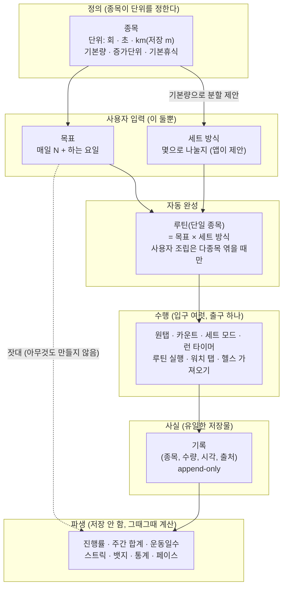

# 개념 모델 (Workout History)

작성일: 2026-08-17 · 상태: **v1.2** (v1.0 사용자 확정 · v1.1 완결성 보완 · v1.2 교차 검토 반영) · 이 문서가 개념의 진실이다 —
기능·화면·문서가 이 모델과 어긋나면 여기가 이기고, 모델을 바꾸려면 이 문서 개정이 먼저다.

> 배경: 실기기 사용 중 "목표·루틴·세트가 따로 놀고 난잡하다"는 사용자 진단(2026-08-16~17)에서
> 출발해, 개념별 의미·단위·상하 관계를 확정했다.

---

## 1. 한 문장 요약

**운동 계획의 입력은 "목표량"과 "세트(몇으로 나눌지)" 둘뿐이다.
단일 종목 수행 계획은 거기서 매번 파생되고, 화면의 모든 숫자는 기록에서 계산된다.**
(종목 정의·다종목 루틴 조립은 별개 축의 입력이다.)

---

## 2. 상관관계 도식

읽는 법 (팔굽혀펴기 예):

1. **종목**이 "팔굽혀펴기는 '개'로 센다, 기본 20개"를 정한다.
2. 사용자는 **목표** "매일 100개, 주 5일"과 **세트** "20개씩 5번"(앱 제안을 수정)만 입력한다.
3. **루틴**은 그 결과로 이미 완성돼 있다 — 홈 카드 탭 = 그 방식대로 수행.
4. 실제로 하면 **기록**이 남는다. 앱이 저장하는 건 이것뿐.
5. "60/100 (60%)", "주 환산 500개", "이번 주 4일 운동" — 전부 기록을 세어 만든 **파생값**이다.

---

## 3. 개념 정의

| # | 개념 | 정의 | 규칙 |
|---|---|---|---|
| 1 | **종목** (Exercise) | 운동의 종류. **단위의 원천** | 단위는 회·초·km(저장 m) 중 하나. 기본량·증가단위·세트 간 기본휴식을 가진다 |
| 2 | **목표** (Goal) | "나는 매일 이만큼 하는 사람"이라는 기준 + 어떻게 나눠 할지 | 입력은 **매일 N + 하는 요일 + 세트 방식**(+ 선택: 기간 — 기본 무기한)뿐. 주 단위·전체 운동일수 목표는 입력에서 제거(→ 7번 파생으로 대체). 목표는 행위가 아니다 — 기록을 재는 잣대 |
| 3 | **세트** | "나눠서 한다"는 **사용자의 선택** | 회·초형은 분할이 기본(100개 → 20×5 제안), **거리형은 단일이 기본**(10km는 10km) — 나누는 건 인터벌을 원할 때 선택(3+3+4km). 저장물이 아니라 기록 여러 장을 묶는 꼬리표. **세트 사이 휴식도 세트 방식의 일부** — 기본값은 종목 기본휴식, 루틴의 rest 블록과 같은 개념 |
| 4 | **루틴** (Routine) | 목표를 이루기 위한 수행 각본. **단일 종목은 목표에서 자동 완성** | 사용자가 직접 조립하는 루틴은 **여러 종목을 엮을 때만**. 스케줄 없음 — "매일"은 목표의 말. 목표와 직접 참조 없음(기록을 통해 채움 — A안 유지) |
| 5 | **수행** | 실제로 하는 것 | 입구는 여럿(원탭·카운트·세트 모드·런 타이머·루틴 실행·워치 탭·헬스 가져오기), 출구는 전부 기록. 어느 입구든 같은 목표에 합산 |
| 6 | **기록** (WorkoutRecord) | **행위의 유일한 저장물** — "언제, 무엇을, 얼마나, 어디서(출처)" | 수정 불가(append-only), 삭제는 tombstone. "기록은 행위의 산물". 출처(폰·워치·헬스)가 남고 재전송·재가져오기는 멱등(중복 안 됨). ※ 정의·계획(종목·목표·루틴)·뱃지 획득도 저장되지만 **행위의 사실**은 기록뿐 |
| 7 | **파생값** | 저장하지 않고 기록에서 계산해 보여주는 모든 숫자 | **주간 합계** = 매일 N × 요일 수(옛 주 단위 목표 대체) · **운동일수** = 기록 있는 날 세기(옛 전체 운동일수 목표 대체) · 진행률·통계·페이스 동일. **스트릭은 2종 구분**: 운동 스트릭(기록한 날 연속=물주기·홈 헤더, 목표 무관)과 목표 스트릭(활성 요일의 달성 연속 — 목표 카드). **예외 — 뱃지 획득**: 진행률은 파생이지만 획득 순간은 사실이라 저장한다(append-only, 스트릭 끊겨도 유지) |

## 3.0 교차 검토 확정 사항 (2026-08-17, 8건 검토 반영)

1. **세트 방식의 영속(결정 A)** — 세트 방식은 **Goal이 저장한다**: `goals`에 nullable 컬럼
   `set_chunk_amount`(분할 크기, NULL=종목 기본량으로 자동 제안)·`set_rest_sec`(휴식, NULL=종목 기본)
   추가(B-63, "컬럼 추가만" 규칙 부합). 세트 수는 저장하지 않는다(목표량 ÷ chunk 파생).
   종목 기본값을 덮어쓰지 않는다 — 다른 목표에 영향 금지.
2. **즉석 계획 vs 저장 루틴(결정 B)** — "루틴 자동 완성"의 정확한 의미:
   **단일 종목 수행 계획은 저장물이 아니다** — 홈 카드 탭 시 목표×세트에서 **매번 파생**되므로
   부모가 바뀌면 자연히 따라 바뀐다. **저장되는 루틴은 다종목 조립뿐**이며 생성 시점
   스냅샷(부모 변경 비추종, 목표 가져오기는 1회 변환)이다. — "자동 갱신"과 "무참조"의 충돌 해소.
3. **세트 방식은 제안이지 강제가 아니다** — 수행 시점에 다르게 해도 된다(세트 모드 즉흥 조정).
   목표의 세트 방식은 기본값일 뿐, 기록·진행률은 어떻게 했든 동일하게 합산.

## 3.1 운동 유형 (종목의 4가지 성질)

종목은 아래 넷 중 하나의 유형을 가진다. 유형이 단위·세트 성질·추가 데이터를 전부 결정한다.

| 유형 | 단위 | 예 | 추가 데이터 | 세트 성질 |
|---|---|---|---|---|
| **횟수형** (reps) | 회 | 푸시업, 스쿼트, 턱걸이 | — | **분할이 기본** (100개 → 20×5 제안) |
| **횟수+중량형** (reps_weight) | 회 + kg | 덤벨컬, 벤치프레스 | **중량(kg)** — 수량과 별개의 속성. 세트마다 다를 수 있다(20kg×10, 25kg×8) | 분할이 기본 |
| **시간형** (seconds) | 초 | 플랭크, 월싯 | — | 분할이 기본 (300초 → 60×5). 루틴에서는 자동 진행 블록(탭 없이 시간이 끝나면 다음) |
| **거리형** (distance) | km 표시 · **저장은 m** | 달리기, 걷기 | 소요 시간(초) → **페이스는 파생**(저장 안 함) · 걸음수 | **단일이 기본** — 연속된 하나의 행위. 분할은 인터벌을 원할 때만 선택 |

유형별 규칙:

- **목표량의 단위는 언제나 유형의 기본 단위다** — 횟수·중량형도 목표는 "회"로 잰다(중량은 기록의 속성이지 목표의 축이 아니다. "20kg 이상만 인정" 같은 중량 조건 목표는 비범위).
- **중량은 기록에 남는 사실**이다 — 같은 세트 그룹 안에서도 세트마다 다르게 기록될 수 있다.
- **거리형의 시간**은 페이스 계산용 입력이지 별도 운동이 아니다 — "30분 달리기"를 원하면 시간형 종목을 따로 만든다(단위 축은 하나만).
- 속도·페이스를 목표로 삼는 것은 비범위(PLANNING 5.3, 2026-07-21 확정)다.

### 커버리지 기준

이 4유형으로 **웬만한 생활 운동을 담는 것**이 목표다(2026-08-17 사용자) — 맨손운동(횟수),
덤벨·바벨(횟수+중량), 플랭크·요가(시간), 달리기·걷기·자전거·수영·등산(거리 또는 시간).
전문 영역(페이스 목표·루트 추적·운동 자세 분석 등)은 의도적 비범위.

## 3.2 시간의 경계 (모든 파생값의 밑바닥)

| 개념 | 정의 | 근거 |
|---|---|---|
| **하루** | 기기 **로컬 자정**에서 다음 자정까지 | "오늘 했다"는 사용자 체감 기준(DEVELOPMENT 단위 규칙 — 스트릭 버그 1순위 지점) |
| **주** | **월요일 시작**, 일요일 끝 | ISO-8601·한국 관습(2026-07-19 확정) |
| 저장 시각 | epoch ms UTC | 계산 시 로컬로 변환해 판정 |

## 4. 산술 관계

| 관계 | 식 | 적용 단위 |
|---|---|---|
| 진행률 | Σ기록(오늘, 활성 요일) ÷ 목표량 | 전부 |
| 주간 합계(환산) | 목표량 × 활성 요일 수 | 전부 |
| 세트 분할 제안 | 목표량 ÷ 종목 기본량 (나머지는 마지막 세트) | **회·초형만 기본** — 거리형은 단일 기본 |
| 루틴 1회 실행 | Σ블록 × 묶음반복 → 기록 N개 | 전부 |
| 운동일수 | 기록이 있는 날의 수 | 종목 무관 |
| 페이스 | 시간 ÷ 거리 (표시만) | 거리형 |

## 5. 이 모델이 금지하는 것 (일관성 가드)

- 거리형을 **자동으로** 세트 분할하기 (2026-08-17 사용자: "달리기 10km를 3km씩 쪼개는 건 루틴이 아니라 그냥 쪼개기")
- 루틴에 스케줄(요일·주기) 넣기 — 스케줄은 목표의 것
- 주 단위·전체 운동일수를 **사용자 입력**으로 받기 — 파생으로만
- 파생값을 저장하기 (ARCHITECTURE 설계 원칙 2와 동일)
- 목표↔루틴 데이터 직접 참조 (PLANNING 5.4 A안)
- **종목의 단위(unit_type) 변경** — 과거 기록의 해석이 깨진다. 수정 화면에서 단위 잠금(구현 완료)

---

## 6. 결정 이력

| 날짜 | 결정 |
|---|---|
| 2026-08-16 | "목표가 재료, 루틴은 엮는 방법" — 목표 기반 루틴 빌더(B-62 ③) |
| 2026-08-17 | v1.2 교차 검토 반영 — 세트 방식은 Goal 영속(결정 A: set_chunk_amount·set_rest_sec NULL 허용 컬럼), 즉석 단일 종목 계획=파생 vs 저장 다종목 루틴=스냅샷(결정 B), 세트 방식은 제안(수행 시 오버라이드 가능), 입력 범위 문구 정정("운동 계획의 입력"), 단위 불변 가드 |
| 2026-08-17 | v1.1 완결성 보완(advisor 전수 점검) — 시간 경계·휴식 소속·스트릭 2종·뱃지 저장 예외·워치 입구·목표 기간·커버리지 기준("웬만한 생활 운동") |
| 2026-08-17 | 운동 유형 4종(횟수·횟수+중량·시간·거리) 정의 — 유형이 단위·세트 성질·추가 데이터를 결정 |
| 2026-08-17 | 사용자 입력은 목표량+세트 방식뿐, 단일 종목 루틴은 자동 완성. 거리형 세트 분할 금지(기본 단일). 주 단위·전체 운동일수 목표 입력 제거 → 파생 대체 |
