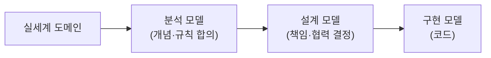

# 도메인 모델의 세 얼굴 — 분석 모델·설계 모델·구현 모델

## 정의

"도메인 모델"이라는 말은 하나의 산출물처럼 들리지만, 실제로는 목적이 다른 여러 모델의 묶음입니다. 조영호의 *오브젝트* 부록 C는 실세계 도메인에서 코드까지 내려오는 길을 **분석 모델 → 설계 모델 → 구현 모델**의 단계로 구분합니다 (책은 출발점인 실세계 도메인까지 포함해 4단계로 그리지만, 우리가 만들어 내는 산출물은 이 세 모델입니다). 세 모델은 같은 도메인을 그리지만 독자도, 표현 수단도, 바뀌는 속도도 다릅니다. 이 구분을 모르면 "도메인 전문가의 개념도를 그대로 클래스로 옮기면 되는 것 아닌가"라는 오해와, "코드가 곧 모델이니 다른 모델은 필요 없다"는 반대편 오해 사이에서 흔들리게 됩니다. 이 페이지는 세 모델의 차이, 그 차이를 무시할 때 생기는 함정, 그리고 DDD의 유비쿼터스 언어가 세 모델을 하나로 꿰는 방식을 정리합니다.

> **비유 — 건물 하나, 도면 셋**
>
> 새 미술관을 짓는다고 해 봅시다. 건축가는 먼저 건축주와 마주 앉아 조감도를 그립니다. 조감도에는 배관도 철골도 없고, 건물이 언덕 위에서 어떤 모습으로 서 있을지만 담깁니다. 건축주가 고개를 끄덕이면 설계 사무소가 구조와 동선을 계산한 설계도면을 그리고, 마지막으로 시공사가 철근 굵기와 콘크리트 배합까지 적힌 시공상세도를 만듭니다. 셋 다 같은 미술관을 그린 그림이지만, 조감도를 들고 공사를 할 수도 없고 시공상세도를 건축주에게 보여 주며 승인을 받을 수도 없습니다.
>
> 소프트웨어의 모델도 같습니다. 분석 모델은 도메인 전문가와 합의하기 위한 조감도이고, 설계 모델은 개발자가 구조를 결정하는 설계도면이며, 구현 모델은 기계가 실행하는 시공상세도인 코드입니다. 하나의 도면으로 세 역할을 다 하려는 순간, 셋 중 어느 독자에게도 맞지 않는 그림이 나옵니다.

## 세 모델 비교

세 모델의 차이를 목적·독자·표현 수단·변화 속도로 비교하면 다음과 같습니다.

| 구분 | 분석 모델 | 설계 모델 | 구현 모델 |
|------|----------|----------|----------|
| **목적** | 도메인 개념·규칙의 합의 | 책임 분배·협력 구조 결정 | 실행 가능한 시스템 |
| **주 독자** | 도메인 전문가 + 분석가 | 개발자 (팀 내 소통) | 컴파일러 + 미래의 개발자 |
| **표현 수단** | 비즈니스 용어, 개념 관계도, 규칙 서술 | 클래스·인터페이스·협력 다이어그램 | 코드 (Java, SQL, 설정) |
| **담기는 것** | 무엇이 있고 어떤 규칙이 성립하는가 | 누가 어떤 책임을 지고 누구와 협력하는가 | 어떻게 동작하는가 + 기술 제약 |
| **바뀌는 속도** | 느림 — 비즈니스가 바뀔 때만 | 중간 — 변경 전략이 바뀔 때 | 빠름 — 리팩터링·기술 교체마다 |

세 모델의 관계를 흐름으로 그리면 다음과 같습니다.



위 흐름에서 각 화살표는 "그대로 옮김"이 아니라 "해석해서 다시 그림"을 뜻합니다. 분석 모델은 실세계에서 소프트웨어와 관련 있는 개념만 추린 결과이고, 설계 모델은 분석 모델의 개념에 변경까지 고려한 책임 구조를 입힌 결과이며, 구현 모델은 설계 모델에 영속성·동시성·프레임워크 같은 기술 제약을 더한 결과입니다. 단계마다 새 정보가 더해지므로 앞 모델을 복사한다고 뒤 모델이 나오지 않습니다.

## 왜 "모델이 하나가 아니다"가 중요한가

모델이 하나라고 믿으면 두 가지 사고 중 하나가 반드시 일어납니다. 첫째, 분석 모델을 코드의 청사진으로 착각해 도메인 개념도를 기계적으로 클래스로 번역합니다. 그 결과 변경을 전혀 고려하지 않은, 데이터 덩어리에 가까운 구조가 나옵니다. 둘째, 반대로 "어차피 코드가 진실"이라며 분석 모델을 버리면, 도메인 전문가와 개발자가 각자의 언어로 말하게 되고 요구사항이 코드로 넘어올 때마다 번역 비용과 오해가 쌓입니다. 부록 C가 정리한 정답은 양자택일이 아니라 **세 모델을 각자의 목적대로 유지하되, 같은 개념·같은 이름·같은 협력을 공유하게 만드는 것**입니다.

세 모델은 바뀌는 속도가 달라서 분리가 더욱 필요합니다. 비즈니스 규칙("결제 대기 상태의 주문만 결제할 수 있다")은 몇 년을 가지만, 구현의 기술 선택(JPA인지 MyBatis인지, 낙관적 잠금인지 비관적 잠금인지)은 훨씬 자주 바뀝니다. 속도가 다른 것을 한 모델에 묶으면 느린 것이 빠른 것에 끌려다니거나, 빠른 것이 느린 것을 오염시킵니다.

## 흔한 함정

### 함정 1 — 분석 모델을 코드에 그대로 강요 (개념 ≠ 클래스 1:1)

요구사항 문서의 명사를 전부 클래스로, 동사를 전부 메서드로 옮기는 접근입니다. 도메인 개념과 클래스가 1:1이어야 한다는 강박은 두 가지 문제를 만듭니다. 하나는 분석 모델에는 없지만 설계에는 필요한 객체(할인 정책 인터페이스, 이벤트, 명세 객체 같은 순수 설계 산물)를 "도메인에 없는 개념"이라며 거부하게 되는 것이고, 다른 하나는 분석 모델의 개념 하나가 설계에서는 여러 클래스로 쪼개져야 하는데(예: "요금 규칙" 하나가 정책 인터페이스 + 구현체 여럿 + 조건 객체로 분해) 그 분해를 막는 것입니다. 분석 모델은 코드의 청사진이 아니라 코드가 표현해야 할 의미의 지도입니다.

### 함정 2 — 구현 제약을 분석 단계로 끌어올리기

도메인 전문가와의 대화에 테이블 구조·외래 키·프레임워크 제약이 끼어드는 경우입니다. "주문과 결제는 조인이 비싸니 한 테이블로 합치죠" 같은 문장이 분석 회의에서 나오면, 비즈니스 규칙의 합의라는 분석 모델의 목적이 무너집니다. 반대 방향의 오염도 있습니다. JPA가 기본 생성자를 요구한다는 이유로 분석 모델의 불변식("주문은 반드시 주문자와 함께 태어난다")을 포기하는 식입니다. 구현 제약은 구현 모델 안에서 해결하고, 분석 단계의 대화는 비즈니스 용어로만 진행해야 합니다. [[src-kakaopay-ddd]]의 DomainEntity와 JpaEntity 분리가 정확히 이 오염을 막는 실전 장치입니다.

## Java 예제 — 하나의 규칙이 세 모델을 통과하는 모습

"결제 대기 상태의 주문만 결제할 수 있다"라는 규칙 하나가 세 모델에서 각각 어떤 모습인지 따라가 봅니다. 먼저 분석 모델에서는 이 규칙이 비즈니스 용어로 된 서술로 존재합니다.

```text
[분석 모델 — 도메인 전문가와 합의한 규칙 서술]
- 주문(Order)은 "결제 대기" 상태에서만 결제(pay)할 수 있다.
- 결제가 완료되면 주문은 "결제 완료" 상태가 된다.
- 결제 완료된 주문만 배송(ship)을 시작할 수 있다.
```

설계 모델에서는 같은 규칙이 책임과 협력의 형태로 바뀝니다. 결제 가능 여부의 판단 책임을 Order가 가진다는 결정, 결제 수단의 다양성에 대비해 Payment를 추상화한다는 결정이 이 단계의 산출물입니다.

```java
// 설계 모델 — 책임과 협력을 표현한 인터페이스 (구현 세부 없음)
public interface Order {
    void pay(Payment payment);   // 결제 대기 상태가 아니면 거부한다
    void ship(Carrier carrier);  // 결제 완료 상태에서만 허용한다
}
```

구현 모델에서는 설계 모델의 이름과 협력을 그대로 유지하면서, 분석·설계 모델에는 없던 기술 제약(영속성 매핑, 동시성 제어)이 추가됩니다.

```java
// 구현 모델 — 같은 이름·같은 협력 + 기술 제약 (JPA, 낙관적 잠금)
@Entity
public class StandardOrder implements Order {
    @Id private Long id;

    @Enumerated(EnumType.STRING)
    private OrderStatus status;

    @Version private long version;  // 분석 모델에는 없는 동시성 제약

    @Override
    public void pay(Payment payment) {
        if (status != OrderStatus.PENDING) {
            throw new IllegalStateException("결제 대기 상태의 주문만 결제할 수 있다");
        }
        payment.approve(this);
        this.status = OrderStatus.PAID;
    }

    @Override
    public void ship(Carrier carrier) {
        if (status != OrderStatus.PAID) {
            throw new IllegalStateException("결제 완료된 주문만 배송할 수 있다");
        }
        carrier.dispatch(this);
    }
}
```

세 단계를 관통해서 살아남은 것은 **이름과 규칙**입니다. 도메인 전문가가 말한 "결제 대기 상태의 주문만 결제할 수 있다"가 설계의 `pay` 시그니처 주석으로, 구현의 가드 절과 예외 메시지로 이어집니다. 반대로 `@Version`이나 `EnumType.STRING` 같은 요소는 구현 모델에만 존재하고 분석 대화에는 올라가지 않습니다. 층마다 다른 요소를 인정하되, 도메인 개념의 이름은 끝까지 같게 유지하는 것이 핵심입니다.

## DDD와의 연결 — 유비쿼터스 언어가 세 모델을 꿰는 실

DDD의 유비쿼터스 언어(Ubiquitous Language)는 세 모델이 따로 놀지 않게 하는 장치입니다. 도메인 전문가가 "주문이 결제되었나요"라고 물으면, 분석 모델에 결제라는 개념이 있고, 설계 모델에 `Order.pay()`가 있고, 구현 코드에 `order.pay()`가 있어야 합니다. 이름이 층을 통과하며 보존되면 요구사항 변경이 어느 클래스를 건드릴지 추적하는 비용이 극적으로 줄고, 도메인 전문가가 메서드 이름만으로도 코드 리뷰에 참여할 수 있게 됩니다.

[[src-kakaopay-ddd]]의 여신코어 구축기는 이 원리의 실전판입니다. 기획자·여신전문가·개발자가 유비쿼터스 언어를 공유한 것이 프로젝트 성공의 핵심이었고, DomainEntity와 JpaEntity를 분리해 구현 모델 내부에서도 도메인 언어 층과 영속성 기술 층을 나눴습니다. 도메인이 커지면 하나의 언어로 전체를 덮으려 하지 말고 Bounded Context로 언어의 유효 범위를 나누라는 것까지가 DDD의 처방입니다. 한편 [[concept-oop]]가 정리하듯 캡슐화·다형성 같은 객체지향 원칙은 설계 모델을 변경에 강하게 만드는 도구이고, DDD는 그 위에서 분석 모델과의 연결을 담당합니다.

다만 부록 C가 경고하듯 모델 구분이 도그마가 되면 안 됩니다. 세 모델을 세 벌의 문서로 만들어 동기화하려 들면 문서 관리 비용이 코드 작성 비용을 넘어섭니다. 실무의 균형점은 분석 모델은 가볍게(용어집 + 핵심 규칙 서술), 설계 모델은 코드에 가장 가까운 형태로(인터페이스와 패키지 구조 자체가 설계 문서), 구현 모델은 코드 그 자체로 유지하는 것입니다.

## 같은 인사이트 패턴 — "층마다 다른 언어를 인정하되 연결을 유지"

층을 하나로 뭉개지도 않고, 끊어 버리지도 않고, 다름을 인정한 채 연결 수단을 명시하는 패턴은 위키의 여러 페이지에 반복해서 나타납니다.

| 페이지 | 분리된 두 층 | 연결을 유지하는 수단 |
|--------|------------|-------------------|
| **이 페이지** | 분석 모델 ↔ 설계 모델 ↔ 구현 모델 | 유비쿼터스 언어 (같은 개념·같은 이름) |
| [[src-kakaopay-ddd]] | DomainEntity ↔ JpaEntity | 명시적 매핑 + 유비쿼터스 언어 |
| [[concept-jpa-enum-mapping]] | 자바 enum ↔ DB 컬럼 | `EnumType.STRING` — 순서가 아닌 이름으로 연결 |
| [[concept-api-backward-compatibility]] | 서버 응답 ↔ 클라이언트 모델 | Tolerant Reader 계약 (미지 필드 무시 약속) |
| [[concept-api-versioning]] | 외부 API 계약 ↔ 내부 구현 | 명시적 버전 — 계약 변경을 드러내고 관리 |

공통 원리는 이렇습니다. **두 층의 언어가 다른 것은 문제가 아니고, 연결 규칙이 암묵적인 것이 문제입니다.** enum의 ordinal 저장이 위험한 이유도, 분석 모델과 코드가 어긋나는 이유도, 연결이 "우연히 맞아 있는 상태"에 의존하기 때문입니다. 연결 수단을 이름·계약·매핑으로 명시하는 순간 각 층은 자유롭게 진화할 수 있습니다.

## 빠른 진단 체크리스트

우리 팀의 모델 상태를 다음 질문으로 점검할 수 있습니다.

- [ ] 도메인 전문가가 말하는 핵심 용어가 코드의 클래스·메서드 이름에 그대로 존재하는가
- [ ] 도메인 전문가와의 회의에서 테이블·조인·프레임워크 이야기가 나오지 않는가
- [ ] 요구사항 문서의 명사 개수와 클래스 개수가 1:1이어야 한다는 강박이 없는가
- [ ] `status == 2` 같은 코드 없이, 상태가 도메인 용어(enum 이름 등)로 표현되는가
- [ ] 기술 교체(ORM 변경 등)를 상상했을 때 비즈니스 규칙 코드가 함께 바뀌지 않는가
- [ ] 도메인이 커졌을 때 Bounded Context 분리를 검토했는가

## 원본 출처

이 페이지는 raw/object/오브젝트 실전 강의 교재 부록C.md (조영호 *오브젝트* 부록 C "동적인 협력, 정적인 코드" 기반 강의 교재)의 모델 구분 논의를 발전시킨 것입니다. 부록 C 전체 정리는 [[lecture-object-appendixC]]에 있습니다.

## 관련 페이지

- [[lecture-object-appendixC]] — 원 소스: 4 모델 관계와 "동적 협력 먼저, 정적 코드 나중"
- [[entity-object]] — *오브젝트* 책 전체 지도와 5권 세트 비교
- [[concept-oop]] — 설계 모델을 변경에 강하게 만드는 객체지향 원칙
- [[src-kakaopay-ddd]] — 유비쿼터스 언어·DomainEntity/JpaEntity 분리의 실전 사례
- [[concept-jpa-enum-mapping]] — 자바 층과 DB 층의 연결을 이름으로 유지하는 같은 패턴
- [[concept-api-backward-compatibility]] — 서버·클라이언트 층의 연결을 계약으로 유지하는 같은 패턴
