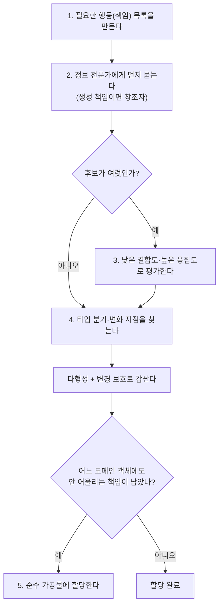

# GRASP — 책임 할당 9패턴

## 정의

GRASP(General Responsibility Assignment Software Patterns)은 "이 책임을 어느 객체에게 줄 것인가"라는 설계 결정을 내릴 때마다 꺼내 쓰는 9가지 사고 도구입니다. 원출처는 Craig Larman의 *Applying UML and Patterns*(초판 1997, 2판 2001에서 9패턴 완성)이고, 한국어권에서는 조영호 *오브젝트* 5장([[lecture-object-ch5]])이 영화 예매 예제로 해설한 판본이 표준처럼 읽힙니다.

회사에 새 업무가 하나 생겼다고 해 봅시다. 관리자는 그 업무에 필요한 자료를 이미 다루고 있는 팀에게 우선 맡기고, 후보 팀이 여럿이면 다른 팀과 오가는 협조 요청이 가장 적은 팀을 고르고, 자주 바뀔 업무라면 창구 담당자를 한 명 정해 바깥 팀이 내부 사정을 몰라도 되게 만듭니다. GRASP은 이 관리자의 판단 기준을 객체 세계에 옮겨 놓은 목록입니다.

이 페이지는 개별 패턴의 심화와 적용 판단을 다룹니다. 코드 리뷰 체크 문항으로 쓰는 한 줄 요약 표는 [[guide-code-authoring-and-review]] §3.4에 이미 있으므로, 여기서는 각 패턴이 답하는 결정과 위반 신호, 그리고 Before/After 코드로 들어갑니다.

## 9패턴 종합 표

아래 표는 패턴마다 "어떤 결정 앞에서 꺼내는가"와 "코드에서 보이는 위반 신호"를 정리한 것입니다.

| 패턴 | 어떤 결정에 쓰나 | 답 | 위반 신호 |
|------|----------------|----|----------|
| 정보 전문가 (Information Expert) | 이 행동을 누가 맡나 | 필요한 정보를 가장 많이 가진 객체 | getter 로 데이터를 꺼내 와 외부에서 계산 |
| 창조자 (Creator) | 이 객체를 누가 생성하나 | 포함·긴밀 사용·정보 보유 관계인 객체 | 생성 재료를 getter 로 긁어모으는 조립 코드 |
| 컨트롤러 (Controller) | 시스템 이벤트를 누가 먼저 받나 | 유스케이스 대표 객체 또는 전담 컨트롤러 | 컨트롤러 안의 비즈니스 로직 (뚱뚱한 컨트롤러) |
| 낮은 결합도 (Low Coupling) | 할당 후보가 여럿일 때 무엇으로 가르나 | 새 의존을 만들지 않는 후보 | 한 클래스의 import 목록이 계속 늘어남 |
| 높은 응집도 (High Cohesion) | 이 책임들을 한 객체에 둬도 되나 | 관련 책임끼리만 묶기 | 서로 무관한 이유로 같은 클래스가 자꾸 수정됨 |
| 다형성 (Polymorphism) | 타입별로 행동이 다를 때 어떻게 하나 | 조건 분기 대신 타입 계층 | `switch (type)` 이 여러 파일에 반복 |
| 순수 가공물 (Pure Fabrication) | 어느 도메인 객체에도 안 어울리는 책임은 | 인위적 객체를 만들어 할당 | Service·Calculator 폭증으로 빈약한 도메인 |
| 간접화 (Indirection) | 두 객체를 직접 묶어도 되나 | 중개 객체를 사이에 둠 | 구체 클래스끼리의 직접 호출 사슬 |
| 변경 보호 (Protected Variations) | 자주 바뀌는 지점을 어떻게 다루나 | 변화 지점 앞에 안정된 인터페이스 | 정책 하나 바꾸는데 수정 파일이 여러 개 |

9개를 외우는 것이 목표가 아닙니다. 아래 심화 4개(정보 전문가·창조자·낮은 결합도×높은 응집도·변경 보호)가 일상 결정의 대부분을 커버하고, 나머지는 특정 상황에서 꺼내는 보조 도구입니다.

## 1. 정보 전문가 — 모든 할당의 출발점

가장 자주 쓰는 패턴입니다. "이 일에 필요한 정보를 누가 이미 가지고 있는가"를 먼저 묻고, 그 객체에게 행동을 맡깁니다. 영화 예매 예제에서 요금 계산 책임이 어디로 가는지 Before/After 로 봅니다.

```java
// Before — 서비스가 getter 로 데이터를 꺼내 와 대신 계산합니다
public class ReservationService {
    public Money calculateFee(Screening screening, int audienceCount) {
        Movie movie = screening.getMovie();
        Money fee = movie.getFee();
        Money discount = calculateDiscount(movie, screening);  // 할인 규칙도 여기에
        return fee.minus(discount).times(audienceCount);
    }
}
```

```java
// After — 요금 정보를 가진 Movie 가 스스로 계산합니다
public class Movie {
    private final Money fee;
    private final DiscountPolicy discountPolicy;

    public Money calculateMovieFee(Screening screening) {
        return fee.minus(discountPolicy.calculateDiscountAmount(screening));
    }
}
```

Before 는 Movie 의 사정이 바뀔 때마다 서비스가 함께 수정되고, 같은 계산이 다른 서비스에 복사되기 쉽습니다. After 는 정보가 있는 곳에 책임이 있으므로 수정 지점이 한 곳입니다 (Tell, Don't Ask 의 정형화).

**적용 판단** — 정보 전문가는 출발점이지 도그마가 아닙니다. 정보를 가진 객체가 비대해지면(예: Movie 가 요금·할인·통계·추천까지) 높은 응집도 패턴과 균형을 잡아 분리합니다.

## 2. 창조자 — 생성 책임의 기본 규칙

객체 B 를 누가 생성해야 하는지 물을 때 씁니다. B 를 포함하거나, B 와 긴밀히 협력하거나, B 의 생성 정보를 가진 객체 A 가 후보입니다.

```java
// Before — 외부 서비스가 Screening 의 데이터를 꺼내 Reservation 을 조립합니다
public class ReservationService {
    public Reservation reserve(Screening screening, Customer customer, int count) {
        Money fee = screening.getMovie().getFee().times(count);
        return new Reservation(customer, screening, fee, count);
    }
}
```

```java
// After — Reservation 의 재료를 모두 아는 Screening 이 직접 생성합니다
public class Screening {
    public Reservation reserve(Customer customer, int audienceCount) {
        return new Reservation(customer, this,
                calculateFee(audienceCount), audienceCount);
    }

    private Money calculateFee(int audienceCount) {
        return movie.calculateMovieFee(this).times(audienceCount);
    }
}
```

Screening 은 Reservation 과 1:N 관계이고 생성에 필요한 정보(요금·상영 정보)를 이미 가지고 있으므로 창조자 조건을 모두 만족합니다. 결과적으로 새 의존이 생기지 않아 낮은 결합도까지 함께 얻습니다.

**적용 판단** — 생성 과정이 복잡해지거나(여러 단계 조립, 외부 자원 필요) 구체 클래스 선택이 변화 지점이면, 도메인 객체 대신 Factory 같은 순수 가공물로 생성 책임을 옮기는 편이 낫습니다.

## 3. 낮은 결합도 × 높은 응집도 — 후보 평가의 저울

앞의 두 패턴이 "첫 후보"를 내면, 이 두 패턴은 그 후보를 평가하는 저울입니다. 할당 후보가 여럿일 때 결합도가 낮아지는 쪽, 응집도가 높아지는 쪽을 고릅니다.

```java
// Before — Movie 가 조건 데이터까지 끌어안고 종류별 if 로 판정합니다
public class Movie {
    private List<PeriodCondition> periodConditions;     // 기간 조건 목록
    private List<SequenceCondition> sequenceConditions; // 순번 조건 목록

    private boolean isDiscountable(Screening screening) {
        return checkPeriodConditions(screening)
            || checkSequenceConditions(screening);  // 조건 종류가 늘 때마다 수정
    }
}
```

```java
// After — 판정 책임을 각 조건에게 돌려주고 Movie 는 인터페이스에만 의존합니다
public interface DiscountCondition {
    boolean isSatisfiedBy(Screening screening);
}
```

```java
public class Movie {
    private List<DiscountCondition> discountConditions;

    private boolean isDiscountable(Screening screening) {
        return discountConditions.stream()
                .anyMatch(condition -> condition.isSatisfiedBy(screening));
    }
}
```

Before 의 Movie 는 두 조건 타입 모두와 결합하고(낮은 결합도 위반), 요금 계산과 조건 판정이라는 다른 변경 이유를 동시에 가집니다(높은 응집도 위반). After 는 결합이 인터페이스 한 지점으로 좁혀지고, 조건 판정은 조건 자신의 책임이 됩니다.

**적용 판단** — 두 패턴은 단독 규칙이 아니라 평가 기준입니다. "이 할당으로 import 가 늘었는가", "이 클래스의 수정 이유가 둘 이상이 됐는가"를 리뷰 문장으로 바꿔 쓰면 그대로 코드 리뷰 어휘가 됩니다.

## 4. 변경 보호 — 변화 지점 앞의 방어막

변경 가능성이 높은 지점을 찾아 그 앞에 안정된 인터페이스를 세우는 패턴입니다. 다형성·간접화가 수단이고 변경 보호가 목적에 해당합니다.

```java
// Before — 정책 종류가 Movie 의 switch 안에 그대로 노출되어 있습니다
public Money calculateDiscountAmount(Screening screening) {
    switch (movieType) {
        case AMOUNT_DISCOUNT:  return discountAmount;
        case PERCENT_DISCOUNT: return fee.times(discountPercent);
        case NONE_DISCOUNT:    return Money.ZERO;
        default: throw new IllegalStateException();
    }
}
```

```java
// After — 변화 지점(할인 정책)을 안정된 추상 뒤로 숨깁니다
public class MembershipDiscountPolicy extends DiscountPolicy {
    @Override
    protected Money getDiscountAmount(Screening screening) {
        return calculateByGrade(screening);  // 회원 등급별 할인
    }
}
```

Before 에서 새 정책 추가는 switch 가 있는 모든 위치의 수정입니다. After 에서 Movie 는 추상 `DiscountPolicy` 에만 의존하므로, 회원 등급 할인 같은 새 정책이 와도 새 클래스 1개 추가로 끝나고 기존 코드는 무변경입니다 (OCP·DIP 충족 — [[concept-oop]] SOLID 절).

**적용 판단** — 모든 지점을 보호하려 들면 추측성 일반화가 됩니다([[entity-refactoring]] 의 악취). 실제 변경 이력이 있거나 요구사항에 변형이 명시된 지점에만 인터페이스를 세웁니다.

## 5. 나머지 4패턴 — 언제 꺼내나

핵심 4패턴 밖의 나머지는 특정 상황에서 꺼내는 보조 도구입니다. 각각의 사용 시점과 남용 신호를 정리합니다.

| 패턴 | 꺼내는 시점 | 남용 신호 |
|------|-----------|----------|
| 컨트롤러 | UI·API 요청이 도메인에 처음 닿는 지점 설계 | 컨트롤러가 도메인 대신 일함 → 트랜잭션 스크립트 퇴화 |
| 다형성 | 같은 타입 분기가 두 곳 이상 반복될 때 | 구현체 1개뿐인데 인터페이스부터 만드는 추측성 설계 |
| 순수 가공물 | 어느 도메인 개념에도 책임이 안 어울릴 때 (Repository 등) | Service·Helper 폭증으로 도메인이 데이터 껍데기가 됨 |
| 간접화 | 두 모듈을 직접 묶으면 배포·테스트가 얽힐 때 | 한 단계 위임만 하는 빈 중개 계층의 층층 쌓임 |

Spring 의 `@RestController` 가 컨트롤러 패턴의 구현이고, `Repository` 가 순수 가공물의 대표 사례라는 점은 [[lecture-object-ch5]] 현업 예제와 같은 맥락입니다.

## 6. 책임 할당 사고 순서

패턴 9개는 병렬 목록이 아니라 순서 있는 질문 흐름으로 쓸 때 힘이 생깁니다. 아래 다이어그램이 그 흐름입니다.



글로 풀면 이렇습니다. 먼저 클래스가 아니라 행동 목록에서 출발합니다(책임 주도 설계의 전제). 각 행동마다 정보 전문가에게 먼저 묻고, 생성 책임이면 창조자 조건으로 후보를 냅니다. 후보가 여럿이면 낮은 결합도와 높은 응집도를 저울로 써서 하나를 고릅니다. 할당 결과에 타입 분기나 자주 바뀔 지점이 보이면 다형성으로 분기를 없애고 변경 보호로 그 지점을 인터페이스 뒤에 숨깁니다. 끝까지 주인을 못 찾은 책임만 순수 가공물로 넘깁니다. 이 순서를 지키면 "일단 Service 를 만들고 시작"하는 습관이 마지막 선택지로 밀려납니다.

## 같은 인사이트 패턴 — 책임을 데이터가 아니라 행동 중심으로

"데이터를 꺼내 오지 말고 행동을 맡겨라"라는 같은 인사이트가 위키의 여러 페이지에 다른 표현으로 누적되어 있습니다.

| 페이지 | 같은 인사이트의 표현 | 위반 형태 |
|--------|--------------------|----------|
| 이 페이지 (GRASP) | 정보 전문가 — 정보 가진 객체에게 행동을 할당 | getter 로 꺼내 외부 서비스가 계산 |
| [[concept-oop]] 캡슐화 | 상태 + 행위를 묶어 잘못된 상태 변경을 차단 | setter 열어 두고 캡슐화라 부름 |
| [[concept-oop]] SOLID 절 | OCP·DIP — 추상에 의존해 변경을 봉쇄 (= 변경 보호의 원칙화) | 구체 클래스 직접 의존 + switch |
| [[entity-object]] | "메시지가 객체를 결정한다, 행동이 상태를 결정한다" | 클래스·필드부터 그리는 설계 |
| [[lecture-object-ch5]] | 4장 데이터 중심 → 5장 책임 중심으로 사고 역전 | 필드 → getter/setter → 외부 Service 순서 |

## 빠른 진단 체크리스트

코드 리뷰나 설계 회의에서 아래 문항으로 GRASP 위반을 빠르게 걸러냅니다.

- [ ] 행동(책임) 목록에서 출발했는가 — 클래스·필드부터 그리지 않았는가
- [ ] getter 로 꺼내 와 외부에서 계산하는 코드가 없는가 (정보 전문가)
- [ ] 생성 코드가 재료를 이미 가진 객체 안에 있는가 (창조자)
- [ ] 이번 할당으로 새 의존이 생겼는가, 수정 이유가 둘 이상인 클래스가 생겼는가 (결합도·응집도)
- [ ] 같은 타입 switch 가 두 곳 이상 반복되는가 (다형성 신호)
- [ ] 변경 이력이 있는 지점만 인터페이스로 보호했는가 — 추측성 일반화는 아닌가 (변경 보호)
- [ ] Service·Helper 가 도메인 객체보다 빠르게 늘고 있지 않은가 (순수 가공물 남용)

## 원본 출처

- raw: `raw/object/오브젝트 실전 강의 교재 5장.md` — 조영호 *오브젝트* 5장 "책임 할당하기" 강의 교재
- 원전: Craig Larman, *Applying UML and Patterns* — GRASP 라는 이름과 9패턴 목록의 출처
- 참고: [Wikipedia — GRASP (object-oriented design)](https://en.wikipedia.org/wiki/GRASP_(object-oriented_design))

## 관련 페이지

- [[lecture-object-ch5]] — 이 페이지의 뼈대가 된 5장 강의 교재 (영화 예매 예제 전체 코드)
- [[guide-code-authoring-and-review]] — §3.4 GRASP 리뷰 질문 한 줄 표 (이 페이지의 요약판)
- [[concept-oop]] — 캡슐화·SOLID 등 GRASP 이 딛고 선 기반 원칙
- [[entity-object]] — 조영호 *오브젝트* 책 전체 지도 (5장은 II부 "책임 관점으로 재정렬"의 중심)
- [[entity-refactoring]] — 위반 신호(악취)를 발견한 뒤의 교정 절차
- [[concept-design-patterns]] — GRASP 이 "누가"를 정하면 디자인 패턴이 "어떻게"를 정함
