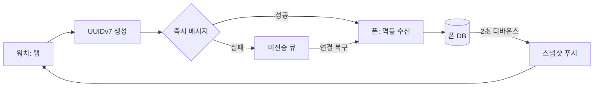

# 얇은 클라이언트 + 멱등 동기화 — 진실은 한 곳, 재전송은 안전하게

## 정의

폰과 워치처럼 두 기기가 한 사용자의 데이터를 다룰 때, **진실은 폰 DB 하나**에만 두고 워치는 두 가지만 가집니다.

| 워치가 가진 것 | 내용 | 없어져도 되나 |
|---------------|------|--------------|
| 스냅샷 캐시 | 폰이 보낸 오늘 종목·목표·누적 | 예, 재요청하면 됩니다 |
| 미전송 큐 | 아직 폰에 닿지 않은 기록 | 아니오, 닿을 때까지 보관합니다 |

워치에 DB를 두면 충돌 해결이 필요해지고, 그것은 기기 간 동기화 마일스톤의 일입니다. [[src-workout-history-launch]]는 그 일을 출시 후로 미루기 위해 워치를 얇게 유지했습니다.

## 메시지 흐름



위 흐름의 요점은 세 가지입니다. 첫째, 기록의 ID는 **워치에서** 만듭니다. 그래야 같은 기록이 두 번 도착해도 폰이 알아봅니다. 둘째, 즉시 전송이 실패하면 큐에 넣고 연결이 복구될 때 다시 보냅니다. 셋째, 폰은 저장이 끝나면 스냅샷을 워치로 밀어 워치 캐시를 진실에 맞춥니다.

## 멱등 수신 — 재전송이 안전해지는 열쇠

```dart
// 폰 쪽 수신. 같은 ID가 두 번 오면 두 번째는 조용히 무시합니다.
Future<void> onWatchRecord(WatchRecord msg) async {
  if (await repo.exists(msg.id)) return;   // 멱등: 재전송·중복 도착 무해
  await repo.append(msg.toRecord());
}
```

```swift
// 워치 쪽 전송. 즉시 시도 + 실패 시 큐 폴백 + 낙관적 로컬 에코.
func send(_ record: WatchRecord) {
    localList.append(record)                     // 낙관적 에코: 목록에 즉시 반영
    if session.isReachable {
        session.sendMessage(record.json, replyHandler: nil) { _ in
            self.queue.enqueue(record)           // 실패하면 큐로
        }
    } else {
        queue.enqueue(record)
    }
}
```

UUIDv7을 쓰는 이유는 시간 순서가 ID에 들어 있어 큐를 비울 때 정렬이 공짜이기 때문입니다. 폰·워치 공통 JSON 메시지 스키마를 쓰면 Wear OS도 같은 스키마로 붙습니다.

## 폰→워치 푸시 — 트리거는 여럿, 전송은 하나

| 항목 | 규칙 |
|------|------|
| 트리거 | 기록 저장·목표 변경·종목 변경 등 5종 |
| 디바운스 | 2초. 연속 저장 다섯 번이 푸시 한 번으로 합쳐집니다 |
| 연결 복구 | 워치가 스냅샷을 재요청합니다 |

## 함정 · 증분 가져오기의 앵커

헬스 앱에서 운동을 증분으로 가져올 때, 앵커(마지막 가져온 시각)는 **실제로 가져온 것이 있을 때만** 전진시킵니다. 권한이 어중간해 전부 건너뛴 배치가 앵커를 밀면 이후 영영 0건이 됩니다.

```dart
Future<void> importIncremental() async {
  final batch = await health.fetchSince(anchor);
  final imported = await repo.appendAll(batch.records);
  if (imported > 0 || batch.complete) {
    anchor = batch.latestTimestamp;   // 가져온 게 있거나 완전 배치일 때만 전진
  }
  // 전부 건너뛴 배치는 앵커를 건드리지 않습니다.
}
```

전체 가져오기는 연 단위 청크로, 최신에서 과거 순으로 돌립니다. 한 번에 긁으면 스피너가 굳고 사용자가 가장 궁금한 최신 기록이 마지막에 옵니다. 청크 중간 실패는 부분 성공을 보존합니다. 불완전 플래그를 세우고 앵커 전진은 유지해야 전체 재스캔을 반복하지 않습니다.

## 삽질 · 시뮬레이터에서 붙지 않는 세션

폰↔워치 세션은 시뮬레이터에서 연결되지 않습니다. 스토어 스크린샷은 워치 앱에 시뮬레이터 전용 데모 스냅샷을 내장해 찍었습니다. 얇은 클라이언트라 "스냅샷 하나만 주입하면 화면이 선다"는 점이 여기서 이득이 됐습니다.

## 같은 인사이트 패턴 — "직접 참조 대신 신호로 협력한다"

| 영역 | 직접 결합 방식 | 신호 협력 방식 | 참조 |
|------|---------------|---------------|------|
| **폰↔워치** | 워치가 DB를 갖고 양방향 동기화 | 멱등 ID 메시지 + 큐 + 스냅샷 푸시 | (이 페이지) |
| 도메인 이벤트 | 한 트랜잭션에서 타 도메인 갱신 | 커밋 후 이벤트 발행 | [[concept-domain-event-eventual-consistency]] |
| 타이머 큐 | 엔진이 햅틱 API 직접 호출 | 큐 이벤트 발행 | [[concept-wall-clock-state-machine]] |
| 애그리거트 연결 | 객체 참조 | ID만 보관 | [[concept-id-reference-vs-object-reference]] |

## 같은 인사이트 패턴 — "진실은 하나, 나머지는 파생"

| 영역 | 진실 | 파생 | 참조 |
|------|------|------|------|
| **폰↔워치** | 폰 DB | 워치 스냅샷 캐시 | (이 페이지) |
| 기록 앱 | append-only 기록 | 스트릭·통계 | [[concept-local-first-append-only]] |
| 타이머 | 인덱스 + 앵커 | 남은 시간 | [[concept-wall-clock-state-machine]] |

→ 공통 원리: **두 기기가 각자 진실을 가지면 충돌 해결이 제품 기능이 됩니다.** 한쪽을 캐시로 격하하고 메시지를 멱등하게 만들면, 재전송·중복·순서 뒤바뀜이 전부 무해해집니다.

## 빠른 진단

- "워치에서 두 번 탭했는데 기록이 두 개" → ID를 폰에서 만들고 있거나 수신이 멱등하지 않습니다.
- "워치 화면이 폰과 다르다" → 푸시 트리거 누락 또는 연결 복구 시 재요청이 없습니다.
- "헬스 가져오기가 어느 날부터 0건" → 빈 배치가 앵커를 전진시켰습니다.
- "전체 가져오기 중 스피너가 굳는다" → 청크 없이 한 번에 긁고 있습니다.

## 원본 출처

- raw: `raw/workout-history/TECH_NOTES.md` §3(증분 앵커)·§5 (2026-09-03 공개 요약)

## 관련 페이지

- [[src-workout-history-launch]] — 이 원칙이 나온 앱의 출시 여정과 삽질 로그
- [[concept-local-first-append-only]] — 폰 DB가 진실인 이유
- [[concept-wall-clock-state-machine]] — 같은 앱의 이벤트 발행·소비 분리
- [[concept-domain-event-eventual-consistency]] — 멱등 소비자·최종 일관성의 서버 쪽 원형
- [[concept-api-backward-compatibility]] — 폰·워치 공통 JSON 스키마를 진화시킬 때의 Tolerant Reader
