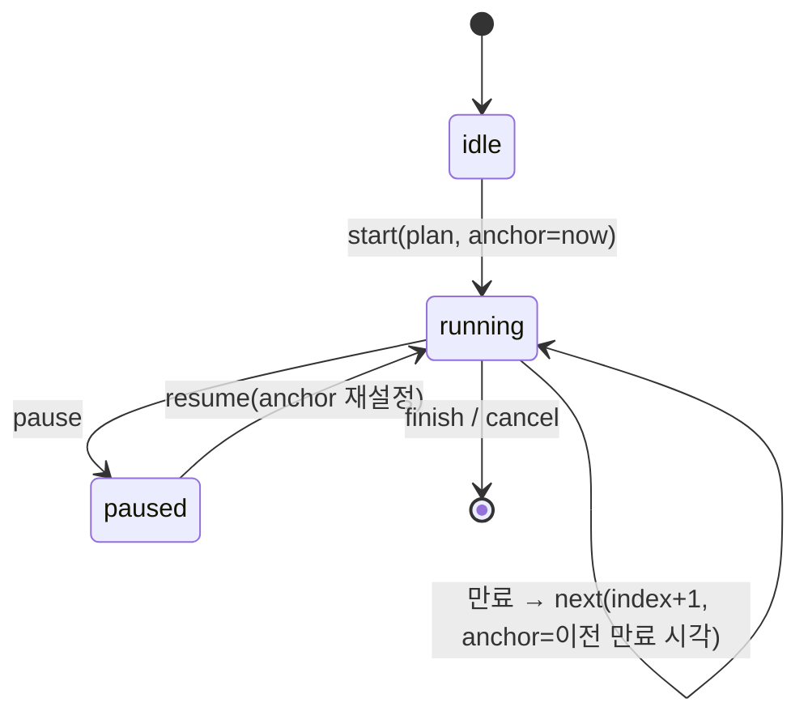

# 벽시계 앵커 타이머 상태기계 — 하나의 엔진, 여러 계획

## 정의

세트 휴식·루틴 인터벌·달리기 타이머처럼 "시간이 흐르는 화면"이 여럿이면, 타이머를 여럿 만들지 않고 **하나의 상태기계에 계획(plan)만 바꿔 끼웁니다**. 엔진의 상태는 카운트다운 숫자가 아니라 **세그먼트 인덱스 + 시작 시각 앵커**이고, 남은 시간은 벽시계에서 매번 계산하는 파생값입니다.

이유는 한 줄입니다. 타이머를 세 개 만들면 "백그라운드 복원"을 세 번 디버깅하게 됩니다. [[src-workout-history-launch]]에서는 세 번째를 만들다 멈추고 엔진을 하나로 합쳤습니다.

## 세그먼트 3종과 계획

| 세그먼트 | 의미 | 끝나는 조건 |
|----------|------|------------|
| `work` | 운동 | 시간형은 자동, 횟수형은 사용자 |
| `rest` | 휴식 | 시간 만료 |
| `openEnded` | 끝을 사용자가 정함(달리기) | 사용자 종료 |

| 계획 | 세그먼트 배열 | 비고 |
|------|--------------|------|
| 세트 모드 | `work ↔ rest` 루프 | 휴식 ±30초 조정, 건너뛰기 |
| 루틴 | 세그먼트 배열 | 시간형 work는 자동 진행 |
| 달리기 | `openEnded` 하나 | 거리는 보정 입력 허용 |



위 도식은 엔진이 가진 상태가 `idle`·`running`·`paused` 셋뿐이고, 화면마다 다른 것은 계획 배열뿐임을 보여줍니다. `running` 안의 자기 전이 둘이 핵심입니다. 첫째는 매 틱마다 남은 시간을 앵커에서 계산하는 전이이고, 둘째는 세그먼트가 만료되면 인덱스를 올리고 앵커를 "이전 만료 시각"으로 옮기는 전이입니다. 앵커를 `now`가 아니라 만료 시각으로 잡아야 앱이 잠들었던 시간만큼 다음 세그먼트가 밀리지 않습니다.

## 구현 골격 — 시계 주입

```dart
class TimerEngine {
  TimerEngine(this.plan, {required this.clock});
  final List<Segment> plan;
  final Clock clock;                 // now()를 직접 부르지 않습니다

  int index = 0;
  late DateTime anchor;              // 현재 세그먼트 시작 시각

  Duration get remaining =>
      plan[index].length - clock.now().difference(anchor);

  /// 앱 복원 직후 또는 매 틱마다 호출. 다운타임이 세그먼트보다 길면 자동 전진.
  void catchUp({int maxAdvance = 8}) {
    var advanced = 0;
    while (remaining.isNegative && advanced < maxAdvance && index < plan.length - 1) {
      anchor = anchor.add(plan[index].length);   // 만료 시각이 다음 앵커
      index++;
      advanced++;
      cues.add(Cue.segmentStarted(plan[index]));
    }
  }

  Snapshot snapshot() => Snapshot(index, anchor);   // 이것만 저장하면 복원 가능
}
```

앱이 죽어도 스냅샷(인덱스·앵커)만 있으면 "남은 휴식"이 정확히 이어집니다. 다운타임이 휴식보다 길었으면 첫 틱에서 다음 세그먼트로 자동 전진하되, 한 틱당 전진 상한(`maxAdvance`)을 두어 며칠 방치된 세션이 수백 번 전진하며 큐를 폭주시키는 일을 막습니다.

| 복원 시나리오 (휴식 60초, 20초 지점에서 앱 종료) | 결과 |
|------|------|
| 10초 뒤 재실행 | 앵커 기준 30초 경과, 남은 30초부터 이어집니다 |
| 90초 뒤 재실행 | 앵커 기준 110초 경과 > 60초, 첫 틱에서 다음 work로 자동 전진합니다 |
| 하루 뒤 재실행 | 상한만큼만 전진하고 멈춥니다 |

## 큐(cue)의 이벤트 발행

엔진은 UI·플랫폼을 모릅니다. 종료 3초 전 카운트다운, 세그먼트 전환, 완료 같은 큐를 이벤트로 발행하고, 별도 서비스가 소비해 햅틱·소리(나중에 TTS)로 바꿉니다.

| 엔진이 아는 것 | 엔진이 모르는 것 |
|---------------|-----------------|
| 계획, 인덱스, 앵커, 시계 | 햅틱·소리·화면·플랫폼 API |
| 큐 이벤트 발행 | 큐를 누가 어떻게 소비하는지 |

이 분리 덕에 엔진은 순수 Dart로 남아 시계를 고정한 단위 테스트가 가능하고, 워치·폰·OS별 알림 차이는 소비자 쪽에서 흡수합니다.

## 계획값 대신 실제값 기록

세트를 저장할 때 "직전 휴식의 실제 경과"를 함께 기록합니다. 계획은 60초였어도 ±30초 조정과 건너뛰기를 거친 실제값이 통계의 진실입니다. [[concept-local-first-append-only]]의 "기록은 행위의 산물" 원칙이 타이머에도 그대로 적용됩니다.

## 같은 인사이트 패턴 — "직접 참조 대신 신호로 협력한다"

| 영역 | 직접 결합 방식 | 신호 협력 방식 | 참조 |
|------|---------------|---------------|------|
| **타이머 큐** | 엔진이 햅틱·소리 API를 직접 호출 | 큐 이벤트 발행 → 별도 서비스가 소비 | (이 페이지) |
| 도메인 이벤트 | 한 트랜잭션에서 타 도메인 갱신 | 커밋 후 이벤트 발행 | [[concept-domain-event-eventual-consistency]] |
| 폰↔워치 | 워치가 폰 DB를 직접 조회 | 멱등 ID 메시지 + 큐 | [[concept-thin-client-idempotent-sync]] |
| 에이전트 오케스트레이션 | 단일 에이전트가 전 단계 수행 | 노드 간 스테이트 전이 | [[concept-graph-engineering]] |

## 같은 인사이트 패턴 — "진실은 하나, 나머지는 파생"

| 영역 | 진실 | 파생 | 참조 |
|------|------|------|------|
| **타이머** | 세그먼트 인덱스 + 시작 앵커 | 남은 시간, 진행률 링 | (이 페이지) |
| 기록 앱 | append-only 기록 | 스트릭·통계 | [[concept-local-first-append-only]] |
| 폰↔워치 | 폰 DB | 워치 스냅샷 | [[concept-thin-client-idempotent-sync]] |

→ 공통 원리: **카운트다운 숫자를 상태로 들고 있으면 앱이 잠든 순간 거짓이 됩니다.** 벽시계와 앵커만 진실로 두면 복원은 "다시 계산"으로 끝납니다.

## 빠른 진단

- "백그라운드 갔다 오면 휴식 시간이 멈춰 있다" → 남은 시간을 상태로 저장하고 틱으로 깎고 있습니다.
- "화면마다 타이머 버그가 따로 있다" → 엔진이 여러 개입니다. 계획만 다른 하나로 합칩니다.
- "타이머 테스트가 실제로 기다린다" → 시계가 주입되지 않았습니다.
- "복원 직후 햅틱이 수십 번 울린다" → 자동 전진에 한 틱당 상한이 없습니다.

## 원본 출처

- raw: `raw/workout-history/TECH_NOTES.md` §4 (2026-09-03 공개 요약)

## 관련 페이지

- [[src-workout-history-launch]] — 이 엔진이 나온 앱의 출시 여정
- [[concept-local-first-append-only]] — 같은 시계 seam 원칙("하루" 경계)과 실제값 기록
- [[concept-thin-client-idempotent-sync]] — 폰↔워치 신호 협력
- [[concept-domain-event-eventual-consistency]] — 이벤트 발행·소비 분리의 서버 쪽 원형
- [[concept-design-patterns]] — 상태 패턴·옵저버 패턴의 교과서적 형태
