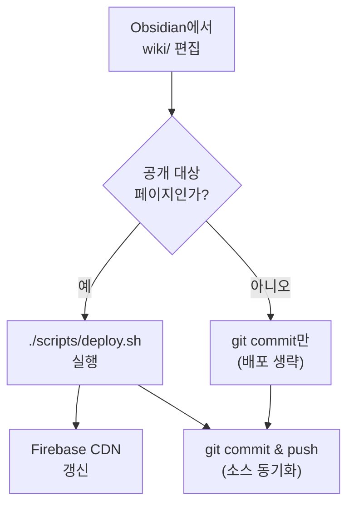

# 위키 배포 가이드 — MkDocs Material + Firebase Hosting

이 위키(`wiki/` 디렉터리)를 정적 사이트로 빌드해 외부에 공개하는 절차. 비용 0원 (도메인 제외), 셋업 1~2시간.

## 결정 배경

| 항목 | 선택 | 이유 |
|------|------|------|
| **SSG** | MkDocs Material | 정보전달력 최강 (검색·TOC), 10년차 안정성, 한국어 자료 풍부 (FastAPI 영향), 단일 메인테이너 활동 활발 |
| **호스팅** | Firebase Hosting | 무료 티어 충분, CDN·SSL 자동, 커스텀 도메인 무료, `firebase deploy` 한 줄 |
| **소스/배포 분리** | 같은 repo 유지 + Firebase 직접 deploy | repo 하나, GitHub 종속 없음 |
| **raw/ 노출** | 제외 | 원본은 비공개, `wiki/` 만 공개 |

## 전체 흐름

<div style="display:flex;flex-direction:column;gap:14px;align-items:center;font-family:sans-serif;margin:24px 0;">

  <div style="background:#eff6ff;border:1px solid #bfdbfe;border-radius:10px;padding:16px;width:100%;box-sizing:border-box;">
    <div style="font-weight:600;margin-bottom:12px;color:#1e40af;font-size:15px;">💻 로컬 머신 — 편집 · 빌드</div>
    <div style="display:flex;align-items:stretch;gap:10px;">
      <div style="background:#dbeafe;border:2px solid #2563eb;border-radius:8px;padding:14px 10px;flex:1;text-align:center;color:#1e3a8a;font-weight:500;">📝<br/>wiki/*.md<br/>편집</div>
      <div style="display:flex;align-items:center;font-size:24px;color:#2563eb;font-weight:bold;">→</div>
      <div style="background:#dbeafe;border:2px solid #2563eb;border-radius:8px;padding:14px 10px;flex:1;text-align:center;color:#1e3a8a;font-weight:500;">🔄<br/>build-site.sh<br/>wiki → docs</div>
      <div style="display:flex;align-items:center;font-size:24px;color:#2563eb;font-weight:bold;">→</div>
      <div style="background:#dbeafe;border:2px solid #2563eb;border-radius:8px;padding:14px 10px;flex:1;text-align:center;color:#1e3a8a;font-weight:500;">🏗️<br/>mkdocs build<br/>HTML 생성</div>
      <div style="display:flex;align-items:center;font-size:24px;color:#2563eb;font-weight:bold;">→</div>
      <div style="background:#dbeafe;border:2px solid #2563eb;border-radius:8px;padding:14px 10px;flex:1;text-align:center;color:#1e3a8a;font-weight:500;">📦<br/>site/<br/>정적 파일</div>
    </div>
  </div>

  <div style="font-size:28px;color:#999;line-height:1;">↓</div>

  <div style="background:#fff7ed;border:1px solid #fed7aa;border-radius:10px;padding:16px;width:100%;box-sizing:border-box;">
    <div style="font-weight:600;margin-bottom:12px;color:#7c2d12;font-size:15px;">🚀 배포</div>
    <div style="background:#fed7aa;border:2px solid #ea580c;border-radius:8px;padding:14px;text-align:center;color:#7c2d12;font-weight:500;">🚀 firebase deploy — Hosting 업로드</div>
  </div>

  <div style="font-size:28px;color:#999;line-height:1;">↓</div>

  <div style="background:#f0fdf4;border:1px solid #bbf7d0;border-radius:10px;padding:16px;width:100%;box-sizing:border-box;">
    <div style="font-weight:600;margin-bottom:12px;color:#15803d;font-size:15px;">🌐 Firebase Hosting — 글로벌 공개</div>
    <div style="display:flex;align-items:stretch;gap:10px;">
      <div style="background:#bbf7d0;border:2px solid #16a34a;border-radius:8px;padding:14px;flex:1;text-align:center;color:#14532d;font-weight:500;">🌍<br/>전 세계 CDN<br/>edge 캐시</div>
      <div style="display:flex;align-items:center;font-size:24px;color:#16a34a;font-weight:bold;">→</div>
      <div style="background:#bbf7d0;border:3px solid #15803d;border-radius:8px;padding:14px;flex:1;text-align:center;color:#14532d;font-weight:600;">🔗<br/>wons-wiki.web.app<br/>공개 URL</div>
    </div>
  </div>

</div>

### 단계별 자세히

**1단계 — 로컬 머신 (편집 · 빌드)**

1. **`wiki/*.md` 편집** — Obsidian에서 마크다운 파일을 평소처럼 편집한다. `[[wikilink]]`, frontmatter, 이미지 모두 그대로 작성.
2. **`build-site.sh`** — 셸 스크립트가 `wiki/`를 `docs/`로 복사하면서 `log.md` 같은 비공개 파일을 제외하고, `[[wikilink]]`를 표준 마크다운 링크로 변환한다.
3. **`mkdocs build`** — `docs/` 안의 마크다운을 Material 테마로 정적 HTML로 변환. 검색 인덱스, 내비게이션, 다크 모드 토글까지 자동 생성.
4. **`site/` 산출물** — 완성된 정적 사이트가 `site/` 디렉터리에 생성된다. 이때까지는 아무도 못 본다.

**2단계 — 배포**

5. **`firebase deploy --only hosting`** — `site/` 디렉터리를 Firebase Hosting에 업로드. 한 번의 명령으로 변경된 파일만 차등 업로드되어 빠르다.

**3단계 — Firebase Hosting (글로벌 공개)**

6. **전 세계 CDN edge 캐시** — Firebase가 업로드된 파일을 전 세계 edge 서버에 자동 배포·캐싱. SSL 인증서도 무료로 자동 적용.
7. **`wons-wiki.web.app`** — 사용자가 이 URL로 접속하면 가장 가까운 edge에서 콘텐츠가 즉시 응답된다. 한국·미국·유럽 모두 빠르게.

> **핵심 분리**: `wiki/` 편집(개인) → `docs/`·`site/` 빌드(자동 변환) → Firebase Hosting(글로벌 공개). 각 단계는 명확히 분리되어 있어 디버깅이 쉽다.

## 사전 결정 포인트

진행 전 확정할 것:

- **공개 범위**: `wiki/` 전체? 또는 일부 페이지만? (예: `log.md` 비공개)
- **Firebase 프로젝트**: 신규 vs 기존 GCP 프로젝트 연결
- **도메인**: `<project>.web.app` 무료 도메인으로 충분? vs 커스텀 도메인
- **자동화**: 로컬에서 수동 `firebase deploy` vs GitHub Actions 자동 배포

---

## Step 1 — MkDocs Material 설치

Python 3.9+ 필요. 프로젝트 격리를 위해 venv 권장.

```bash
cd /Users/jungwonpark/Documents/my-wiki

python3 -m venv .venv
source .venv/bin/activate

pip install mkdocs-material
pip install pymdown-extensions       # 코드 하이라이트, 어드모니션 등
pip install mkdocs-glightbox         # 이미지 라이트박스
pip install mkdocs-roamlinks-plugin  # [[wikilink]] 호환

# requirements 고정
pip freeze > requirements.txt
```

`.gitignore` 에 추가:

```gitignore
.venv/
site/
__pycache__/
```

## Step 2 — 디렉터리 매핑 (wiki/ → docs/)

MkDocs는 기본적으로 `docs/` 를 소스로 본다. `wiki/` 를 그대로 쓰지 않는 이유:
- `wiki/log.md`, `wiki/index.md` 등 위키 전용 메타 파일을 공개에서 제외 가능
- 빌드 시점에 변환·필터링 단계를 끼울 수 있음

방법 A — **빌드 스크립트로 복사** (권장)

`scripts/build-site.sh`:

```bash
#!/usr/bin/env bash
set -euo pipefail

ROOT="$(cd "$(dirname "$0")/.." && pwd)"
cd "$ROOT"

# 1. docs/ 초기화
rm -rf docs
mkdir -p docs

# 2. wiki/ → docs/ 복사 (공개 제외 항목 필터)
rsync -a \
  --exclude 'log.md' \
  wiki/ docs/

# 3. raw/assets/ 의 이미지가 wiki에서 참조되면 함께 복사
if [ -d "raw/assets" ]; then
  mkdir -p docs/assets
  cp -R raw/assets/ docs/assets/
fi

# 4. mkdocs 빌드
mkdocs build --strict
```

```bash
chmod +x scripts/build-site.sh
```

방법 B — **mkdocs.yml `docs_dir: wiki`** 직접 지정 (단순하지만 필터링 불가)

이 가이드는 방법 A 기준으로 진행.

## Step 3 — `mkdocs.yml` 설정

루트에 `mkdocs.yml` 생성:

```yaml
site_name: Wons Wiki
site_description: 박정원의 개인 지식 위키
site_author: JungWon Park
site_url: https://wiki.example.com   # 커스텀 도메인 또는 firebase URL

# 빌드 스크립트가 docs/ 를 만든다는 가정
docs_dir: docs
site_dir: site

theme:
  name: material
  language: ko
  palette:
    # 라이트/다크 토글
    - media: "(prefers-color-scheme: light)"
      scheme: default
      primary: indigo
      accent: indigo
      toggle:
        icon: material/brightness-7
        name: 다크 모드로 전환
    - media: "(prefers-color-scheme: dark)"
      scheme: slate
      primary: indigo
      accent: indigo
      toggle:
        icon: material/brightness-4
        name: 라이트 모드로 전환
  features:
    - navigation.instant       # SPA처럼 빠른 전환
    - navigation.tracking      # URL에 현재 섹션 반영
    - navigation.tabs          # 상단 탭 (카테고리)
    - navigation.sections      # 사이드바 섹션
    - navigation.indexes       # index.md 가 섹션 대표 페이지
    - navigation.top           # 위로 가기 버튼
    - search.suggest           # 검색 제안
    - search.highlight         # 검색어 하이라이트
    - search.share             # 검색 결과 공유
    - content.code.copy        # 코드 블록 복사 버튼
    - content.code.annotate    # 코드 어노테이션
    - content.tabs.link        # 탭 동기화
  icon:
    repo: fontawesome/brands/github

# 한국어 검색 (CJK 토크나이저 자동 적용)
plugins:
  - search:
      lang: ko
  - roamlinks       # [[파일명]] 위키링크 자동 변환
  - glightbox       # 이미지 클릭 시 라이트박스

# 마크다운 확장
markdown_extensions:
  - admonition                # !!! note 박스
  - attr_list                 # 속성 부착
  - md_in_html
  - footnotes
  - tables
  - toc:
      permalink: true         # 헤더에 앵커 링크
      toc_depth: 3
  - pymdownx.highlight:
      anchor_linenums: true
      line_spans: __span
      pygments_lang_class: true
  - pymdownx.inlinehilite
  - pymdownx.snippets
  - pymdownx.superfences:
      custom_fences:
        - name: mermaid
          class: mermaid
          format: !!python/name:pymdownx.superfences.fence_code_format
  - pymdownx.tabbed:
      alternate_style: true
  - pymdownx.tasklist:
      custom_checkbox: true
  - pymdownx.details
  - pymdownx.emoji:
      emoji_index: !!python/name:material.extensions.emoji.twemoji
      emoji_generator: !!python/name:material.extensions.emoji.to_svg

# 사이트 네비게이션 (자동 생성도 가능하지만 명시 권장)
nav:
  - 홈: index.md
  - Sources:
    - src-llm-wiki-pattern.md
    - src-spring-boot.md
    - src-spring-framework-7.md
    # ... 필요 페이지
  - Concepts:
    - concept-compounding-knowledge.md
    - concept-memex.md
    # ...
  - Entities:
    - entity-obsidian.md
    # ...
  - Guides:
    - guide-project-docs-setup.md
    - guide-deploy-mkdocs-firebase.md

extra:
  social:
    - icon: fontawesome/brands/github
      link: https://github.com/<your-handle>

copyright: © 2026 JungWon Park
```

> **Tip**: `nav:` 를 생략하면 파일 시스템 기준으로 자동 생성. 위키가 커지면 명시하는 게 깔끔.

## Step 4 — Obsidian `[[링크]]` 호환

- `mkdocs-roamlinks-plugin` 이 자동으로 `[[파일명]]` → `[파일명](파일명.md)` 변환.
- frontmatter `sources:`, `external:` 같은 비표준 필드는 MkDocs가 무시하므로 안전.
- 이미지 임베드 `![[image.png]]` 는 별도 처리 필요 → 본문에선 표준 마크다운 `` 권장.

## Step 5 — 로컬 미리보기

```bash
source .venv/bin/activate
./scripts/build-site.sh    # docs/ 생성
mkdocs serve               # http://127.0.0.1:8000
```

- **핫 리로드**: `docs/` 파일 저장하면 자동 새로고침
- **`wiki/` 직접 편집 워크플로**: Obsidian으로 `wiki/` 편집 → 별도 터미널에서 `./scripts/build-site.sh` 재실행 (또는 fswatch 등으로 자동화)

자동 재빌드 셸 (선택):

```bash
brew install fswatch

fswatch -o wiki/ | while read; do
  ./scripts/build-site.sh
done &

mkdocs serve --dirtyreload
```

## Step 6 — Firebase 프로젝트 생성

1. https://console.firebase.google.com → 프로젝트 추가
2. 이름: `wons-wiki` (예시)
3. Google Analytics 사용 여부 선택 (개인 위키는 비활성 권장)
4. 프로젝트 생성 완료 후 좌측 메뉴 → **Hosting** → 시작하기

## Step 7 — Firebase CLI 설치 및 초기화

```bash
# CLI 설치 (글로벌 1회)
npm install -g firebase-tools

# 로그인 (브라우저 열림)
firebase login

# 프로젝트 디렉터리에서 초기화
cd /Users/jungwonpark/Documents/my-wiki
firebase init hosting
```

대화형 프롬프트 응답:

| 질문 | 응답 |
|------|------|
| Use an existing project | `wons-wiki` 선택 |
| Public directory | `site` (mkdocs 빌드 출력) |
| Configure as single-page app | **No** |
| Set up automatic builds with GitHub | **No** (수동 배포 권장 — 종속 회피) |
| File `site/404.html` already exists. Overwrite? | **No** |
| File `site/index.html` already exists. Overwrite? | **No** |

생성된 `firebase.json`:

```json
{
  "hosting": {
    "public": "site",
    "ignore": [
      "firebase.json",
      "**/.*",
      "**/node_modules/**"
    ],
    "headers": [
      {
        "source": "**/*.@(css|js|woff2|svg|png|jpg|webp)",
        "headers": [
          { "key": "Cache-Control", "value": "public, max-age=31536000, immutable" }
        ]
      },
      {
        "source": "**/*.html",
        "headers": [
          { "key": "Cache-Control", "value": "public, max-age=300, must-revalidate" }
        ]
      }
    ]
  }
}
```

## Step 8 — 첫 배포

```bash
./scripts/build-site.sh     # site/ 생성
firebase deploy --only hosting
```

배포 완료 후 출력되는 URL:
- `https://wons-wiki.web.app`
- `https://wons-wiki.firebaseapp.com`

## Step 9 — 커스텀 도메인 (선택)

1. Firebase 콘솔 → Hosting → **Add custom domain**
2. 도메인 입력 (예: `wiki.jungwon.dev`)
3. Firebase가 제공하는 DNS 레코드를 도메인 등록처(가비아·Cloudflare·Route 53 등)에 추가
   - `A` 레코드 2개 (Firebase IP)
   - 또는 `CNAME` 레코드
4. DNS 전파 대기 (수 분 ~ 수 시간)
5. SSL 인증서 자동 발급 (Let's Encrypt 기반)

## Step 10 — 배포 자동화 (선택)

GitHub Actions를 쓰지 않고 로컬 스크립트로 통합:

`scripts/deploy.sh`:

```bash
#!/usr/bin/env bash
set -euo pipefail

ROOT="$(cd "$(dirname "$0")/.." && pwd)"
cd "$ROOT"

echo "▶ 빌드 중..."
source .venv/bin/activate
./scripts/build-site.sh

echo "▶ Firebase 배포 중..."
firebase deploy --only hosting

echo "✅ 배포 완료: https://wons-wiki.web.app"
```

```bash
chmod +x scripts/deploy.sh
```

일상 운영: `./scripts/deploy.sh` 한 번만 실행.

GitHub Actions를 원한다면 `firebase init hosting:github` 가 워크플로 파일 자동 생성. (GitHub 종속이 싫다면 위 로컬 스크립트로 충분.)

---

## 트러블슈팅

| 증상 | 원인 | 해결 |
|------|------|------|
| `mkdocs build` 가 `WARNING: A relative path '...' is included...` | wiki 내부 깨진 링크 | `--strict` 로 발견. `[[파일명]]` 의 파일이 실제 존재하는지 확인 |
| 한국어 검색이 안 됨 | `plugins.search.lang` 누락 | `mkdocs.yml` 에 `lang: ko` 명시 |
| `firebase deploy` 가 `Error: HTTP Error: 403` | Firebase 권한 누락 | `firebase login --reauth` |
| 사이트는 떠도 CSS 깨짐 | `site_url` 미설정 또는 잘못된 base path | `mkdocs.yml` 의 `site_url` 확인 |
| `[[링크]]` 가 그대로 노출 | `roamlinks` 플러그인 누락 | `pip install mkdocs-roamlinks-plugin` + `mkdocs.yml` plugins 추가 |
| Mermaid 다이어그램 렌더 안 됨 | superfences custom_fence 누락 | Step 3 의 `pymdownx.superfences.custom_fences` 블록 확인 |

---

## 유지보수 흐름



**흐름 설명**:

1. **편집**: Obsidian에서 `wiki/*.md`를 평소처럼 편집.
2. **갈림길**: 이 수정이 공개 사이트에도 반영해야 할 내용인가?
   - **예**: `./scripts/deploy.sh`를 실행 (빌드 + Firebase 배포 + git commit·push 한 번에).
   - **아니오**: 비공개 작업(개인 메모, 실험)이면 `git commit`만 (Firebase 배포 생략).
3. **분기 후 합류**: 두 경로 모두 마지막은 `git commit & push`로 만나 소스 동기화.

권장 패턴:
- **편집 ↔ 즉시 배포**: 가벼운 수정은 `deploy.sh` 한 번. 1~2분 내 반영.
- **대규모 작업**: 로컬 `mkdocs serve`로 미리 확인 → 만족 시 `deploy.sh`.
- **롤백**: Firebase 콘솔 → Hosting → Release history → 원하는 버전 옆 "Rollback".

## 비용 예상

| 항목 | 비용 |
|------|------|
| MkDocs Material (OSS) | 0원 |
| Firebase Hosting | 무료 티어 내 (10GB 저장 + 360MB/일 전송) |
| `<project>.web.app` 도메인 | 0원 |
| 커스텀 도메인 (선택) | 연 1~2만원 (가비아·Namecheap 등) |
| SSL 인증서 | 0원 (자동) |
| **합계** | **0원 ~ 연 2만원** |

## 참고 자료

- MkDocs Material 공식: https://squidfunk.github.io/mkdocs-material/
- MkDocs 코어: https://www.mkdocs.org/
- Firebase Hosting: https://firebase.google.com/docs/hosting
- FastAPI 문서 (Material for MkDocs 사용 예): https://fastapi.tiangolo.com/
- 관련 위키 페이지: [[entity-obsidian]], [[guide-project-docs-setup]]
