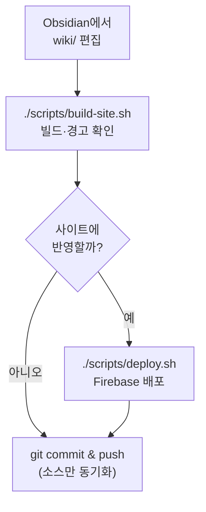

# 위키 배포 가이드 — MkDocs Material + Firebase Hosting

이 위키(`wiki/` 디렉터리)를 정적 사이트로 빌드해 외부에 공개하는 절차입니다. 실제 운영 중인 [wiki.wonslab.dev](https://wiki.wonslab.dev)의 설정 파일·스크립트를 그대로 옮겼으므로, 같은 구조의 저장소라면 이 순서대로 따라 하면 됩니다. 비용은 0원(도메인 제외)이고 셋업은 1~2시간 걸립니다.

## 결정 배경

| 항목 | 선택 | 이유 |
|------|------|------|
| **SSG** | MkDocs Material | 검색·목차 등 정보 전달력이 좋고, 오래 검증되었으며 한국어 자료가 풍부합니다 |
| **호스팅** | Firebase Hosting | 무료 티어로 충분하고 CDN·SSL·커스텀 도메인이 무료이며 `firebase deploy` 한 줄로 배포합니다 |
| **소스/배포 분리** | 같은 repo 유지 + Firebase 직접 deploy | 저장소 하나로 관리하고 GitHub에 종속되지 않습니다 |
| **raw/ 노출** | 제외 (`raw/assets/` 이미지만 복사) | 원본은 비공개로 두고 `wiki/`만 공개합니다 |

## 전체 흐름

<div style="display:flex;flex-direction:column;gap:14px;align-items:center;font-family:sans-serif;margin:24px 0;">

  <div style="background:#eff6ff;border:1px solid #bfdbfe;border-radius:10px;padding:16px;width:100%;box-sizing:border-box;">
    <div style="font-weight:600;margin-bottom:12px;color:#1e40af;font-size:15px;">💻 로컬 머신 — 편집 · 빌드</div>
    <div style="display:flex;align-items:stretch;gap:10px;">
      <div style="background:#dbeafe;border:2px solid #2563eb;border-radius:8px;padding:14px 10px;flex:1;text-align:center;color:#1e3a8a;font-weight:500;">📝<br/>wiki/*.md<br/>편집</div>
      <div style="display:flex;align-items:center;font-size:24px;color:#2563eb;font-weight:bold;">→</div>
      <div style="background:#dbeafe;border:2px solid #2563eb;border-radius:8px;padding:14px 10px;flex:1;text-align:center;color:#1e3a8a;font-weight:500;">🔄<br/>build-site.sh<br/>wiki → docs · 링크 변환</div>
      <div style="display:flex;align-items:center;font-size:24px;color:#2563eb;font-weight:bold;">→</div>
      <div style="background:#dbeafe;border:2px solid #2563eb;border-radius:8px;padding:14px 10px;flex:1;text-align:center;color:#1e3a8a;font-weight:500;">🏗️<br/>mkdocs build<br/>HTML 생성</div>
      <div style="display:flex;align-items:center;font-size:24px;color:#2563eb;font-weight:bold;">→</div>
      <div style="background:#dbeafe;border:2px solid #2563eb;border-radius:8px;padding:14px 10px;flex:1;text-align:center;color:#1e3a8a;font-weight:500;">📦<br/>site/<br/>정적 파일</div>
    </div>
  </div>

  <div style="font-size:28px;color:#999;line-height:1;">↓</div>

  <div style="background:#fff7ed;border:1px solid #fed7aa;border-radius:10px;padding:16px;width:100%;box-sizing:border-box;">
    <div style="font-weight:600;margin-bottom:12px;color:#7c2d12;font-size:15px;">🚀 배포</div>
    <div style="background:#fed7aa;border:2px solid #ea580c;border-radius:8px;padding:14px;text-align:center;color:#7c2d12;font-weight:500;">🚀 firebase deploy — Hosting 업로드</div>
  </div>

  <div style="font-size:28px;color:#999;line-height:1;">↓</div>

  <div style="background:#f0fdf4;border:1px solid #bbf7d0;border-radius:10px;padding:16px;width:100%;box-sizing:border-box;">
    <div style="font-weight:600;margin-bottom:12px;color:#15803d;font-size:15px;">🌐 Firebase Hosting — 글로벌 공개</div>
    <div style="display:flex;align-items:stretch;gap:10px;">
      <div style="background:#bbf7d0;border:2px solid #16a34a;border-radius:8px;padding:14px;flex:1;text-align:center;color:#14532d;font-weight:500;">🌍<br/>전 세계 CDN<br/>edge 캐시</div>
      <div style="display:flex;align-items:center;font-size:24px;color:#16a34a;font-weight:bold;">→</div>
      <div style="background:#bbf7d0;border:3px solid #15803d;border-radius:8px;padding:14px;flex:1;text-align:center;color:#14532d;font-weight:600;">🔗<br/>wiki.wonslab.dev<br/>공개 URL</div>
    </div>
  </div>

</div>

### 단계별 자세히

**1단계 — 로컬 머신 (편집 · 빌드)**

1. **`wiki/*.md` 편집** — Obsidian에서 마크다운 파일을 평소처럼 편집합니다. `[[wikilink]]`, frontmatter, 이미지를 모두 그대로 작성합니다.
2. **`build-site.sh`** — 셸 스크립트가 `wiki/`를 `docs/`로 복사하면서 `log.md`를 제외하고, `raw/assets/` 이미지와 사이트 전용 CSS를 함께 복사한 뒤 `scripts/wikilinks.py`로 `[[wikilink]]`를 표준 마크다운 링크로 변환합니다.
3. **`mkdocs build --clean`** — `docs/` 안의 마크다운을 Material 테마로 정적 HTML로 변환합니다. 검색 인덱스, 내비게이션, 다크 모드 토글, 새 글 🆕 배지까지 이때 생성됩니다.
4. **`site/` 산출물** — 완성된 정적 사이트가 `site/` 디렉터리에 생성됩니다. 이때까지는 아무도 볼 수 없습니다.

**2단계 — 배포**

5. **`firebase deploy --only hosting`** — `site/` 디렉터리를 Firebase Hosting에 업로드합니다. 변경된 파일만 차등 업로드되어 빠릅니다.

**3단계 — Firebase Hosting (글로벌 공개)**

6. **전 세계 CDN edge 캐시** — Firebase가 업로드된 파일을 전 세계 edge 서버에 배포·캐싱합니다. SSL 인증서도 무료로 자동 적용됩니다.
7. **`wiki.wonslab.dev`** — 사용자가 접속하면 가장 가까운 edge에서 콘텐츠가 응답합니다. 기본 주소 `wons-wiki.web.app`도 계속 동작합니다.

> **핵심 분리**: `wiki/` 편집(원본) → `docs/`·`site/` 빌드(자동 변환, git 추적 안 함) → Firebase Hosting(공개). 단계가 분리되어 있어 어느 단계에서 문제가 생겼는지 찾기 쉽습니다.

## 사전 결정 포인트

진행 전에 다음을 확정합니다.

- **공개 범위**: `wiki/` 전체를 공개할지, 일부를 제외할지 정합니다. 이 위키는 작업 기록인 `log.md`만 제외합니다.
- **Firebase 프로젝트**: 신규 프로젝트를 만들지, 기존 GCP 프로젝트에 연결할지 정합니다.
- **도메인**: 무료 `<project>.web.app`으로 충분한지, 커스텀 도메인을 붙일지 정합니다.
- **자동화**: 로컬에서 수동 `firebase deploy`로 배포할지, GitHub Actions로 자동 배포할지 정합니다.

---

## Step 1 — MkDocs Material 설치

Python 3.9 이상이 필요합니다. 프로젝트 격리를 위해 venv를 권장합니다. 빌드 스크립트는 `.venv/`가 있으면 그 안의 Python·MkDocs를 우선 사용합니다.

```bash
cd <프로젝트_루트>          # 본인 위키 저장소 경로로 교체

python3 -m venv .venv
source .venv/bin/activate

pip install mkdocs-material          # pymdown-extensions 포함
pip install mkdocs-glightbox         # 이미지 라이트박스

# 버전 고정
pip freeze > requirements.txt
```

`[[wikilink]]` 변환은 플러그인이 아니라 Step 4의 자체 스크립트가 담당하므로 별도 플러그인을 설치하지 않습니다.

`.gitignore`에 빌드 산출물을 추가합니다.

```gitignore
.venv/
docs/
site/
__pycache__/
.firebase/
firebase-debug.log
```

## Step 2 — 빌드 스크립트 (wiki/ → docs/ → site/)

MkDocs는 `docs/`를 소스로 봅니다. `wiki/`를 직접 소스로 쓰지 않고 복사본을 만드는 이유는 다음과 같습니다.

- 작업 기록(`log.md`)처럼 공개하지 않을 파일을 걸러낼 수 있습니다.
- `raw/assets/` 이미지, 사이트 전용 CSS를 빌드 시점에만 합칠 수 있습니다.
- `[[wikilink]]` 변환을 복사본에만 적용하므로 Obsidian용 원본이 그대로 유지됩니다.

`index.md`는 제외하지 않습니다. 위키 전체 목록이 곧 사이트 홈(`nav`의 `홈: index.md`)이 됩니다.

**파일**: `scripts/build-site.sh`

```bash
#!/usr/bin/env bash
# wiki/ 를 docs/ 로 복사한 뒤 MkDocs 빌드
set -euo pipefail

ROOT="$(cd "$(dirname "$0")/.." && pwd)"
cd "$ROOT"

echo "▶ docs/ 초기화"
rm -rf docs
mkdir -p docs

echo "▶ wiki/ → docs/ 복사 (log.md 제외)"
rsync -a \
  --exclude 'log.md' \
  wiki/ docs/

if [ -d "raw/assets" ]; then
  echo "▶ raw/assets/ → docs/assets/ 복사"
  mkdir -p docs/assets
  cp -R raw/assets/ docs/assets/
fi

if [ -d "scripts/css" ]; then
  echo "▶ 사이트 전용 CSS → docs/stylesheets/ 복사"
  mkdir -p docs/stylesheets
  cp scripts/css/*.css docs/stylesheets/
fi

echo "▶ [[wikilink]] → 표준 마크다운 변환"
if [ -x ".venv/bin/python3" ]; then
  .venv/bin/python3 scripts/wikilinks.py docs
else
  python3 scripts/wikilinks.py docs
fi

echo "▶ mkdocs build"
if [ -x ".venv/bin/mkdocs" ]; then
  .venv/bin/mkdocs build --clean
else
  mkdocs build --clean
fi

echo "✅ 빌드 완료 → site/"
```

실행 권한을 줍니다.

```bash
chmod +x scripts/build-site.sh
```

단계별 역할은 다음과 같습니다.

| 단계 | 하는 일 |
|------|---------|
| docs/ 초기화 | 이전 빌드 잔재(삭제된 페이지)가 남지 않도록 매번 새로 만듭니다 |
| rsync 복사 | `wiki/` 전체를 복사하되 `log.md`는 제외합니다 |
| raw/assets 복사 | 페이지가 참조하는 이미지를 `docs/assets/`로 옮깁니다 (원본 `raw/`는 공개하지 않습니다) |
| CSS 복사 | `scripts/css/extra.css`를 `docs/stylesheets/`에 두어 `mkdocs.yml`의 `extra_css`가 찾게 합니다 |
| wikilinks 변환 | `[[파일명]]`을 `[파일명](파일명.md)`로 바꿉니다 (Step 4) |
| mkdocs build | `--clean`으로 `site/`를 비운 뒤 다시 생성합니다 |

`--clean`은 `site/`에 남은 이전 산출물을 지우는 옵션입니다. 깨진 링크 경고를 빌드 실패로 만들고 싶다면 `--strict`를 추가할 수 있지만, 이 위키는 경고를 출력으로 확인하는 방식으로 운영합니다.

사이트 전용 CSS 예시는 다음과 같습니다.

**파일**: `scripts/css/extra.css`

```css
/* Mermaid 다이어그램 중앙 정렬 — Material 기본 스타일에 우선 적용 */
.md-typeset .mermaid,
.mermaid {
  text-align: center !important;
}

/* 우측 목차(TOC) 숨김 — 본문 가독성 우선 */
.md-sidebar--secondary {
  display: none !important;
}

/* admonition(콜아웃 박스) 글자 크기 — Material 기본(.64rem)이 본문보다 작아 확대 */
.md-typeset .admonition,
.md-typeset details {
  font-size: .8rem;
}
```

## Step 3 — `mkdocs.yml` 설정

루트에 `mkdocs.yml`을 만듭니다. 아래는 이 위키의 실제 설정이며, `nav`만 일부를 생략했습니다.

**파일**: `mkdocs.yml`

```yaml
site_name: Wons Wiki
site_description: wonslab의 개인 지식 위키 (Second Brain)
site_author: wonslab
site_url: https://wiki.wonslab.dev

docs_dir: docs          # 빌드 스크립트가 만든 복사본
site_dir: site

theme:
  name: material
  custom_dir: overrides # 템플릿 확장 (선택)
  language: ko
  palette:
    - media: "(prefers-color-scheme: light)"
      scheme: default
      primary: indigo
      accent: indigo
      toggle:
        icon: material/brightness-7
        name: 다크 모드로 전환
    - media: "(prefers-color-scheme: dark)"
      scheme: slate
      primary: indigo
      accent: indigo
      toggle:
        icon: material/brightness-4
        name: 라이트 모드로 전환
  features:
    - navigation.instant    # SPA처럼 빠른 전환
    - navigation.tracking   # URL에 현재 섹션 반영
    - navigation.tabs       # 상단 탭 (카테고리)
    - navigation.indexes    # 섹션 대표 페이지
    - navigation.prune      # 큰 nav에서 HTML 크기 절감
    - navigation.top        # 위로 가기 버튼
    - toc.follow
    - search.suggest
    - search.highlight
    - search.share
    - content.code.copy     # 코드 블록 복사 버튼
    - content.code.annotate
    - content.tabs.link
  icon:
    repo: fontawesome/brands/github

hooks:
  - scripts/new_badge.py    # 최근 30일 신규 페이지에 🆕 (Step 5)

plugins:
  - search:
      lang: ko
  - glightbox

markdown_extensions:
  - admonition
  - attr_list
  - md_in_html
  - footnotes
  - tables
  - toc:
      permalink: true
      toc_depth: 3
      slugify: !!python/object/apply:pymdownx.slugs.slugify
        kwds:
          case: lower
  - pymdownx.highlight:
      anchor_linenums: true
      line_spans: __span
      pygments_lang_class: true
  - pymdownx.inlinehilite
  - pymdownx.snippets
  - pymdownx.superfences:
      custom_fences:
        - name: mermaid
          class: mermaid
          format: !!python/name:pymdownx.superfences.fence_code_format
  - pymdownx.tabbed:
      alternate_style: true
  - pymdownx.tasklist:
      custom_checkbox: true
  - pymdownx.details
  - pymdownx.emoji:
      emoji_index: !!python/name:material.extensions.emoji.twemoji
      emoji_generator: !!python/name:material.extensions.emoji.to_svg

nav:
  - 홈: index.md
  - 위키·지식관리:
    - 개념:
      - 복리 지식: concept-compounding-knowledge.md
      - Memex: concept-memex.md
    - 환경설정:
      - 위키 배포: guide-deploy-mkdocs-firebase.md
  # ... 이하 카테고리 생략

extra:
  generator: false          # 푸터의 "Made with Material" 숨김

extra_css:
  - stylesheets/extra.css   # build-site.sh 가 복사

copyright: '© 2026 wonslab'
```

설정에서 눈여겨볼 부분은 다음과 같습니다.

| 항목 | 설명 |
|------|------|
| `toc.slugify` | 한글 제목도 앵커가 생성되도록 `pymdownx.slugs.slugify`를 씁니다 |
| `custom_dir: overrides` | `overrides/main.html`에서 `base.html`을 확장해 검색엔진 소유 확인 `<meta>` 태그 등을 넣습니다. 필요 없으면 이 줄을 지웁니다 |
| `hooks` | 플러그인 패키지 없이 Python 파일 하나로 빌드 과정에 끼어듭니다 |
| `nav` | 생략하면 파일 시스템 기준으로 자동 생성됩니다. 페이지가 많아지면 명시하는 편이 관리하기 좋습니다 |

`overrides/main.html` 예시는 다음과 같습니다.

**파일**: `overrides/main.html`

```html



  {{ super() }}
  <meta name="google-site-verification" content="<발급받은 값>" />

```

## Step 4 — Obsidian `[[링크]]` 변환 (`scripts/wikilinks.py`)

Obsidian의 `[[파일명]]`은 MkDocs가 이해하지 못하므로, 빌드 직전에 `docs/` 복사본을 표준 마크다운 링크로 바꿉니다. 외부 플러그인 대신 표준 라이브러리만 쓰는 스크립트 하나로 처리합니다.

| 원본 | 변환 결과 |
|------|-----------|
| `[[name]]` | `[name](name.md)` |
| `[[name|alias]]` | `[alias](name.md)` |
| `![[image.png]]` | `` |
| 코드블록·인라인 코드 안의 `[[...]]` | 변환하지 않습니다 (예시 코드 보호) |
| `\[\[name\]\]` (이스케이프) | 링크로 바꾸지 않고 `[[name]]` 글자로 표시합니다 |

**파일**: `scripts/wikilinks.py`

```python
#!/usr/bin/env python3
r"""Convert Obsidian [[wikilink]] to standard markdown links.

- 코드블록 (```...```) 과 인라인 코드 (`...`) 안의 [[...]] 는 보호
- [[name]]       → [name](name.md)
- [[name|alias]] → [alias](name.md)
- ![[image.png]] →  (이미지 임베드)
- 백슬래시 이스케이프 \[\[name\]\] 는 변환하지 않고 \[ \] 만 풀어줌

Usage: python3 scripts/wikilinks.py <docs_dir>
"""
from __future__ import annotations

import re
import sys
from pathlib import Path

CODE_BLOCK = re.compile(r"```[\s\S]*?```")
INLINE_CODE = re.compile(r"`[^`\n]*`")
WIKILINK = re.compile(r"!?\[\[([^\[\]\n]+?)\]\]")
ESCAPED = re.compile(r"\\\[\\\[([^\n]+?)\\\]\\\]")


def _convert(match: re.Match[str]) -> str:
    raw = match.group(0)
    inner = match.group(1)
    is_embed = raw.startswith("!")
    if "|" in inner:
        target, _, alias = inner.partition("|")
    else:
        target, alias = inner, inner
    target = target.strip()
    alias = alias.strip()
    if is_embed:
        return f""
    # 이미 .md 확장자가 있거나 URL인 경우 그대로
    if target.startswith(("http://", "https://", "/")) or target.endswith(".md"):
        return f"[{alias}]({target})"
    return f"[{alias}]({target}.md)"


def _unescape(match: re.Match[str]) -> str:
    return f"[[{match.group(1)}]]"


def convert(text: str) -> str:
    placeholders: list[str] = []

    def stash(m: re.Match[str]) -> str:
        placeholders.append(m.group(0))
        return f"\x00WIKI_STASH_{len(placeholders) - 1}\x00"

    text = CODE_BLOCK.sub(stash, text)
    text = INLINE_CODE.sub(stash, text)
    text = WIKILINK.sub(_convert, text)
    text = ESCAPED.sub(_unescape, text)

    def restore(m: re.Match[str]) -> str:
        return placeholders[int(m.group(1))]

    text = re.sub(r"\x00WIKI_STASH_(\d+)\x00", restore, text)
    return text


def main(docs_dir: str) -> None:
    root = Path(docs_dir)
    converted = 0
    for md_file in root.rglob("*.md"):
        original = md_file.read_text(encoding="utf-8")
        new = convert(original)
        if new != original:
            md_file.write_text(new, encoding="utf-8")
            converted += 1
    print(f"  wikilinks 변환: {converted}개 파일")


if __name__ == "__main__":
    if len(sys.argv) != 2:
        print("Usage: python3 scripts/wikilinks.py <docs_dir>", file=sys.stderr)
        sys.exit(1)
    main(sys.argv[1])
```

핵심은 `convert()`의 순서입니다. 코드블록과 인라인 코드를 먼저 자리표시자로 빼 두고(`stash`), 링크를 변환한 뒤 되돌립니다(`restore`). 이렇게 해야 `[[...]]`를 설명하는 예시 코드가 링크로 바뀌지 않습니다. 모든 페이지가 `docs/` 한 디렉터리에 평평하게 있으므로 경로 없이 `파일명.md`로 연결해도 됩니다.

frontmatter의 `sources:`, `external:` 같은 비표준 필드는 MkDocs가 무시하므로 그대로 두어도 됩니다.

## Step 5 — 새 페이지 🆕 배지 (`scripts/new_badge.py`)

최근에 추가된 페이지를 메뉴에서 눈에 띄게 하려고 MkDocs [hooks](https://www.mkdocs.org/user-guide/configuration/#hooks)를 씁니다. hook은 `mkdocs.yml`의 `hooks:`에 Python 파일 경로를 적으면 빌드 이벤트마다 해당 함수가 호출되는 기능이며, 플러그인 패키지를 만들 필요가 없습니다.

**파일**: `scripts/new_badge.py`

```python
"""MkDocs hook — frontmatter `created`가 NEW_DAYS일 이내인 페이지의 메뉴 제목에 🆕를 붙인다.

빌드 시점 기준이므로, 배지는 30일이 지난 뒤 다음 빌드·배포에서 사라진다.
"""
import datetime as dt
import re

NEW_DAYS = 30
CREATED = re.compile(r"^created:\s*(\d{4}-\d{2}-\d{2})", re.M)


def on_nav(nav, config, files):
    today = dt.date.today()
    for page in nav.pages:
        try:
            head = open(page.file.abs_src_path, encoding="utf-8").read(2000)
        except OSError:
            continue
        m = CREATED.search(head)
        if m and page.title and (today - dt.date.fromisoformat(m.group(1))).days <= NEW_DAYS:
            page.title = "🆕 " + page.title
    return nav
```

동작 방식은 다음과 같습니다.

- `on_nav`는 내비게이션이 만들어진 직후 호출됩니다. 각 페이지 파일 앞부분에서 frontmatter `created:` 날짜를 읽습니다.
- `created`가 오늘로부터 30일(`NEW_DAYS`) 이내면 메뉴 제목 앞에 `🆕 `를 붙입니다. 사람이 배지를 달거나 뗄 필요가 없습니다.
- 판정 기준은 **빌드한 날짜**입니다. 30일이 지나도 다시 빌드·배포하기 전까지는 배지가 남아 있습니다.
- `created`가 없는 페이지는 건너뜁니다. 기간을 바꾸려면 `NEW_DAYS` 값만 수정합니다.

## Step 6 — 로컬 미리보기

```bash
source .venv/bin/activate
./scripts/build-site.sh    # docs/ · site/ 생성
mkdocs serve               # http://127.0.0.1:8000
```

- `mkdocs serve`는 `docs/`를 감시하므로 `docs/` 파일을 저장하면 자동으로 새로고침됩니다.
- Obsidian에서 `wiki/`를 편집했다면 `./scripts/build-site.sh`를 다시 실행해야 반영됩니다. `docs/`는 매번 새로 만들어지는 복사본이므로 직접 편집하지 않습니다.

`wiki/` 변경을 자동으로 반영하고 싶다면 fswatch로 재빌드를 걸 수 있습니다(선택).

```bash
brew install fswatch

fswatch -o wiki/ | while read; do
  ./scripts/build-site.sh
done &

mkdocs serve --dirtyreload
```

## Step 7 — Firebase 프로젝트 생성

1. https://console.firebase.google.com 에서 프로젝트를 추가합니다.
2. 이름을 정합니다 (예: `wons-wiki`).
3. Google Analytics 사용 여부를 선택합니다 (개인 위키는 비활성을 권장합니다).
4. 프로젝트 생성이 끝나면 좌측 메뉴 → **Hosting** → 시작하기를 누릅니다.

## Step 8 — Firebase CLI 설치 및 초기화

> ⚠️ 아래는 대화형 명령(`firebase login`은 브라우저, `firebase init`은 프롬프트)이라 **한 번에 붙여넣지 말고 블록 단위로** 실행합니다.

```bash
# ① CLI 설치 (글로벌 1회)
npm install -g firebase-tools
```

```bash
# ② 로그인 (브라우저 열림 — 응답 끝낸 뒤 다음 블록)
firebase login
```

```bash
# ③ 프로젝트 디렉터리에서 초기화 (대화형 프롬프트)
cd <프로젝트_루트>          # 본인 위키 저장소 경로로 교체
firebase init hosting
```

대화형 프롬프트에는 다음과 같이 응답합니다.

| 질문 | 응답 |
|------|------|
| Use an existing project | `wons-wiki` 선택 |
| Public directory | `site` (mkdocs 빌드 출력) |
| Configure as single-page app | **No** |
| Set up automatic builds with GitHub | **No** (수동 배포 권장 — 종속 회피) |
| File `site/404.html` already exists. Overwrite? | **No** |
| File `site/index.html` already exists. Overwrite? | **No** |

초기화하면 `.firebaserc`(기본 프로젝트 지정)와 `firebase.json`이 생성됩니다. `firebase.json`을 다음과 같이 수정합니다.

**파일**: `firebase.json`

```json
{
  "hosting": {
    "public": "site",
    "ignore": [
      "firebase.json",
      "**/.*",
      "**/node_modules/**"
    ],
    "cleanUrls": true,
    "trailingSlash": false,
    "headers": [
      {
        "source": "**/*.@(css|js|woff2|svg|png|jpg|jpeg|webp|ico)",
        "headers": [
          { "key": "Cache-Control", "value": "public, max-age=31536000, immutable" }
        ]
      },
      {
        "source": "**/*.html",
        "headers": [
          { "key": "Cache-Control", "value": "public, max-age=300, must-revalidate" }
        ]
      }
    ]
  }
}
```

| 설정 | 의미 |
|------|------|
| `cleanUrls: true` | `/page.html`을 `/page`로도 접근하게 합니다 |
| `trailingSlash: false` | URL 끝 슬래시를 붙이지 않는 형태로 통일합니다 |
| 정적 자원 캐시 1년 | Material이 CSS·JS 파일명에 해시를 붙이므로 오래 캐시해도 안전합니다 |
| HTML 캐시 5분 | 새 배포가 5분 안에 반영되도록 짧게 둡니다 |

## Step 9 — 첫 배포

```bash
./scripts/build-site.sh     # site/ 생성
firebase deploy --only hosting
```

배포가 끝나면 다음 주소로 접속할 수 있습니다.

- `https://wons-wiki.web.app`
- `https://wons-wiki.firebaseapp.com`

## Step 10 — 커스텀 도메인 (선택)

이 위키는 `wiki.wonslab.dev`를 연결해 운영합니다.

1. Firebase 콘솔 → Hosting → **Add custom domain**을 누릅니다.
2. 도메인을 입력합니다 (예: `wiki.wonslab.dev`).
3. Firebase가 안내하는 DNS 레코드(`A` 레코드 또는 소유 확인용 `TXT` 레코드)를 도메인 등록처(가비아·Cloudflare·Route 53 등)에 추가합니다.
4. DNS 전파를 기다립니다 (수 분 ~ 수 시간).
5. SSL 인증서가 자동 발급됩니다.
6. `mkdocs.yml`의 `site_url`을 커스텀 도메인(`https://wiki.wonslab.dev`)으로 바꾸고 다시 배포합니다. canonical 링크·사이트맵이 이 값을 기준으로 생성됩니다.

## Step 11 — 배포 스크립트

빌드와 배포를 한 번에 실행하는 스크립트를 둡니다. GitHub Actions 없이 로컬에서 운영합니다.

**파일**: `scripts/deploy.sh`

```bash
#!/usr/bin/env bash
# 빌드 + Firebase Hosting 배포
set -euo pipefail

ROOT="$(cd "$(dirname "$0")/.." && pwd)"
cd "$ROOT"

"$ROOT/scripts/build-site.sh"

echo "▶ Firebase 배포 중..."
firebase deploy --only hosting

echo "✅ 배포 완료"
echo "   https://wons-wiki.web.app"
echo "   https://wons-wiki.firebaseapp.com"
```

```bash
chmod +x scripts/deploy.sh
./scripts/deploy.sh
```

`build-site.sh`가 `.venv/`를 직접 찾으므로 venv를 활성화하지 않아도 됩니다. 이 스크립트는 git 작업을 하지 않으므로, 소스 커밋·push는 따로 실행합니다.

GitHub Actions를 원한다면 `firebase init hosting:github`가 워크플로 파일을 생성합니다. GitHub 종속을 피하고 싶다면 위 로컬 스크립트로 충분합니다.

---

## 트러블슈팅

| 증상 | 원인 | 해결 |
|------|------|------|
| `mkdocs build`가 `WARNING: ... contains a link to 'xxx.md' which is not found` 출력 | `[[파일명]]`의 대상 페이지가 없음 | 파일명 오타나 삭제된 페이지를 확인합니다. 경고를 실패로 만들려면 `--strict`를 붙입니다 |
| `[[링크]]`가 사이트에 그대로 노출 | `mkdocs build`를 직접 실행해 wikilinks 변환 단계를 건너뜀 | 항상 `./scripts/build-site.sh`로 빌드합니다. 인라인 코드 안의 `[[...]]`는 의도적으로 변환하지 않습니다 |
| 이미지가 깨짐 | 이미지가 `raw/assets/` 밖에 있음 | `raw/assets/`에 두고 `assets/파일명`으로 참조합니다 |
| 🆕 배지가 30일이 지나도 남아 있음 | 배지는 빌드 시점에 계산됨 | 다시 빌드·배포하면 사라집니다 |
| 🆕 배지가 붙지 않음 | frontmatter에 `created:`가 없거나 형식이 `YYYY-MM-DD`가 아님 | `created: 2026-09-28` 형식으로 적습니다 |
| 한국어 검색이 안 됨 | `plugins.search.lang` 누락 | `mkdocs.yml`에 `lang: ko`를 명시합니다 |
| `firebase deploy`가 `Error: HTTP Error: 403` | Firebase 권한 누락 | `firebase login --reauth`로 다시 로그인합니다 |
| 사이트는 뜨지만 CSS가 깨짐 | `site_url` 미설정 또는 잘못된 base path | `mkdocs.yml`의 `site_url`을 확인합니다 |
| Mermaid 다이어그램이 렌더되지 않음 | superfences `custom_fences` 누락 | Step 3의 `pymdownx.superfences.custom_fences` 블록을 확인합니다 |

---

## 유지보수 흐름


```mermaid
%%{init: {'themeVariables': {'fontSize': '16px'}, 'flowchart': {'nodeSpacing': 40, 'rankSpacing': 50, 'padding': 12}}}%%
flowchart TD
  A["Obsidian에서<br/>wiki/ 편집"] --> B["./scripts/build-site.sh<br/>빌드·경고 확인"]
  B --> C{"사이트에<br/>반영할까?"}
  C -->|예| D["./scripts/deploy.sh<br/>Firebase 배포"]
  C -->|아니오| E["git commit & push<br/>(소스만 동기화)"]
  D --> E
```

**흐름 설명**:

1. **편집**: Obsidian에서 `wiki/*.md`를 평소처럼 편집합니다.
2. **빌드 확인**: `./scripts/build-site.sh`로 빌드해 깨진 링크 경고가 없는지 확인합니다.
3. **갈림길**: 바로 사이트에 반영할지 정합니다. `log.md`를 뺀 `wiki/` 전체가 공개되므로, 공개하기 이른 내용은 배포를 미뤄 둡니다.
   - **예**: `./scripts/deploy.sh`로 빌드와 Firebase 배포를 한 번에 실행합니다.
   - **아니오**: 배포를 생략하고 소스만 커밋합니다.
4. **합류**: 두 경로 모두 `git commit & push`로 소스를 동기화합니다. `deploy.sh`는 git 작업을 하지 않으므로 커밋은 따로 실행합니다.

권장 패턴은 다음과 같습니다.

- **가벼운 수정**: `deploy.sh` 한 번이면 1~2분 안에 반영됩니다.
- **대규모 작업**: 로컬 `mkdocs serve`로 미리 확인한 뒤 `deploy.sh`를 실행합니다.
- **롤백**: Firebase 콘솔 → Hosting → Release history에서 원하는 버전 옆 "Rollback"을 누릅니다.

## 비용 예상

| 항목 | 비용 |
|------|------|
| MkDocs Material (OSS) | 0원 |
| Firebase Hosting | 무료 티어 내 (10GB 저장 + 360MB/일 전송) |
| `<project>.web.app` 도메인 | 0원 |
| 커스텀 도메인 (선택) | 연 1~2만원 (가비아·Namecheap 등) |
| SSL 인증서 | 0원 (자동) |
| **합계** | **0원 ~ 연 2만원** |

## 참고 자료

- MkDocs Material 공식: https://squidfunk.github.io/mkdocs-material/
- MkDocs 코어: https://www.mkdocs.org/
- MkDocs hooks: https://www.mkdocs.org/user-guide/configuration/#hooks
- Firebase Hosting: https://firebase.google.com/docs/hosting
- FastAPI 문서 (Material for MkDocs 사용 예): https://fastapi.tiangolo.com/
- 관련 위키 페이지: [[entity-obsidian]], [[guide-project-docs-setup]], [[guide-wiki-authoring-standards]]
