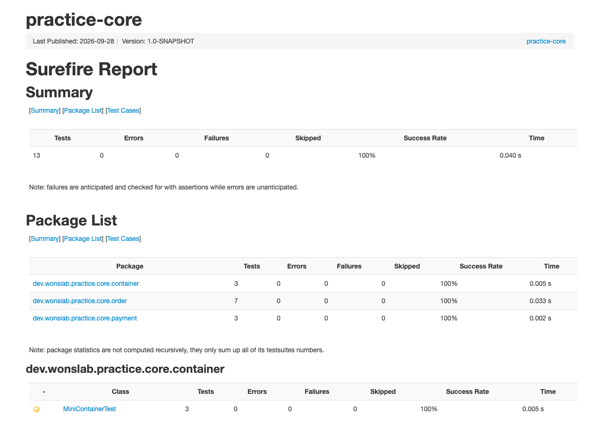
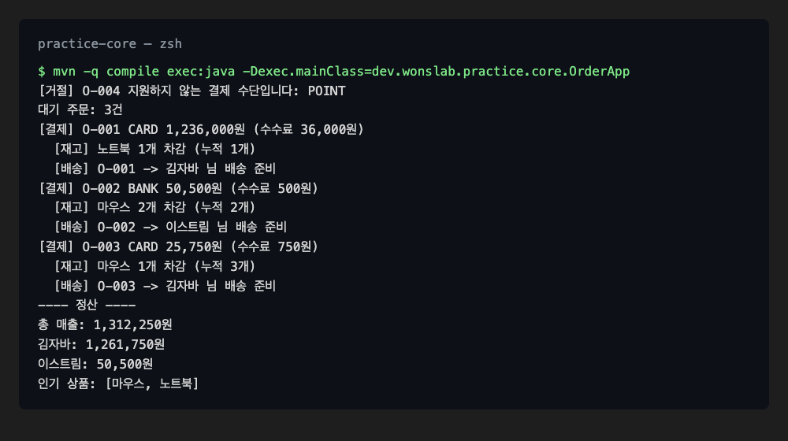

# Java 실습 과제 — 주문 처리 콘솔 앱 (Java 핵심, Spring 없이)

> **이 과제의 목표**: 컬렉션·스트림, 인터페이스와 다형성, 손으로 만든 미니 IoC 컨테이너, 디자인 패턴 2개(전략·옵저버)를 **하나의 작은 콘솔 앱** 안에서 엮어 봅니다. Spring 없이 순수 Java만으로 만들기 때문에, 나중에 Spring이 대신해 주는 일이 무엇인지 몸으로 먼저 겪게 됩니다.
>
> **선수 지식**: [[java-study-ch02]] (클래스·인터페이스) · [[java-study-ch03]] (컬렉션·람다·스트림) · [[java-study-ch04]] (전략·옵저버 패턴). **소요 시간**: 약 3~4시간.

> **진행 방법**: 각 단계는 "과제 설명 → 검증 테스트(그대로 입력) → 직접 구현 → 테스트 실행" 순서입니다. 구현이 막히면 접힌 **모범 답안**을 펼쳐 비교하세요. 테스트가 먼저 주어지므로, 테스트가 통과하면 그 단계는 끝난 것입니다.

---

## 과제 개요·학습 목표

온라인 상점의 주문을 받아 결제하고, 결제가 끝나면 재고·배송 담당에게 알린 뒤, 마지막에 매출을 정산하는 콘솔 앱을 만듭니다. 화면 입력 없이 `OrderApp`이 미리 정한 주문 4건을 흘려 보내고, 그 결과를 터미널에 출력합니다.

| 학습 목표 | 이 과제에서 확인하는 자리 |
|-----------|------------------------|
| 컬렉션 선택 | 대기 주문은 `Queue`(선입선출), 영수증은 `List`, 집계는 `Map` |
| 스트림 집계 | `groupingBy`·`summingLong`·`sorted`·`limit`로 고객별 매출·인기 상품 계산 |
| 인터페이스와 다형성 | `PaymentStrategy` 하나로 카드·계좌이체 결제를 같은 방식으로 호출 |
| 전략 패턴 | 결제 수단마다 수수료 계산을 별도 클래스로 분리 |
| 옵저버 패턴 | 결제 완료를 `OrderListener`들에게 알리고, 서비스는 누가 듣는지 모름 |
| 제어의 역전(IoC) | 객체 생성·연결을 `MiniContainer`에 맡기고 `OrderApp`은 꺼내 쓰기만 함 |
| 단위 테스트 | JUnit 5로 단계마다 동작을 먼저 고정하고 구현 |

---

## 요구사항

아래 표가 이 과제의 전체 명세입니다. 각 요구사항은 2~6단계에서 하나씩 구현하고, 괄호 안의 테스트로 확인합니다.

| ID | 요구사항 | 구현 단계 |
|----|---------|----------|
| R1 | 주문(`Order`)은 주문번호·고객·상품·수량·단가·결제 수단을 가지며, 수량·단가가 0 이하이면 생성을 거부합니다 | 2단계 |
| R2 | 영수증 저장소는 총 매출, 고객별 매출(이름 순), 판매 수량 기준 인기 상품 N개를 계산합니다 | 2단계 |
| R3 | 결제 수단은 카드(수수료 3%)와 계좌이체(수수료 500원 고정) 두 가지이며, 같은 인터페이스로 다룹니다 | 3단계 |
| R4 | 주문은 대기열에 들어온 순서대로 처리되며, 지원하지 않는 결제 수단은 대기열에 넣기 전에 거절합니다 | 4단계 |
| R5 | 결제가 끝나면 등록된 모든 리스너(재고·배송)가 알림을 받습니다 | 4단계 |
| R6 | 객체 생성과 의존 관계 연결은 미니 IoC 컨테이너가 맡으며, 같은 타입은 한 번만 만든다(싱글톤) | 5단계 |
| R7 | `OrderApp`을 실행하면 결제·재고·배송 로그와 정산 결과가 출력됩니다 | 6단계 |

---

## 1. 프로젝트 구성

이 과제는 Spring도 데이터베이스도 쓰지 않는 순수 Java 프로젝트이므로, 빌드 설정 파일 하나와 소스 디렉터리만 있으면 됩니다. 먼저 작업 디렉터리를 만들고 표준 디렉터리 구조를 준비합니다.

```bash
mkdir practice-core
cd practice-core
mkdir -p src/main/java/dev/wonslab/practice/core src/test/java/dev/wonslab/practice/core
```

> **Windows**: PowerShell의 `mkdir`은 중간 디렉터리를 자동으로 만들므로 `-p` 없이 `mkdir src/main/java/dev/wonslab/practice/core`, `mkdir src/test/java/dev/wonslab/practice/core`를 한 줄씩 실행합니다. IDE로 파일을 만들 때 디렉터리가 함께 생기므로 이 단계를 건너뛰어도 됩니다.

프로젝트 루트에 Maven 빌드 설정 파일을 만듭니다. Java 21로 컴파일하고, 테스트용 JUnit 5와 콘솔 앱 실행용 exec 플러그인을 선언합니다.

**파일**: pom.xml

```xml
<?xml version="1.0" encoding="UTF-8"?>
<project xmlns="http://maven.apache.org/POM/4.0.0"
         xmlns:xsi="http://www.w3.org/2001/XMLSchema-instance"
         xsi:schemaLocation="http://maven.apache.org/POM/4.0.0 https://maven.apache.org/xsd/maven-4.0.0.xsd">
    <modelVersion>4.0.0</modelVersion>

    <groupId>dev.wonslab</groupId>
    <artifactId>practice-core</artifactId>
    <version>1.0-SNAPSHOT</version>

    <properties>
        <maven.compiler.release>21</maven.compiler.release>
        <project.build.sourceEncoding>UTF-8</project.build.sourceEncoding>
    </properties>

    <dependencies>
        <dependency>
            <groupId>org.junit.jupiter</groupId>
            <artifactId>junit-jupiter</artifactId>
            <version>5.11.4</version>
            <scope>test</scope>
        </dependency>
    </dependencies>

    <build>
        <plugins>
            <plugin>
                <groupId>org.apache.maven.plugins</groupId>
                <artifactId>maven-surefire-plugin</artifactId>
                <version>3.5.2</version>
            </plugin>
            <plugin>
                <groupId>org.codehaus.mojo</groupId>
                <artifactId>exec-maven-plugin</artifactId>
                <version>3.5.0</version>
            </plugin>
        </plugins>
    </build>
</project>
```

6단계까지 마치면 프로젝트는 아래 구조가 됩니다. 패키지는 역할별로 `order`(도메인·서비스), `payment`(결제 전략), `event`(리스너), `container`(IoC)로 나눕니다.

```text
practice-core/
├── pom.xml
└── src/
    ├── main/java/dev/wonslab/practice/core/
    │   ├── OrderApp.java
    │   ├── order/       Order, Receipt, ReceiptRepository, OrderService
    │   ├── payment/     PaymentStrategy, CardPayment, BankTransferPayment
    │   ├── event/       OrderListener, InventoryListener, ShippingListener
    │   └── container/   MiniContainer, AppConfig
    └── test/java/dev/wonslab/practice/core/
        ├── order/       ReceiptRepositoryTest, OrderServiceTest
        ├── payment/     PaymentStrategyTest
        └── container/   MiniContainerTest
```

설정이 올바른지 확인하려면 프로젝트 루트에서 아래 명령을 실행합니다.

```bash
mvn -q validate
```

아무것도 출력되지 않고 명령이 끝나면 정상입니다.

---

## 2. 주문 도메인과 컬렉션 정산 (R1·R2)

첫 단계는 데이터를 담는 그릇과, 쌓인 데이터를 집계하는 저장소입니다. 이 단계에서 스트림의 `groupingBy`로 "고객별 합계"와 "상품별 수량 순위"를 만드는 연습을 합니다.

**과제**:

- `order` 패키지에 `Order` record를 만듭니다. 컴팩트 생성자에서 수량·단가가 0 이하이면 `IllegalArgumentException`을 던지고, `amount()`는 `단가 × 수량`을 돌려줍니다.
- `Receipt` record는 주문·결제 수단 이름·수수료를 담고, `total()`은 `상품 금액 + 수수료`입니다.
- `ReceiptRepository`는 영수증을 `List`에 모으고 `totalSales()`, `salesByCustomer()`(고객 이름 순 `TreeMap`), `topItems(n)`(판매 수량 내림차순, 같으면 이름 순)을 제공합니다.

먼저 아래 검증 테스트를 그대로 입력합니다. `@DisplayName`은 테스트 결과에 표시할 한글 이름입니다.

**파일**: src/test/java/dev/wonslab/practice/core/order/ReceiptRepositoryTest.java

```java
package dev.wonslab.practice.core.order;

import org.junit.jupiter.api.BeforeEach;
import org.junit.jupiter.api.DisplayName;
import org.junit.jupiter.api.Test;

import java.util.List;
import java.util.Map;

import static org.junit.jupiter.api.Assertions.assertEquals;
import static org.junit.jupiter.api.Assertions.assertThrows;

class ReceiptRepositoryTest {

    private final ReceiptRepository repository = new ReceiptRepository();

    @BeforeEach
    void setUp() {
        repository.save(new Receipt(new Order("O-1", "김자바", "노트북", 1, 1_000_000, "CARD"), "CARD", 30_000));
        repository.save(new Receipt(new Order("O-2", "이스트림", "마우스", 3, 20_000, "BANK"), "BANK", 500));
        repository.save(new Receipt(new Order("O-3", "김자바", "마우스", 1, 20_000, "BANK"), "BANK", 500));
    }

    @Test
    @DisplayName("총 매출은 모든 영수증 합계(상품 금액 + 수수료)다")
    void totalSales() {
        assertEquals(1_111_000, repository.totalSales());
    }

    @Test
    @DisplayName("고객별 매출은 이름 순으로 합산된다")
    void salesByCustomer() {
        assertEquals(Map.of("김자바", 1_050_500L, "이스트림", 60_500L), repository.salesByCustomer());
        assertEquals(List.of("김자바", "이스트림"), List.copyOf(repository.salesByCustomer().keySet()));
    }

    @Test
    @DisplayName("인기 상품은 판매 수량 내림차순이다")
    void topItems() {
        assertEquals(List.of("마우스", "노트북"), repository.topItems(2));
        assertEquals(List.of("마우스"), repository.topItems(1));
    }

    @Test
    @DisplayName("수량이 0인 주문은 만들 수 없다")
    void rejectZeroQuantity() {
        assertThrows(IllegalArgumentException.class,
                () -> new Order("O-9", "김자바", "노트북", 0, 1_000, "CARD"));
    }
}
```

테스트를 통과시키도록 세 파일을 구현한 뒤 비교합니다.

??? example "모범 답안"

    **파일**: src/main/java/dev/wonslab/practice/core/order/Order.java

    ```java
    package dev.wonslab.practice.core.order;

    public record Order(String id, String customer, String item,
                        int quantity, long unitPrice, String payMethod) {

        public Order {
            if (quantity <= 0) {
                throw new IllegalArgumentException("수량은 1 이상이어야 합니다: " + quantity);
            }
            if (unitPrice <= 0) {
                throw new IllegalArgumentException("단가는 0보다 커야 합니다: " + unitPrice);
            }
        }

        public long amount() {
            return unitPrice * quantity;
        }
    }
    ```

    **파일**: src/main/java/dev/wonslab/practice/core/order/Receipt.java

    ```java
    package dev.wonslab.practice.core.order;

    public record Receipt(Order order, String method, long fee) {

        public long total() {
            return order.amount() + fee;
        }
    }
    ```

    **파일**: src/main/java/dev/wonslab/practice/core/order/ReceiptRepository.java

    ```java
    package dev.wonslab.practice.core.order;

    import java.util.ArrayList;
    import java.util.Comparator;
    import java.util.List;
    import java.util.Map;
    import java.util.TreeMap;
    import java.util.stream.Collectors;

    public class ReceiptRepository {

        private final List<Receipt> receipts = new ArrayList<>();

        public void save(Receipt receipt) {
            receipts.add(receipt);
        }

        public List<Receipt> findAll() {
            return List.copyOf(receipts);
        }

        public long totalSales() {
            return receipts.stream().mapToLong(Receipt::total).sum();
        }

        public Map<String, Long> salesByCustomer() {
            return receipts.stream().collect(Collectors.groupingBy(
                    r -> r.order().customer(),
                    TreeMap::new,
                    Collectors.summingLong(Receipt::total)));
        }

        public List<String> topItems(int n) {
            Map<String, Integer> quantityByItem = receipts.stream().collect(Collectors.groupingBy(
                    r -> r.order().item(),
                    Collectors.summingInt(r -> r.order().quantity())));
            return quantityByItem.entrySet().stream()
                    .sorted(Map.Entry.<String, Integer>comparingByValue(Comparator.reverseOrder())
                            .thenComparing(Map.Entry.comparingByKey()))
                    .limit(n)
                    .map(Map.Entry::getKey)
                    .toList();
        }
    }
    ```

    `topItems`는 두 번 스트림을 씁니다. 첫 번째는 상품별 수량 합계 `Map`을 만들고, 두 번째는 그 `Map`의 항목을 값 내림차순 → 키 오름차순으로 정렬해 앞에서 `n`개만 자릅니다.

이 단계의 테스트만 골라 실행합니다.

```bash
mvn test -Dtest=ReceiptRepositoryTest
```

```text
예상 결과
[INFO] Running dev.wonslab.practice.core.order.ReceiptRepositoryTest
[INFO] Tests run: 4, Failures: 0, Errors: 0, Skipped: 0
[INFO] BUILD SUCCESS
```

---

## 3. 결제 전략 — 인터페이스와 다형성 (R3)

결제 수단마다 `if ("CARD".equals(...)) ... else if ...`로 분기하면, 새 결제 수단이 생길 때마다 기존 코드를 고쳐야 합니다. 전략 패턴은 "수수료를 계산한다"는 약속만 인터페이스로 두고, 계산 방법은 수단별 클래스로 나눠서 이 문제를 없앱니다.

**과제**:

- `payment` 패키지에 `PaymentStrategy` 인터페이스를 만듭니다. `name()`은 결제 수단 코드(`"CARD"`, `"BANK"`), `fee(long amount)`는 수수료입니다.
- `CardPayment`는 금액의 3%(원 단위 버림), `BankTransferPayment`는 금액과 관계없이 500원을 돌려줍니다.

**파일**: src/test/java/dev/wonslab/practice/core/payment/PaymentStrategyTest.java

```java
package dev.wonslab.practice.core.payment;

import org.junit.jupiter.api.DisplayName;
import org.junit.jupiter.api.Test;

import java.util.List;

import static org.junit.jupiter.api.Assertions.assertEquals;

class PaymentStrategyTest {

    @Test
    @DisplayName("카드 수수료는 결제 금액의 3%다")
    void cardFee() {
        assertEquals(3_000, new CardPayment().fee(100_000));
    }

    @Test
    @DisplayName("계좌이체 수수료는 금액과 무관하게 500원이다")
    void bankFee() {
        assertEquals(500, new BankTransferPayment().fee(100_000));
        assertEquals(500, new BankTransferPayment().fee(1_000));
    }

    @Test
    @DisplayName("같은 인터페이스로 여러 전략을 다룬다 (다형성)")
    void polymorphism() {
        List<PaymentStrategy> strategies = List.of(new CardPayment(), new BankTransferPayment());
        long totalFee = strategies.stream().mapToLong(s -> s.fee(10_000)).sum();
        assertEquals(800, totalFee);
    }
}
```

세 번째 테스트가 이 단계의 핵심입니다. `List<PaymentStrategy>`에 서로 다른 구현을 담고 같은 `fee()`를 호출해도, 실제로는 각 객체의 계산이 실행됩니다.

??? example "모범 답안"

    **파일**: src/main/java/dev/wonslab/practice/core/payment/PaymentStrategy.java

    ```java
    package dev.wonslab.practice.core.payment;

    public interface PaymentStrategy {

        String name();

        long fee(long amount);
    }
    ```

    **파일**: src/main/java/dev/wonslab/practice/core/payment/CardPayment.java

    ```java
    package dev.wonslab.practice.core.payment;

    public class CardPayment implements PaymentStrategy {

        @Override
        public String name() {
            return "CARD";
        }

        @Override
        public long fee(long amount) {
            return amount * 3 / 100;
        }
    }
    ```

    **파일**: src/main/java/dev/wonslab/practice/core/payment/BankTransferPayment.java

    ```java
    package dev.wonslab.practice.core.payment;

    public class BankTransferPayment implements PaymentStrategy {

        @Override
        public String name() {
            return "BANK";
        }

        @Override
        public long fee(long amount) {
            return 500;
        }
    }
    ```

```bash
mvn test -Dtest=PaymentStrategyTest
```

```text
예상 결과
[INFO] Running dev.wonslab.practice.core.payment.PaymentStrategyTest
[INFO] Tests run: 3, Failures: 0, Errors: 0, Skipped: 0
[INFO] BUILD SUCCESS
```

---

## 4. 주문 처리와 이벤트 알림 — Queue와 옵저버 (R4·R5)

이 단계에서 앞의 조각들을 하나의 흐름으로 묶습니다. 주문은 `Queue`에 쌓였다가 들어온 순서대로 결제되고, 결제가 끝날 때마다 리스너들에게 알림이 갑니다. `OrderService`는 리스너를 `OrderListener` 목록으로만 알기 때문에, 쿠폰 발행 같은 새 후속 작업이 생겨도 서비스 코드는 바뀌지 않습니다. 이것이 옵저버 패턴입니다.

**과제**:

- `event` 패키지에 `OrderListener` 함수형 인터페이스(`void onPaid(Receipt receipt)`)를 만듭니다.
- `InventoryListener`는 상품별 누적 판매 수량을 `Map.merge`로 세고 `soldCount(item)`으로 조회하게 합니다. `ShippingListener`는 배송 준비한 주문번호를 모읍니다. 둘 다 처리 내용을 한 줄씩 출력합니다.
- `order` 패키지의 `OrderService`는 결제 전략 목록·저장소·리스너 목록을 생성자로 받습니다. `place()`는 결제 수단을 검사한 뒤 대기열에 넣고, `processAll()`은 대기열이 빌 때까지 꺼내 결제 → 저장 → 알림을 반복합니다.

검증 테스트는 실제 리스너 대신 람다 하나(`recorder`)를 리스너로 넣어, 알림이 왔는지만 기록합니다. `OrderListener`가 함수형 인터페이스이기 때문에 가능한 방식입니다.

**파일**: src/test/java/dev/wonslab/practice/core/order/OrderServiceTest.java

```java
package dev.wonslab.practice.core.order;

import dev.wonslab.practice.core.event.OrderListener;
import dev.wonslab.practice.core.payment.BankTransferPayment;
import dev.wonslab.practice.core.payment.CardPayment;
import org.junit.jupiter.api.DisplayName;
import org.junit.jupiter.api.Test;

import java.util.ArrayList;
import java.util.List;

import static org.junit.jupiter.api.Assertions.assertEquals;
import static org.junit.jupiter.api.Assertions.assertThrows;

class OrderServiceTest {

    private final ReceiptRepository repository = new ReceiptRepository();
    private final List<String> events = new ArrayList<>();
    private final OrderListener recorder = receipt -> events.add(receipt.order().id());
    private final OrderService service = new OrderService(
            List.of(new CardPayment(), new BankTransferPayment()), repository, List.of(recorder));

    @Test
    @DisplayName("대기 주문은 들어온 순서(FIFO)대로 처리된다")
    void processInOrder() {
        service.place(new Order("A", "김자바", "펜", 1, 1_000, "BANK"));
        service.place(new Order("B", "김자바", "펜", 1, 1_000, "CARD"));

        List<Receipt> receipts = service.processAll();

        assertEquals(List.of("A", "B"), receipts.stream().map(r -> r.order().id()).toList());
        assertEquals(0, service.pendingCount());
    }

    @Test
    @DisplayName("결제가 끝나면 등록된 리스너가 모두 알림을 받는다")
    void notifyListeners() {
        service.place(new Order("A", "김자바", "펜", 1, 1_000, "CARD"));
        service.processAll();

        assertEquals(List.of("A"), events);
        assertEquals(1, repository.findAll().size());
    }

    @Test
    @DisplayName("지원하지 않는 결제 수단은 대기열에 들어가지 않는다")
    void rejectUnknownPayMethod() {
        assertThrows(IllegalArgumentException.class,
                () -> service.place(new Order("A", "김자바", "펜", 1, 1_000, "POINT")));
        assertEquals(0, service.pendingCount());
    }
}
```

??? example "모범 답안"

    **파일**: src/main/java/dev/wonslab/practice/core/event/OrderListener.java

    ```java
    package dev.wonslab.practice.core.event;

    import dev.wonslab.practice.core.order.Receipt;

    @FunctionalInterface
    public interface OrderListener {

        void onPaid(Receipt receipt);
    }
    ```

    **파일**: src/main/java/dev/wonslab/practice/core/event/InventoryListener.java

    ```java
    package dev.wonslab.practice.core.event;

    import dev.wonslab.practice.core.order.Order;
    import dev.wonslab.practice.core.order.Receipt;

    import java.util.HashMap;
    import java.util.Map;

    public class InventoryListener implements OrderListener {

        private final Map<String, Integer> sold = new HashMap<>();

        @Override
        public void onPaid(Receipt receipt) {
            Order order = receipt.order();
            int total = sold.merge(order.item(), order.quantity(), Integer::sum);
            System.out.printf("  [재고] %s %d개 차감 (누적 %d개)%n", order.item(), order.quantity(), total);
        }

        public int soldCount(String item) {
            return sold.getOrDefault(item, 0);
        }
    }
    ```

    **파일**: src/main/java/dev/wonslab/practice/core/event/ShippingListener.java

    ```java
    package dev.wonslab.practice.core.event;

    import dev.wonslab.practice.core.order.Receipt;

    import java.util.ArrayList;
    import java.util.List;

    public class ShippingListener implements OrderListener {

        private final List<String> shipped = new ArrayList<>();

        @Override
        public void onPaid(Receipt receipt) {
            shipped.add(receipt.order().id());
            System.out.printf("  [배송] %s -> %s 님 배송 준비%n", receipt.order().id(), receipt.order().customer());
        }

        public List<String> shippedOrderIds() {
            return List.copyOf(shipped);
        }
    }
    ```

    **파일**: src/main/java/dev/wonslab/practice/core/order/OrderService.java

    ```java
    package dev.wonslab.practice.core.order;

    import dev.wonslab.practice.core.event.OrderListener;
    import dev.wonslab.practice.core.payment.PaymentStrategy;

    import java.util.ArrayDeque;
    import java.util.ArrayList;
    import java.util.List;
    import java.util.Map;
    import java.util.Queue;
    import java.util.function.Function;
    import java.util.stream.Collectors;

    public class OrderService {

        private final Queue<Order> pending = new ArrayDeque<>();
        private final Map<String, PaymentStrategy> strategies;
        private final ReceiptRepository repository;
        private final List<OrderListener> listeners;

        public OrderService(List<PaymentStrategy> strategies, ReceiptRepository repository,
                            List<OrderListener> listeners) {
            this.strategies = strategies.stream()
                    .collect(Collectors.toMap(PaymentStrategy::name, Function.identity()));
            this.repository = repository;
            this.listeners = List.copyOf(listeners);
        }

        public void place(Order order) {
            if (!strategies.containsKey(order.payMethod())) {
                throw new IllegalArgumentException("지원하지 않는 결제 수단입니다: " + order.payMethod());
            }
            pending.offer(order);
        }

        public int pendingCount() {
            return pending.size();
        }

        public List<Receipt> processAll() {
            List<Receipt> done = new ArrayList<>();
            Order order;
            while ((order = pending.poll()) != null) {
                PaymentStrategy strategy = strategies.get(order.payMethod());
                Receipt receipt = new Receipt(order, strategy.name(), strategy.fee(order.amount()));
                System.out.printf("[결제] %s %s %,d원 (수수료 %,d원)%n",
                        order.id(), strategy.name(), receipt.total(), receipt.fee());
                repository.save(receipt);
                listeners.forEach(listener -> listener.onPaid(receipt));
                done.add(receipt);
            }
            return done;
        }
    }
    ```

    생성자에서 전략 목록을 `Map<이름, 전략>`으로 바꿔 두면, 결제할 때 `if` 분기 없이 `strategies.get(order.payMethod())` 한 번으로 전략을 고릅니다.

```bash
mvn test -Dtest=OrderServiceTest
```

테스트 중 `processAll()`이 출력한 결제 로그가 함께 보입니다(테스트 메서드 실행 순서에 따라 줄 순서는 달라질 수 있습니다).

```text
예상 결과
[INFO] Running dev.wonslab.practice.core.order.OrderServiceTest
[결제] A CARD 1,030원 (수수료 30원)
[결제] A BANK 1,500원 (수수료 500원)
[결제] B CARD 1,030원 (수수료 30원)
[INFO] Tests run: 3, Failures: 0, Errors: 0, Skipped: 0
[INFO] BUILD SUCCESS
```

---

## 5. 미니 IoC 컨테이너 (R6)

지금까지는 테스트가 `new OrderService(...)`로 의존 객체를 직접 만들어 넣었습니다. 앱이 커지면 "누가 누구를 만들어 누구에게 넘기는가"가 여기저기 흩어집니다. 이 단계에서는 생성·연결 책임을 한곳(컨테이너)으로 모읍니다. 객체가 스스로 의존 객체를 만들지 않고 바깥에서 받는 것, 즉 제어권이 뒤집히는 것이 제어의 역전(IoC, Inversion of Control)입니다.

**과제**:

- `container` 패키지에 `MiniContainer`를 만듭니다. `register(타입, 팩토리)`로 "이 타입은 이렇게 만든다"를 등록하고, `get(타입)`은 처음 요청될 때 팩토리를 실행해 만든 객체를 저장해 두었다가 다음부터 같은 객체를 돌려줍니다. 등록되지 않은 타입은 `IllegalStateException`입니다.
- 팩토리는 `Function<MiniContainer, T>`입니다. 팩토리가 컨테이너를 받으므로, 안에서 `x.get(다른타입)`으로 의존 객체를 꺼내 생성자에 넘길 수 있습니다.
- `AppConfig.container()`는 저장소·리스너 2개·`OrderService`를 등록한 컨테이너를 돌려줍니다.

**파일**: src/test/java/dev/wonslab/practice/core/container/MiniContainerTest.java

```java
package dev.wonslab.practice.core.container;

import dev.wonslab.practice.core.event.InventoryListener;
import dev.wonslab.practice.core.order.Order;
import dev.wonslab.practice.core.order.OrderService;
import dev.wonslab.practice.core.order.ReceiptRepository;
import org.junit.jupiter.api.DisplayName;
import org.junit.jupiter.api.Test;

import static org.junit.jupiter.api.Assertions.assertEquals;
import static org.junit.jupiter.api.Assertions.assertSame;
import static org.junit.jupiter.api.Assertions.assertThrows;

class MiniContainerTest {

    @Test
    @DisplayName("같은 타입을 두 번 꺼내면 같은 인스턴스(싱글톤)다")
    void singleton() {
        MiniContainer container = AppConfig.container();
        assertSame(container.get(ReceiptRepository.class), container.get(ReceiptRepository.class));
    }

    @Test
    @DisplayName("등록하지 않은 타입을 꺼내면 예외가 난다")
    void unknownType() {
        MiniContainer container = new MiniContainer();
        assertThrows(IllegalStateException.class, () -> container.get(String.class));
    }

    @Test
    @DisplayName("컨테이너가 주입한 의존 객체를 서비스와 리스너가 공유한다")
    void wiring() {
        MiniContainer container = AppConfig.container();
        OrderService service = container.get(OrderService.class);

        service.place(new Order("A", "김자바", "펜", 2, 1_000, "CARD"));
        service.processAll();

        assertEquals(1, container.get(ReceiptRepository.class).findAll().size());
        assertEquals(2, container.get(InventoryListener.class).soldCount("펜"));
    }
}
```

세 번째 테스트는 `OrderService`에 주입된 저장소·리스너가 컨테이너에서 꺼낸 것과 **같은 객체**인지 확인합니다. 싱글톤이 아니면 서비스가 저장한 영수증이 다른 저장소에 들어가 이 테스트가 실패합니다.

??? example "모범 답안"

    **파일**: src/main/java/dev/wonslab/practice/core/container/MiniContainer.java

    ```java
    package dev.wonslab.practice.core.container;

    import java.util.HashMap;
    import java.util.Map;
    import java.util.function.Function;

    public class MiniContainer {

        private final Map<Class<?>, Function<MiniContainer, ?>> factories = new HashMap<>();
        private final Map<Class<?>, Object> singletons = new HashMap<>();

        public <T> void register(Class<T> type, Function<MiniContainer, ? extends T> factory) {
            factories.put(type, factory);
        }

        public <T> T get(Class<T> type) {
            Object bean = singletons.get(type);
            if (bean == null) {
                Function<MiniContainer, ?> factory = factories.get(type);
                if (factory == null) {
                    throw new IllegalStateException("등록되지 않은 타입입니다: " + type.getSimpleName());
                }
                bean = factory.apply(this);
                singletons.put(type, bean);
            }
            return type.cast(bean);
        }
    }
    ```

    **파일**: src/main/java/dev/wonslab/practice/core/container/AppConfig.java

    ```java
    package dev.wonslab.practice.core.container;

    import dev.wonslab.practice.core.event.InventoryListener;
    import dev.wonslab.practice.core.event.ShippingListener;
    import dev.wonslab.practice.core.order.OrderService;
    import dev.wonslab.practice.core.order.ReceiptRepository;
    import dev.wonslab.practice.core.payment.BankTransferPayment;
    import dev.wonslab.practice.core.payment.CardPayment;

    import java.util.List;

    public final class AppConfig {

        private AppConfig() {
        }

        public static MiniContainer container() {
            MiniContainer c = new MiniContainer();
            c.register(ReceiptRepository.class, x -> new ReceiptRepository());
            c.register(InventoryListener.class, x -> new InventoryListener());
            c.register(ShippingListener.class, x -> new ShippingListener());
            c.register(OrderService.class, x -> new OrderService(
                    List.of(new CardPayment(), new BankTransferPayment()),
                    x.get(ReceiptRepository.class),
                    List.of(x.get(InventoryListener.class), x.get(ShippingListener.class))));
            return c;
        }
    }
    ```

    `get()`을 `singletons.computeIfAbsent(type, t -> factory.apply(this))`로 줄이고 싶어지지만, 팩토리 안에서 다시 `get()`을 호출해 같은 `HashMap`을 수정하므로 `ConcurrentModificationException`이 납니다. 그래서 "조회 → 없으면 생성 → 저장"을 풀어 썼습니다.

```bash
mvn test -Dtest=MiniContainerTest
```

```text
예상 결과
[INFO] Running dev.wonslab.practice.core.container.MiniContainerTest
[결제] A CARD 2,060원 (수수료 60원)
  [재고] 펜 2개 차감 (누적 2개)
  [배송] A -> 김자바 님 배송 준비
[INFO] Tests run: 3, Failures: 0, Errors: 0, Skipped: 0
[INFO] BUILD SUCCESS
```

---

## 6. 앱 조립과 실행 (R7)

마지막으로 실행 진입점을 만듭니다. `OrderApp`은 객체를 직접 `new` 하지 않고 컨테이너에서 꺼내 쓰기만 합니다. 주문 4건 중 `POINT` 결제 1건은 R4에 따라 거절되는지 확인하는 용도입니다.

**과제**: 아래 동작을 하는 `OrderApp`의 `main`을 작성합니다.

1. `AppConfig.container()`에서 `OrderService`와 `ReceiptRepository`를 꺼냅니다.
2. 주문 3건(카드·계좌이체·카드)을 넣고, `POINT` 주문 1건은 예외를 잡아 `[거절]` 줄을 출력합니다.
3. 대기 주문 수를 출력하고 `processAll()`을 호출합니다.
4. 총 매출, 고객별 매출, 인기 상품 2개를 출력합니다.

??? example "모범 답안"

    **파일**: src/main/java/dev/wonslab/practice/core/OrderApp.java

    ```java
    package dev.wonslab.practice.core;

    import dev.wonslab.practice.core.container.AppConfig;
    import dev.wonslab.practice.core.container.MiniContainer;
    import dev.wonslab.practice.core.order.Order;
    import dev.wonslab.practice.core.order.OrderService;
    import dev.wonslab.practice.core.order.ReceiptRepository;

    public class OrderApp {

        public static void main(String[] args) {
            MiniContainer container = AppConfig.container();
            OrderService service = container.get(OrderService.class);
            ReceiptRepository repository = container.get(ReceiptRepository.class);

            service.place(new Order("O-001", "김자바", "노트북", 1, 1_200_000, "CARD"));
            service.place(new Order("O-002", "이스트림", "마우스", 2, 25_000, "BANK"));
            service.place(new Order("O-003", "김자바", "마우스", 1, 25_000, "CARD"));
            try {
                service.place(new Order("O-004", "박큐", "키보드", 1, 80_000, "POINT"));
            } catch (IllegalArgumentException e) {
                System.out.println("[거절] O-004 " + e.getMessage());
            }
            System.out.println("대기 주문: " + service.pendingCount() + "건");

            service.processAll();

            System.out.println("---- 정산 ----");
            System.out.printf("총 매출: %,d원%n", repository.totalSales());
            repository.salesByCustomer()
                    .forEach((customer, sum) -> System.out.printf("%s: %,d원%n", customer, sum));
            System.out.println("인기 상품: " + repository.topItems(2));
        }
    }
    ```

프로젝트 루트에서 앱을 실행합니다.

```bash
mvn -q compile exec:java -Dexec.mainClass=dev.wonslab.practice.core.OrderApp
```

> **Windows**: PowerShell에서는 `-D` 인자를 따옴표로 감싸 `mvn -q compile exec:java "-Dexec.mainClass=dev.wonslab.practice.core.OrderApp"`로 실행합니다. 한글이 깨지면 먼저 `chcp 65001`로 터미널 코드 페이지를 UTF-8로 바꿉니다.

```text
예상 결과
[거절] O-004 지원하지 않는 결제 수단입니다: POINT
대기 주문: 3건
[결제] O-001 CARD 1,236,000원 (수수료 36,000원)
  [재고] 노트북 1개 차감 (누적 1개)
  [배송] O-001 -> 김자바 님 배송 준비
[결제] O-002 BANK 50,500원 (수수료 500원)
  [재고] 마우스 2개 차감 (누적 2개)
  [배송] O-002 -> 이스트림 님 배송 준비
[결제] O-003 CARD 25,750원 (수수료 750원)
  [재고] 마우스 1개 차감 (누적 3개)
  [배송] O-003 -> 김자바 님 배송 준비
---- 정산 ----
총 매출: 1,312,250원
김자바: 1,261,750원
이스트림: 50,500원
인기 상품: [마우스, 노트북]
```

금액을 손으로 검산하면 구조가 보입니다. 노트북 120만 원 카드 결제는 수수료 3%인 3만 6천 원이 붙고, 마우스 2개(5만 원) 계좌이체는 500원만 붙습니다. 김자바 님의 매출 1,261,750원은 O-001(1,236,000원)과 O-003(25,750원)의 합입니다.

---

## 실행·테스트

모든 단계를 마쳤으면 전체 테스트를 한 번에 실행합니다.

```bash
mvn test
```

아래는 출력 중 테스트 요약 줄만 발췌한 것입니다. 테스트 클래스가 실행되는 순서는 환경에 따라 다를 수 있습니다.

```text
예상 결과
[INFO] Tests run: 3, Failures: 0, Errors: 0, Skipped: 0 -- in dev.wonslab.practice.core.order.OrderServiceTest
[INFO] Tests run: 4, Failures: 0, Errors: 0, Skipped: 0 -- in dev.wonslab.practice.core.order.ReceiptRepositoryTest
[INFO] Tests run: 3, Failures: 0, Errors: 0, Skipped: 0 -- in dev.wonslab.practice.core.payment.PaymentStrategyTest
[INFO] Tests run: 3, Failures: 0, Errors: 0, Skipped: 0 -- in dev.wonslab.practice.core.container.MiniContainerTest
[INFO] Results:
[INFO] Tests run: 13, Failures: 0, Errors: 0, Skipped: 0
[INFO] BUILD SUCCESS
```

테스트 결과를 HTML 보고서로 보고 싶으면 아래 명령을 실행합니다. `surefire-report` 플러그인이 방금 실행한 테스트 결과를 읽어 보고서 파일을 만듭니다.

```bash
mvn surefire-report:report-only
```

명령이 끝나면 `target/reports/surefire.html`을 브라우저로 엽니다. 아래 스크린샷이 그 화면입니다.

---

## 스크린샷



*surefire HTML 보고서 — 4개 테스트 클래스, 13개 테스트 전부 통과*

보고서 위쪽 요약 표는 전체 테스트 수·실패·오류·건너뜀·성공률을, 아래 패키지별 표는 `order`·`payment`·`container` 패키지마다 몇 개가 통과했는지를 보여 줍니다. 실패가 있으면 성공률이 100% 아래로 떨어지고, 해당 테스트의 예외 메시지가 보고서 아래쪽에 나옵니다.



*`OrderApp` 실행 결과 — 거절 1건, 결제·재고·배송 로그 3세트, 정산*

한 주문마다 `[결제]` 한 줄 아래에 `[재고]`와 `[배송]` 두 줄이 들여쓰기로 따라옵니다. 이 세 줄 묶음이 옵저버 패턴의 흐름입니다. `OrderService`는 결제 한 줄만 출력했고, 나머지 두 줄은 알림을 받은 리스너가 각자 출력했습니다.

---

## 채점 기준·셀프 체크

제출 전에 아래 표로 스스로 점검합니다. 배점 합계는 100점입니다.

| 항목 | 확인 방법 | 배점 |
|------|----------|------|
| 전체 테스트 통과 | `mvn test`가 `Tests run: 13, Failures: 0` | 30 |
| 앱 출력 일치 | 6단계 예상 결과와 금액·순서가 같음 | 15 |
| 컬렉션 선택 근거 | 대기열에 `Queue`, 집계에 `Map`을 쓴 이유를 한 문장으로 설명할 수 있음 | 10 |
| 전략 패턴 | `OrderService`에 결제 수단별 `if`/`switch` 분기가 없음 | 15 |
| 옵저버 패턴 | `OrderService`가 `InventoryListener`·`ShippingListener`를 import하지 않음 | 15 |
| IoC | `OrderApp`에 `new OrderService`·`new ReceiptRepository`가 없음 | 10 |
| 코드 위생 | 패키지 선언이 디렉터리와 일치하고, 외부에 내부 컬렉션을 그대로 노출하지 않음(`List.copyOf`) | 5 |

---

## 도전 과제 (선택)

기본 과제를 마쳤다면 아래 중 하나 이상에 도전해 봅니다. 각 과제는 기존 코드를 거의 고치지 않고 **추가만으로** 끝나는지가 설계의 시험대입니다.

| 도전 | 힌트 | 드러나는 원칙 |
|------|------|------------|
| 간편결제(수수료 1%, 최소 100원) 추가 | `PaymentStrategy` 구현 1개 + `AppConfig` 한 줄 | 개방-폐쇄 원칙(OCP) |
| 쿠폰 발행 리스너 추가 | 5만 원 이상 결제 시 `[쿠폰]` 줄 출력 | 옵저버의 확장성 |
| 순환 의존 감지 | `get()` 중인 타입을 `Set`에 기록해 두고, 다시 들어오면 예외 | 컨테이너의 안전장치 |
| `Scanner` 메뉴 | 1) 주문 2) 처리 3) 정산 0) 종료 | 입력과 도메인 분리 |

---

## 같은 인사이트 패턴

이 과제의 세 장치는 모두 "바뀌는 부분을 인터페이스 뒤로 숨기고, 연결은 바깥에서 한다"는 한 가지 생각의 변주입니다.

| 장치 | 숨긴 것 | 연결하는 쪽 | 관련 페이지 |
|------|--------|-----------|-----------|
| 전략 패턴 | 수수료 계산 방법 | `AppConfig`의 전략 목록 | [[concept-design-patterns]] |
| 옵저버 패턴 | 결제 후속 작업의 종류 | `AppConfig`의 리스너 목록 | [[concept-design-patterns]] |
| 미니 IoC 컨테이너 | 객체 생성 순서·방법 | `MiniContainer` | [[concept-solid]] (의존성 역전) |

---

## 막혔을 때

| 증상 | 원인 확인 |
|------|---------|
| `package ... does not exist` | 파일 위치와 첫 줄 `package` 선언이 일치하는지 확인합니다 |
| `No tests to run` | 테스트 클래스 이름을 `-Dtest=`에 정확히 적었는지, 파일이 `src/test/java` 아래인지 확인합니다 |
| `ConcurrentModificationException` | `MiniContainer.get()`에서 `computeIfAbsent`를 쓰지 않았는지 확인합니다 (5단계 모범 답안 참고) |
| 한글이 `?`로 출력됨 | pom.xml의 `project.build.sourceEncoding`이 UTF-8인지, Windows는 `chcp 65001`을 실행했는지 확인합니다 |

---

## 관련 페이지

- [[guide-java-track1-basics]] — T1 기초 트랙 (이 과제의 선수 과정)
- [[guide-java-track2-design]] — T2 객체지향 설계 트랙 (이 과제가 다루는 패턴의 이론)
- [[java-study-ch02]] — 클래스·인터페이스·record
- [[java-study-ch03]] — 컬렉션·람다·스트림
- [[java-study-ch04]] — 객체지향 설계와 패턴
- [[concept-oop]] — 캡슐화·다형성
- [[concept-solid]] — OCP·DIP
- [[concept-design-patterns]] — 전략·옵저버 패턴
