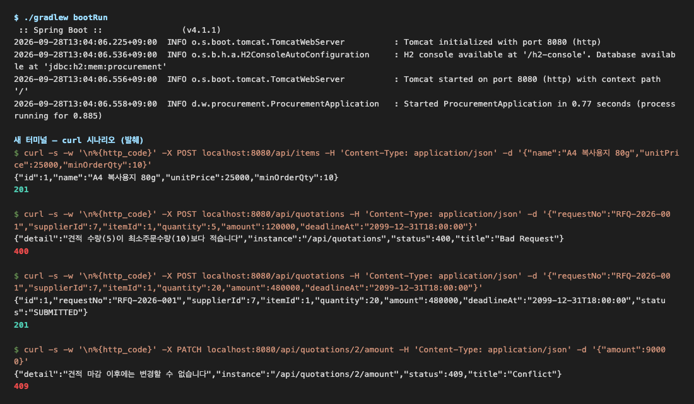
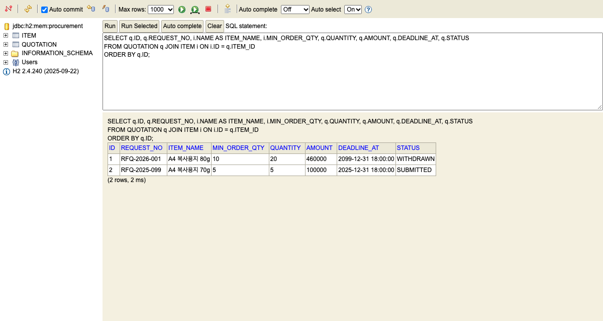
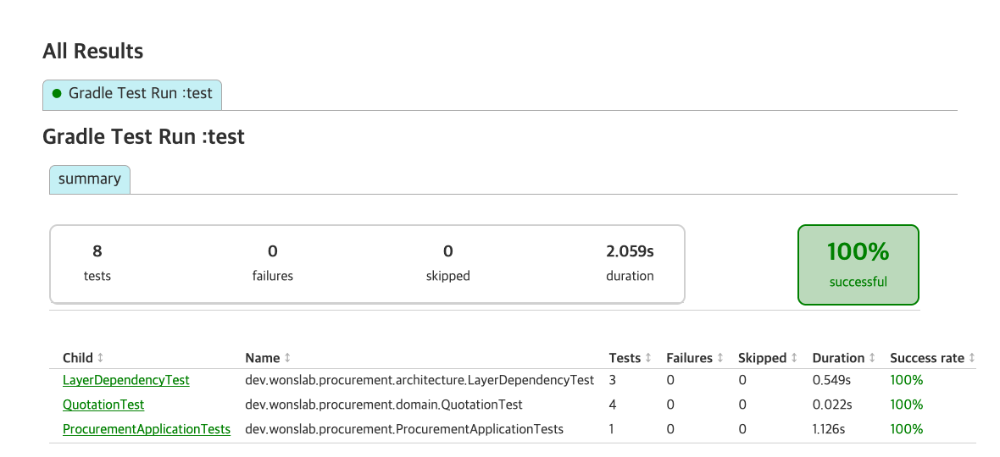

# Spring 실습 과제 — 견적 업무 API (4계층 + Command/Query + MyBatis)

> **이 과제의 목표**: B2B 조달의 **물품 등록 → 견적 제출 → 금액 변경·철회** 흐름을 REST API로 만들면서, 코드를 **4계층(interfaces·application·domain·infrastructure)** 으로 나누고 **쓰기(Command)와 읽기(Query) 경로를 분리**합니다. 영속성은 JPA 대신 **MyBatis XML 매퍼**로 SQL을 직접 씁니다.
>
> **선수 학습**: [[java-study-ch07]](SQL·페이징) · [[guide-java-practice-spring-library]](계층형 REST API 기본형). 코스 안내는 [[guide-java-track4-spring-web]]에 있습니다.

---

## 과제 개요

공급사가 물품을 등록하고, 구매기관의 견적 요청에 견적을 제출하는 업무를 API로 옮깁니다. 앞선 도서 대여 과제가 controller·service·repository 3층이었다면, 이번 과제는 **도메인이 어떤 기술에도 의존하지 않도록 의존 방향을 뒤집는 것**이 핵심입니다. 도메인 계층에는 Spring·MyBatis import가 한 줄도 없고, 테스트가 이것을 자동으로 검사합니다.

| 항목 | 내용 |
|------|------|
| 결과물 | 물품·견적 2개 애그리거트의 REST API (엔드포인트 7개) |
| 기술 | Spring Boot 4.1.1 · Java 21 · Gradle Kotlin DSL · MyBatis · H2 · Bean Validation · ArchUnit |
| 예상 소요 | 4~6시간 (단계별 모범 답안을 보면 2시간) |
| 프로젝트 | `procurement` (groupId `dev.wonslab`, 기본 패키지 `dev.wonslab.procurement`) |

### 학습 목표

| # | 목표 | 확인 방법 |
|---|------|----------|
| 1 | 4계층의 책임과 허용되는 의존 방향을 설명하고 패키지로 나눌 수 있다 | ArchUnit 테스트 통과 |
| 2 | 도메인에 리포지토리 **인터페이스**를 두고 인프라에 **어댑터**로 구현할 수 있다 | 도메인 패키지에 Spring·MyBatis import 없음 |
| 3 | Command 서비스와 Query 서비스, Command 매퍼와 Query 매퍼를 나눌 수 있다 | 패키지·파일 구조 |
| 4 | MyBatis 동적 SQL로 검색하고 **Data SQL과 Count SQL을 따로** 작성할 수 있다 | 페이징 curl 응답의 `totalCount` |
| 5 | 업무 규칙을 도메인 메서드에 두고, 예외 종류로 400/409를 나눌 수 있다 | curl 시나리오 |

---

## 왜 4계층·Command/Query 분리인가

3계층(controller → service → repository)에서는 서비스가 리포지토리 **구현**에 직접 기대므로, 영속 기술을 바꾸면 업무 코드까지 흔들립니다. 4계층은 도메인이 필요한 저장 기능을 **인터페이스로 선언**하고, 인프라가 그것을 구현하게 해 화살표 하나를 뒤집습니다([[concept-solid]]의 의존 역전 원칙).

<div style="display:flex;flex-direction:column;gap:10px;font-family:sans-serif;margin:24px 0;">
  <div style="display:flex;align-items:stretch;gap:8px;flex-wrap:wrap;">
    <div style="background:#dbeafe;border:2px solid #2563eb;border-radius:8px;padding:12px 8px;flex:1;min-width:120px;text-align:center;color:#1e3a8a;"><b>interfaces</b><br><span style="font-size:13px;">Controller · ReqDto<br>ApiExceptionHandler</span></div>
    <div style="display:flex;align-items:center;font-size:24px;color:#2563eb;font-weight:bold;">→</div>
    <div style="background:#dbeafe;border:2px solid #2563eb;border-radius:8px;padding:12px 8px;flex:1;min-width:120px;text-align:center;color:#1e3a8a;"><b>application</b><br><span style="font-size:13px;">CommandService · QueryService<br>Command · Result</span></div>
    <div style="display:flex;align-items:center;font-size:24px;color:#2563eb;font-weight:bold;">→</div>
    <div style="background:#bbf7d0;border:3px solid #16a34a;border-radius:8px;padding:12px 8px;flex:1;min-width:120px;text-align:center;color:#14532d;"><b>domain</b><br><span style="font-size:13px;">Item · Quotation<br>Repository 인터페이스</span></div>
    <div style="display:flex;align-items:center;font-size:24px;color:#ea580c;font-weight:bold;">←</div>
    <div style="background:#fed7aa;border:2px solid #ea580c;border-radius:8px;padding:12px 8px;flex:1;min-width:120px;text-align:center;color:#7c2d12;"><b>infrastructure</b><br><span style="font-size:13px;">RepositoryAdapter<br>MyBatis Mapper · XML</span></div>
  </div>
</div>

그림의 화살표는 **"이 계층이 저 계층의 클래스를 import한다"** 는 뜻입니다. 단계별로 풀면 다음과 같습니다.

1. **interfaces → application**: 컨트롤러는 HTTP 요청을 ReqDto로 받아 Command로 바꾼 뒤 응용 서비스를 부릅니다. 업무 판단은 하지 않습니다.
2. **application → domain**: 응용 서비스는 트랜잭션을 열고, 도메인 객체를 불러와 메서드를 호출하고, 결과를 Result 레코드로 돌려줍니다.
3. **domain (중심)**: 업무 규칙과 리포지토리 인터페이스만 있습니다. 어느 계층도 import하지 않습니다.
4. **infrastructure ← domain**: 어댑터가 도메인의 리포지토리 인터페이스를 `implements`하고, 내부에서 MyBatis 매퍼를 호출합니다. 화살표가 도메인 쪽을 향하는 것이 "의존 역전"입니다.

| 계층 | 책임 | 이 과제의 클래스 | import해도 되는 계층 |
|------|------|-----------------|--------------------|
| interfaces | HTTP 입출력, 입력 형식 검증, 예외 → 상태 코드 변환 | `ItemRestController`, `QuotationSubmitReqDto`, `ApiExceptionHandler` | application |
| application | 유스케이스 흐름, 트랜잭션, 애그리거트 간 조율 | `QuotationCommandService`, `ItemQueryService` | domain |
| domain | 업무 규칙, 상태 전이, 저장소 계약 | `Item`, `Quotation`, `ItemQueryRepository` | 없음 |
| infrastructure | SQL 실행, 도메인 저장소 계약 구현 | `ItemQueryRepositoryAdapter`, `ItemQueryMapper.xml` | domain |

Command/Query 분리(CQRS의 가장 가벼운 형태)는 **같은 애그리거트라도 쓰기와 읽기를 다른 서비스·다른 매퍼로 나누는 것**입니다. 이 과제에서는 DB를 나누지 않고 코드 경로만 나눕니다.

| 구분 | Command (쓰기) | Query (읽기) |
|------|---------------|-------------|
| 서비스 | `ItemCommandService` — `@Transactional` | `ItemQueryService` — `@Transactional(readOnly = true)` |
| 저장소 | `ItemCommandRepository.insert` | `ItemQueryRepository.findById·search·count` |
| 매퍼 XML | `ItemCommandMapper.xml` (insert·update) | `ItemQueryMapper.xml` (select, 동적 SQL) |
| 바뀌는 이유 | 업무 규칙이 바뀔 때 | 화면·검색 조건이 바뀔 때 |

---

## 요구사항·업무 규칙

아래 규칙이 채점 대상입니다. 규칙 번호(R1~R8)는 본문 전체에서 같은 뜻으로 씁니다.

| 번호 | 규칙 | 지키는 곳 | 위반 시 응답 |
|------|------|----------|------------|
| R1 | 물품명은 필수, 단가는 0 이상 | ReqDto(`@NotBlank`·`@Min`) + `Item` 생성자 | 400 |
| R2 | 최소주문수량(MOQ)은 1 이상 | ReqDto(`@Min(1)`) + `Item` 생성자 | 400 |
| R3 | 견적 수량은 해당 물품의 MOQ 이상 | `Item.checkOrderable()` — 응용 서비스가 호출 | 400 |
| R4 | 견적금액은 0보다 커야 한다 | ReqDto(`@Positive`) + `Quotation` | 400 |
| R5 | 제출(`SUBMITTED`) 상태의 견적만 금액 변경·철회할 수 있다 | `Quotation.requireOpen()` | 409 |
| R6 | 마감 시각이 지나면 금액 변경·철회할 수 없다 | `Quotation.requireOpen()` | 409 |
| R7 | 물품 검색은 페이지 단위(`page` 0 이상, `size` 1~100), 목록 SQL과 건수 SQL을 따로 둔다 | `ItemSearchParam` + `ItemQueryMapper.xml` | 400 |
| R8 | 없는 물품·견적 ID | 응용 서비스 | 400 (교육용 단순화, 도전 과제에서 404로 분리) |

예외 → 상태 코드 규약은 하나입니다. **입력값이 틀리면 `IllegalArgumentException`(400), 입력은 맞지만 지금 상태에서 허용되지 않으면 `IllegalStateException`(409)** 입니다. 둘을 가르는 질문은 "같은 요청을 나중에 다시 보내면 성공할 수 있는가"입니다. R6은 요청 자체는 올바르지만 시점이 늦었으므로 409입니다.

---

## API 명세

| 메서드 | 경로 | 설명 | 성공 | 요청 본문 예 |
|--------|------|------|------|-------------|
| POST | `/api/items` | 물품 등록 | 201 | `{"name":"A4 복사용지 80g","unitPrice":25000,"minOrderQty":10}` |
| GET | `/api/items/{id}` | 물품 단건 조회 | 200 | — |
| GET | `/api/items?keyword=&page=0&size=20` | 물품 검색·페이징 | 200 | — |
| POST | `/api/quotations` | 견적 제출 | 201 | `{"requestNo":"RFQ-2026-001","supplierId":7,"itemId":1,"quantity":20,"amount":480000,"deadlineAt":"2099-12-31T18:00:00"}` |
| GET | `/api/quotations/{id}` | 견적 조회 | 200 | — |
| PATCH | `/api/quotations/{id}/amount` | 견적 금액 변경 | 200 | `{"amount":460000}` |
| PATCH | `/api/quotations/{id}/withdraw` | 견적 철회 | 200 | — |

오류 응답은 Spring의 표준 `ProblemDetail`(RFC 9457) 모양으로 통일합니다.

```json
{"detail":"견적 마감 이후에는 변경할 수 없습니다","instance":"/api/quotations/2/amount","status":409,"title":"Conflict"}
```

---

## 1. 프로젝트 구성

이 단계에서는 빈 프로젝트를 만들고 의존성을 고정합니다. [[java-study-ch06]] 6.1과 같은 방법으로 start.spring.io에 요청하되, 빌드 도구는 **Gradle Kotlin DSL**(`type=gradle-project-kotlin`)을 씁니다.

```bash
# start.spring.io에 요청해 zip으로 받아 푼다 (한 줄)
curl https://start.spring.io/starter.zip -d type=gradle-project-kotlin -d language=java -d javaVersion=21 -d groupId=dev.wonslab -d artifactId=procurement -d packageName=dev.wonslab.procurement -d dependencies=web,validation,h2 -o procurement.zip
unzip procurement.zip -d procurement
cd procurement
```

> **Windows**: PowerShell에서는 `curl` 대신 **`curl.exe`**로 실행하고, 압축은 `Expand-Archive procurement.zip -DestinationPath procurement`로 풉니다.

`dependencies`에 `mybatis`가 없는 이유가 있습니다. start.spring.io는 기본 버전인 Spring Boot 4.1.1과 MyBatis 스타터를 함께 요청하면 `Dependency 'mybatis' is not compatible with Spring Boot 4.1.1`로 거절합니다(생성기 목록이 아직 Boot 4.0.x까지만 등록돼 있음). Maven Central에는 Boot 4.1 기준으로 빌드된 `mybatis-spring-boot-starter:4.1.0`이 있으므로, 생성된 `build.gradle.kts`에 직접 추가합니다. `// 추가:` 주석이 붙은 세 줄이 생성본과 다른 부분입니다.

**파일**: build.gradle.kts

```kotlin
plugins {
	java
	id("org.springframework.boot") version "4.1.1"
	id("io.spring.dependency-management") version "1.1.7"
}

group = "dev.wonslab"
version = "0.0.1-SNAPSHOT"

java {
	toolchain {
		languageVersion = JavaLanguageVersion.of(21)
	}
}

repositories {
	mavenCentral()
}

dependencies {
	implementation("org.springframework.boot:spring-boot-h2console")
	implementation("org.springframework.boot:spring-boot-starter-validation")
	implementation("org.springframework.boot:spring-boot-starter-webmvc")
	implementation("org.mybatis.spring.boot:mybatis-spring-boot-starter:4.1.0") // 추가: MyBatis
	runtimeOnly("com.h2database:h2")
	testImplementation("org.springframework.boot:spring-boot-starter-validation-test")
	testImplementation("org.springframework.boot:spring-boot-starter-webmvc-test")
	testImplementation("com.tngtech.archunit:archunit-junit5:1.4.1") // 추가: 계층 의존 방향 테스트
	testRuntimeOnly("org.junit.platform:junit-platform-launcher")
}

tasks.withType<Test> {
	useJUnitPlatform()
	testLogging { events("passed", "failed") } // 추가: 테스트 이름별 결과 출력
}
```

설정 파일은 생성된 `application.properties`를 지우고 YAML로 씁니다. H2를 MySQL 호환 모드로 띄우고, `schema.sql`을 매 기동마다 실행하고, MyBatis가 `snake_case` 컬럼을 `camelCase` 필드에 자동으로 맞추게 합니다.

**파일**: src/main/resources/application.yml

```yaml
spring:
  application.name: procurement
  datasource:
    url: jdbc:h2:mem:procurement;MODE=MySQL;DB_CLOSE_DELAY=-1
    username: sa
  sql:
    init:
      mode: always
  h2:
    console:
      enabled: true
      path: /h2-console

mybatis:
  mapper-locations: classpath:mapper/*.xml
  configuration:
    map-underscore-to-camel-case: true
```

테이블은 JPA처럼 자동 생성되지 않으므로 DDL을 직접 씁니다. 도메인 규칙(R1·R2·R4)을 DB `CHECK` 제약으로 한 번 더 막아 두면, 코드 버그로 잘못된 값이 들어가는 것을 마지막에 걸러 줍니다.

**파일**: src/main/resources/schema.sql

```sql
CREATE TABLE IF NOT EXISTS item
(
    id            BIGINT       NOT NULL AUTO_INCREMENT PRIMARY KEY,
    name          VARCHAR(200) NOT NULL,
    unit_price    BIGINT       NOT NULL,
    min_order_qty INT          NOT NULL,
    CONSTRAINT ck_item_unit_price CHECK (unit_price >= 0),
    CONSTRAINT ck_item_min_order_qty CHECK (min_order_qty >= 1)
);

CREATE TABLE IF NOT EXISTS quotation
(
    id          BIGINT       NOT NULL AUTO_INCREMENT PRIMARY KEY,
    request_no  VARCHAR(100) NOT NULL,
    supplier_id BIGINT       NOT NULL,
    item_id     BIGINT       NOT NULL,
    quantity    INT          NOT NULL,
    amount      BIGINT       NOT NULL,
    deadline_at TIMESTAMP    NOT NULL,
    status      VARCHAR(20)  NOT NULL,
    CONSTRAINT fk_quotation_item FOREIGN KEY (item_id) REFERENCES item (id),
    CONSTRAINT ck_quotation_amount CHECK (amount > 0)
);
```

완성 후 디렉터리 구조는 아래와 같습니다. 계층이 곧 최상위 패키지이고, 그 아래를 애그리거트(`item`·`quotation`)로 나눕니다.

```text
procurement/
├── build.gradle.kts
└── src
    ├── main
    │   ├── java/dev/wonslab/procurement
    │   │   ├── ProcurementApplication.java      # 생성된 그대로
    │   │   ├── interfaces      (ApiExceptionHandler, item/, quotation/)
    │   │   ├── application     (item/, quotation/)
    │   │   ├── domain          (item/, quotation/)
    │   │   └── infrastructure  (item/, quotation/)
    │   └── resources
    │       ├── application.yml
    │       ├── schema.sql
    │       └── mapper/  (ItemCommandMapper.xml, ItemQueryMapper.xml, QuotationCommandMapper.xml, QuotationQueryMapper.xml)
    └── test/java/dev/wonslab/procurement
        ├── ProcurementApplicationTests.java     # 생성된 그대로
        ├── architecture/LayerDependencyTest.java
        └── domain/QuotationTest.java
```

의존성이 제대로 받아지는지 빌드로 확인합니다. 아직 클래스가 없어도 성공합니다.

```bash
./gradlew build -x test        # Windows: gradlew.bat build -x test
```

```text
예상 결과
BUILD SUCCESSFUL in 5s
```

---

## 2. 도메인 계층 — 규칙과 저장소 계약

**과제**: `domain.item`·`domain.quotation` 패키지에 아래 클래스를 만듭니다. 이 단계의 목표는 **업무 규칙을 도메인 객체 안에 두고, 저장소는 인터페이스로만 선언하는 것**입니다. 이 패키지 안에는 `org.springframework`·`org.apache.ibatis` import가 한 줄도 있으면 안 됩니다.

| 클래스 | 요구 사항 |
|--------|----------|
| `Item` | `id`·`name`·`unitPrice`·`minOrderQty`. 생성자에서 R1·R2 검사, `checkOrderable(quantity)`로 R3 검사 |
| `ItemSearchParam` | `record(keyword, page, size)` — R7의 범위 검사 |
| `ItemCommandRepository` / `ItemQueryRepository` | 쓰기(`insert`) / 읽기(`findById`·`search`·`count`) 계약 |
| `QuotationStatus` | `SUBMITTED`, `WITHDRAWN` |
| `Quotation` | 물품은 객체가 아니라 `itemId`로 참조. `changeAmount(amount, now)`·`withdraw(now)`에서 R5·R6 검사 |
| `QuotationCommandRepository` / `QuotationQueryRepository` | 쓰기(`insert`·`update`) / 읽기(`findById`) 계약 |

힌트는 세 가지입니다.

- MyBatis는 조회 결과를 채울 때 기본 생성자로 객체를 만들고 필드에 값을 넣습니다. 외부에서 빈 객체를 못 만들게 `protected`로 둡니다. setter는 만들지 않습니다.
- `Quotation`이 `Item` 객체를 필드로 들고 있으면 견적을 불러올 때마다 물품까지 함께 읽어야 합니다. 애그리거트 경계를 넘는 연결은 ID로 합니다([[concept-id-reference-vs-object-reference]]).
- 현재 시각을 `LocalDateTime.now()`로 도메인 안에서 읽지 말고 **인자 `now`로 받습니다**. 그래야 8단계에서 "마감 1시간 전"·"마감 시각 정각"을 날짜 조작 없이 테스트할 수 있습니다.

??? example "모범 답안 — domain 패키지 (8개 파일)"

    물품 애그리거트입니다. 규칙 위반은 모두 `IllegalArgumentException`(입력값 오류)입니다.

    **파일**: src/main/java/dev/wonslab/procurement/domain/item/Item.java

    ```java
    package dev.wonslab.procurement.domain.item;

    public class Item {
        private Long id;
        private String name;
        private long unitPrice;
        private int minOrderQty;

        protected Item() { // MyBatis가 조회 결과를 채울 때 사용
        }

        public Item(String name, long unitPrice, int minOrderQty) {
            if (name == null || name.isBlank()) throw new IllegalArgumentException("물품명은 필수입니다");
            if (unitPrice < 0) throw new IllegalArgumentException("단가는 0 이상이어야 합니다");
            if (minOrderQty < 1) throw new IllegalArgumentException("최소주문수량은 1 이상이어야 합니다");
            this.name = name;
            this.unitPrice = unitPrice;
            this.minOrderQty = minOrderQty;
        }

        public void checkOrderable(int quantity) {
            if (quantity < minOrderQty) {
                throw new IllegalArgumentException(
                        "견적 수량(" + quantity + ")이 최소주문수량(" + minOrderQty + ")보다 적습니다");
            }
        }

        public Long getId() { return id; }
        public String getName() { return name; }
        public long getUnitPrice() { return unitPrice; }
        public int getMinOrderQty() { return minOrderQty; }
    }
    ```

    검색 조건 값 객체입니다. 컴팩트 생성자에서 범위를 검사하므로, 잘못된 페이지 값은 SQL까지 가지 않습니다.

    **파일**: src/main/java/dev/wonslab/procurement/domain/item/ItemSearchParam.java

    ```java
    package dev.wonslab.procurement.domain.item;

    public record ItemSearchParam(String keyword, int page, int size) {
        public ItemSearchParam {
            if (page < 0) throw new IllegalArgumentException("page는 0 이상이어야 합니다");
            if (size < 1 || size > 100) throw new IllegalArgumentException("size는 1~100 사이여야 합니다");
        }
    }
    ```

    물품 쓰기 저장소 계약입니다. 이 과제에서 물품은 등록만 합니다.

    **파일**: src/main/java/dev/wonslab/procurement/domain/item/ItemCommandRepository.java

    ```java
    package dev.wonslab.procurement.domain.item;

    public interface ItemCommandRepository {
        Item insert(Item item);
    }
    ```

    물품 읽기 저장소 계약입니다. 목록(`search`)과 건수(`count`)가 별도 메서드인 것이 R7의 출발점입니다.

    **파일**: src/main/java/dev/wonslab/procurement/domain/item/ItemQueryRepository.java

    ```java
    package dev.wonslab.procurement.domain.item;

    import java.util.List;
    import java.util.Optional;

    public interface ItemQueryRepository {
        Optional<Item> findById(Long id);
        List<Item> search(ItemSearchParam param);
        long count(ItemSearchParam param);
    }
    ```

    견적 상태 enum입니다.

    **파일**: src/main/java/dev/wonslab/procurement/domain/quotation/QuotationStatus.java

    ```java
    package dev.wonslab.procurement.domain.quotation;

    public enum QuotationStatus {
        SUBMITTED, // 제출됨 — 마감 전까지 금액 변경·철회 가능
        WITHDRAWN  // 철회됨 — 이후 변경 불가
    }
    ```

    견적 애그리거트입니다. 상태 규칙 위반(R5·R6)은 `IllegalStateException`, 값 오류(R4)는 `IllegalArgumentException`으로 구분합니다.

    **파일**: src/main/java/dev/wonslab/procurement/domain/quotation/Quotation.java

    ```java
    package dev.wonslab.procurement.domain.quotation;

    import java.time.LocalDateTime;

    public class Quotation {
        private Long id;
        private String requestNo;
        private Long supplierId;
        private Long itemId; // 다른 애그리거트(물품)는 ID로만 참조
        private int quantity;
        private long amount;
        private LocalDateTime deadlineAt;
        private QuotationStatus status;

        protected Quotation() { // MyBatis가 조회 결과를 채울 때 사용
        }

        public Quotation(String requestNo, Long supplierId, Long itemId,
                         int quantity, long amount, LocalDateTime deadlineAt) {
            if (requestNo == null || requestNo.isBlank()) throw new IllegalArgumentException("견적요청번호는 필수입니다");
            if (supplierId == null || itemId == null || deadlineAt == null) {
                throw new IllegalArgumentException("공급사·물품·마감일시는 필수입니다");
            }
            validateAmount(amount);
            this.requestNo = requestNo;
            this.supplierId = supplierId;
            this.itemId = itemId;
            this.quantity = quantity;
            this.amount = amount;
            this.deadlineAt = deadlineAt;
            this.status = QuotationStatus.SUBMITTED;
        }

        public void changeAmount(long amount, LocalDateTime now) {
            requireOpen(now);
            validateAmount(amount);
            this.amount = amount;
        }

        public void withdraw(LocalDateTime now) {
            requireOpen(now);
            this.status = QuotationStatus.WITHDRAWN;
        }

        private void requireOpen(LocalDateTime now) {
            if (status != QuotationStatus.SUBMITTED) throw new IllegalStateException("제출 상태의 견적만 변경할 수 있습니다");
            if (!now.isBefore(deadlineAt)) throw new IllegalStateException("견적 마감 이후에는 변경할 수 없습니다");
        }

        private static void validateAmount(long amount) {
            if (amount <= 0) throw new IllegalArgumentException("견적금액은 0보다 커야 합니다");
        }

        public Long getId() { return id; }
        public String getRequestNo() { return requestNo; }
        public Long getSupplierId() { return supplierId; }
        public Long getItemId() { return itemId; }
        public int getQuantity() { return quantity; }
        public long getAmount() { return amount; }
        public LocalDateTime getDeadlineAt() { return deadlineAt; }
        public QuotationStatus getStatus() { return status; }
    }
    ```

    견적 쓰기 저장소 계약입니다.

    **파일**: src/main/java/dev/wonslab/procurement/domain/quotation/QuotationCommandRepository.java

    ```java
    package dev.wonslab.procurement.domain.quotation;

    public interface QuotationCommandRepository {
        Quotation insert(Quotation quotation);
        Quotation update(Quotation quotation);
    }
    ```

    견적 읽기 저장소 계약입니다.

    **파일**: src/main/java/dev/wonslab/procurement/domain/quotation/QuotationQueryRepository.java

    ```java
    package dev.wonslab.procurement.domain.quotation;

    import java.util.Optional;

    public interface QuotationQueryRepository {
        Optional<Quotation> findById(Long id);
    }
    ```

도메인 계층만으로 컴파일되는지 확인합니다. 다른 계층이 아직 없어도 성공해야 도메인이 독립적이라는 뜻입니다.

```bash
./gradlew compileJava        # Windows: gradlew.bat compileJava
```

```text
예상 결과
BUILD SUCCESSFUL in 1s
```

---

## 3. 인프라 계층 — MyBatis 매퍼와 어댑터

**과제**: `infrastructure.item`·`infrastructure.quotation` 패키지와 `resources/mapper/`에 아래를 만듭니다. 이 단계의 목표는 **도메인 저장소 계약을 MyBatis로 구현하되, MyBatis 타입이 도메인·응용 계층으로 새어 나가지 않게 하는 것**입니다.

| 파일 | 요구 사항 |
|------|----------|
| `ItemCommandMapper` + `.xml` | `insert` — 생성된 키를 `item.id`에 채움(`useGeneratedKeys`) |
| `ItemQueryMapper` + `.xml` | `findById`, `search`(Data SQL: `limit`·`offset`), `count`(Count SQL) |
| `ItemCommandRepositoryAdapter` / `ItemQueryRepositoryAdapter` | 도메인 인터페이스를 `implements`, 내부에서 매퍼 호출 |
| `QuotationCommandMapper` + `.xml` | `insert`, `update`(금액·상태만) |
| `QuotationQueryMapper` + `.xml` | `findById` |
| `QuotationCommandRepositoryAdapter` / `QuotationQueryRepositoryAdapter` | 위와 같은 방식 |

힌트는 세 가지입니다.

- XML의 `namespace`는 매퍼 인터페이스의 전체 이름과, `<select id>`는 메서드 이름과 정확히 같아야 합니다.
- **Count SQL은 Data SQL을 `select count(*) from (...)`으로 감싸지 않습니다.** 감싸면 필요 없는 `order by`까지 실행되고, 조인이 붙으면 건수가 달라질 수 있습니다. 대신 `<sql id>`로 **검색 조건만** 공유합니다.
- `offset`은 `page * size`입니다. MyBatis `<bind>`로 SQL 안에서 계산하면 파라미터 객체에 계산용 필드를 둘 필요가 없습니다.

??? example "모범 답안 — infrastructure 패키지 (8개 파일) + 매퍼 XML (4개 파일)"

    물품 쓰기 매퍼 인터페이스입니다. `@Mapper`가 붙은 인터페이스는 MyBatis가 구현체를 만들어 빈으로 등록합니다.

    **파일**: src/main/java/dev/wonslab/procurement/infrastructure/item/ItemCommandMapper.java

    ```java
    package dev.wonslab.procurement.infrastructure.item;

    import dev.wonslab.procurement.domain.item.Item;
    import org.apache.ibatis.annotations.Mapper;

    @Mapper
    public interface ItemCommandMapper {
        void insert(Item item);
    }
    ```

    물품 쓰기 SQL입니다. `keyProperty="id"`가 DB가 만든 키를 `Item.id` 필드에 넣어 줍니다.

    **파일**: src/main/resources/mapper/ItemCommandMapper.xml

    ```xml
    <?xml version="1.0" encoding="UTF-8"?>
    <!DOCTYPE mapper PUBLIC "-//mybatis.org//DTD Mapper 3.0//EN" "https://mybatis.org/dtd/mybatis-3-mapper.dtd">
    <mapper namespace="dev.wonslab.procurement.infrastructure.item.ItemCommandMapper">

        <insert id="insert" useGeneratedKeys="true" keyProperty="id">
            insert into item (name, unit_price, min_order_qty)
            values (#{name}, #{unitPrice}, #{minOrderQty})
        </insert>
    </mapper>
    ```

    물품 읽기 매퍼 인터페이스입니다. `Optional` 반환은 MyBatis 3.5부터 지원합니다.

    **파일**: src/main/java/dev/wonslab/procurement/infrastructure/item/ItemQueryMapper.java

    ```java
    package dev.wonslab.procurement.infrastructure.item;

    import dev.wonslab.procurement.domain.item.Item;
    import dev.wonslab.procurement.domain.item.ItemSearchParam;
    import org.apache.ibatis.annotations.Mapper;

    import java.util.List;
    import java.util.Optional;

    @Mapper
    public interface ItemQueryMapper {
        Optional<Item> findById(Long id);
        List<Item> search(ItemSearchParam param);
        long count(ItemSearchParam param);
    }
    ```

    물품 읽기 SQL입니다. `searchWhere` 조각을 Data SQL과 Count SQL이 함께 씁니다.

    **파일**: src/main/resources/mapper/ItemQueryMapper.xml

    ```xml
    <?xml version="1.0" encoding="UTF-8"?>
    <!DOCTYPE mapper PUBLIC "-//mybatis.org//DTD Mapper 3.0//EN" "https://mybatis.org/dtd/mybatis-3-mapper.dtd">
    <mapper namespace="dev.wonslab.procurement.infrastructure.item.ItemQueryMapper">

        <sql id="searchWhere">
            <where>
                <if test="keyword != null and keyword != ''">
                    name like concat('%', #{keyword}, '%')
                </if>
            </where>
        </sql>

        <select id="findById" resultType="dev.wonslab.procurement.domain.item.Item">
            select id, name, unit_price, min_order_qty
            from item
            where id = #{id}
        </select>

        <!-- Data SQL: 한 페이지 분량만 가져온다 -->
        <select id="search" resultType="dev.wonslab.procurement.domain.item.Item">
            <bind name="offset" value="page * size"/>
            select id, name, unit_price, min_order_qty
            from item
            <include refid="searchWhere"/>
            order by id desc
            limit #{size} offset #{offset}
        </select>

        <!-- Count SQL: Data SQL을 감싸지 않고 조건만 공유해 따로 센다 -->
        <select id="count" resultType="long">
            select count(*)
            from item
            <include refid="searchWhere"/>
        </select>
    </mapper>
    ```

    물품 쓰기 어댑터입니다. 도메인의 `ItemCommandRepository`를 구현합니다.

    **파일**: src/main/java/dev/wonslab/procurement/infrastructure/item/ItemCommandRepositoryAdapter.java

    ```java
    package dev.wonslab.procurement.infrastructure.item;

    import dev.wonslab.procurement.domain.item.Item;
    import dev.wonslab.procurement.domain.item.ItemCommandRepository;
    import org.springframework.stereotype.Repository;

    @Repository
    public class ItemCommandRepositoryAdapter implements ItemCommandRepository {
        private final ItemCommandMapper mapper;

        public ItemCommandRepositoryAdapter(ItemCommandMapper mapper) {
            this.mapper = mapper;
        }

        @Override
        public Item insert(Item item) {
            mapper.insert(item); // useGeneratedKeys로 item.id가 채워진다
            return item;
        }
    }
    ```

    물품 읽기 어댑터입니다.

    **파일**: src/main/java/dev/wonslab/procurement/infrastructure/item/ItemQueryRepositoryAdapter.java

    ```java
    package dev.wonslab.procurement.infrastructure.item;

    import dev.wonslab.procurement.domain.item.Item;
    import dev.wonslab.procurement.domain.item.ItemQueryRepository;
    import dev.wonslab.procurement.domain.item.ItemSearchParam;
    import org.springframework.stereotype.Repository;

    import java.util.List;
    import java.util.Optional;

    @Repository
    public class ItemQueryRepositoryAdapter implements ItemQueryRepository {
        private final ItemQueryMapper mapper;

        public ItemQueryRepositoryAdapter(ItemQueryMapper mapper) {
            this.mapper = mapper;
        }

        @Override
        public Optional<Item> findById(Long id) {
            return mapper.findById(id);
        }

        @Override
        public List<Item> search(ItemSearchParam param) {
            return mapper.search(param);
        }

        @Override
        public long count(ItemSearchParam param) {
            return mapper.count(param);
        }
    }
    ```

    견적 쓰기 매퍼 인터페이스입니다.

    **파일**: src/main/java/dev/wonslab/procurement/infrastructure/quotation/QuotationCommandMapper.java

    ```java
    package dev.wonslab.procurement.infrastructure.quotation;

    import dev.wonslab.procurement.domain.quotation.Quotation;
    import org.apache.ibatis.annotations.Mapper;

    @Mapper
    public interface QuotationCommandMapper {
        void insert(Quotation quotation);
        void update(Quotation quotation);
    }
    ```

    견적 쓰기 SQL입니다. `update`는 바뀔 수 있는 컬럼(금액·상태)만 갱신합니다.

    **파일**: src/main/resources/mapper/QuotationCommandMapper.xml

    ```xml
    <?xml version="1.0" encoding="UTF-8"?>
    <!DOCTYPE mapper PUBLIC "-//mybatis.org//DTD Mapper 3.0//EN" "https://mybatis.org/dtd/mybatis-3-mapper.dtd">
    <mapper namespace="dev.wonslab.procurement.infrastructure.quotation.QuotationCommandMapper">

        <insert id="insert" useGeneratedKeys="true" keyProperty="id">
            insert into quotation (request_no, supplier_id, item_id, quantity, amount, deadline_at, status)
            values (#{requestNo}, #{supplierId}, #{itemId}, #{quantity}, #{amount}, #{deadlineAt}, #{status})
        </insert>

        <update id="update">
            update quotation
            set amount = #{amount},
                status = #{status}
            where id = #{id}
        </update>
    </mapper>
    ```

    견적 읽기 매퍼 인터페이스입니다.

    **파일**: src/main/java/dev/wonslab/procurement/infrastructure/quotation/QuotationQueryMapper.java

    ```java
    package dev.wonslab.procurement.infrastructure.quotation;

    import dev.wonslab.procurement.domain.quotation.Quotation;
    import org.apache.ibatis.annotations.Mapper;

    import java.util.Optional;

    @Mapper
    public interface QuotationQueryMapper {
        Optional<Quotation> findById(Long id);
    }
    ```

    견적 읽기 SQL입니다.

    **파일**: src/main/resources/mapper/QuotationQueryMapper.xml

    ```xml
    <?xml version="1.0" encoding="UTF-8"?>
    <!DOCTYPE mapper PUBLIC "-//mybatis.org//DTD Mapper 3.0//EN" "https://mybatis.org/dtd/mybatis-3-mapper.dtd">
    <mapper namespace="dev.wonslab.procurement.infrastructure.quotation.QuotationQueryMapper">

        <select id="findById" resultType="dev.wonslab.procurement.domain.quotation.Quotation">
            select id, request_no, supplier_id, item_id, quantity, amount, deadline_at, status
            from quotation
            where id = #{id}
        </select>
    </mapper>
    ```

    견적 쓰기 어댑터입니다.

    **파일**: src/main/java/dev/wonslab/procurement/infrastructure/quotation/QuotationCommandRepositoryAdapter.java

    ```java
    package dev.wonslab.procurement.infrastructure.quotation;

    import dev.wonslab.procurement.domain.quotation.Quotation;
    import dev.wonslab.procurement.domain.quotation.QuotationCommandRepository;
    import org.springframework.stereotype.Repository;

    @Repository
    public class QuotationCommandRepositoryAdapter implements QuotationCommandRepository {
        private final QuotationCommandMapper mapper;

        public QuotationCommandRepositoryAdapter(QuotationCommandMapper mapper) {
            this.mapper = mapper;
        }

        @Override
        public Quotation insert(Quotation quotation) {
            mapper.insert(quotation);
            return quotation;
        }

        @Override
        public Quotation update(Quotation quotation) {
            mapper.update(quotation);
            return quotation;
        }
    }
    ```

    견적 읽기 어댑터입니다.

    **파일**: src/main/java/dev/wonslab/procurement/infrastructure/quotation/QuotationQueryRepositoryAdapter.java

    ```java
    package dev.wonslab.procurement.infrastructure.quotation;

    import dev.wonslab.procurement.domain.quotation.Quotation;
    import dev.wonslab.procurement.domain.quotation.QuotationQueryRepository;
    import org.springframework.stereotype.Repository;

    import java.util.Optional;

    @Repository
    public class QuotationQueryRepositoryAdapter implements QuotationQueryRepository {
        private final QuotationQueryMapper mapper;

        public QuotationQueryRepositoryAdapter(QuotationQueryMapper mapper) {
            this.mapper = mapper;
        }

        @Override
        public Optional<Quotation> findById(Long id) {
            return mapper.findById(id);
        }
    }
    ```

컴파일을 확인합니다. XML 오류는 컴파일로 잡히지 않습니다. 문법 오류나 잘못된 `resultType`은 6단계 기동 시점에, `namespace`·`id` 불일치는 7단계에서 그 SQL을 호출하는 시점에 드러납니다.

```bash
./gradlew compileJava        # Windows: gradlew.bat compileJava
```

```text
예상 결과
BUILD SUCCESSFUL in 1s
```

---

## 4. 응용 계층 — Command/Query 서비스

**과제**: `application.item`·`application.quotation` 패키지에 아래를 만듭니다. 이 단계의 목표는 **유스케이스 하나를 서비스 메서드 하나로 쓰되, 판단은 도메인에 맡기고 서비스는 순서만 조율하는 것**입니다.

| 클래스 | 요구 사항 |
|--------|----------|
| `RegisterItemCommand`, `SubmitQuotationCommand` | 쓰기 입력 레코드 — interfaces의 ReqDto와 별개 |
| `ItemResult`, `ItemPage`, `QuotationResult` | 출력 레코드 — 도메인 객체를 계층 밖으로 내보내지 않음 |
| `ItemCommandService` | `register` — `@Transactional` |
| `ItemQueryService` | `find`, `search`(목록 + 건수) — `@Transactional(readOnly = true)` |
| `QuotationCommandService` | `submit`(R3: 물품을 읽어 `checkOrderable` 호출), `changeAmount`, `withdraw` |
| `QuotationQueryService` | `find` |

힌트는 두 가지입니다.

- R3은 물품과 견적 두 애그리거트에 걸친 규칙입니다. `Quotation` 생성자가 `ItemQueryRepository`를 부를 수는 없으므로, 응용 서비스가 물품을 읽어 확인한 뒤 견적을 만듭니다([[concept-aggregate-boundary]]).
- Command 서비스가 대상을 불러올 때는 Query **저장소**(도메인 인터페이스)를 씁니다. Query **서비스**를 부르면 Result 레코드가 돌아와 도메인 메서드를 호출할 수 없습니다.

??? example "모범 답안 — application 패키지 (9개 파일)"

    물품 등록 입력입니다.

    **파일**: src/main/java/dev/wonslab/procurement/application/item/RegisterItemCommand.java

    ```java
    package dev.wonslab.procurement.application.item;

    public record RegisterItemCommand(String name, long unitPrice, int minOrderQty) {
    }
    ```

    물품 출력입니다. 정적 팩터리 `from`이 도메인 → 출력 변환을 맡습니다.

    **파일**: src/main/java/dev/wonslab/procurement/application/item/ItemResult.java

    ```java
    package dev.wonslab.procurement.application.item;

    import dev.wonslab.procurement.domain.item.Item;

    public record ItemResult(Long id, String name, long unitPrice, int minOrderQty) {
        public static ItemResult from(Item item) {
            return new ItemResult(item.getId(), item.getName(), item.getUnitPrice(), item.getMinOrderQty());
        }
    }
    ```

    검색 결과 한 페이지입니다.

    **파일**: src/main/java/dev/wonslab/procurement/application/item/ItemPage.java

    ```java
    package dev.wonslab.procurement.application.item;

    import java.util.List;

    public record ItemPage(List<ItemResult> items, long totalCount, int page, int size) {
    }
    ```

    물품 쓰기 서비스입니다.

    **파일**: src/main/java/dev/wonslab/procurement/application/item/ItemCommandService.java

    ```java
    package dev.wonslab.procurement.application.item;

    import dev.wonslab.procurement.domain.item.Item;
    import dev.wonslab.procurement.domain.item.ItemCommandRepository;
    import org.springframework.stereotype.Service;
    import org.springframework.transaction.annotation.Transactional;

    @Service
    @Transactional
    public class ItemCommandService {
        private final ItemCommandRepository commandRepository;

        public ItemCommandService(ItemCommandRepository commandRepository) {
            this.commandRepository = commandRepository;
        }

        public ItemResult register(RegisterItemCommand command) {
            Item item = new Item(command.name(), command.unitPrice(), command.minOrderQty());
            return ItemResult.from(commandRepository.insert(item));
        }
    }
    ```

    물품 읽기 서비스입니다. 같은 `param`으로 목록과 건수를 각각 조회합니다.

    **파일**: src/main/java/dev/wonslab/procurement/application/item/ItemQueryService.java

    ```java
    package dev.wonslab.procurement.application.item;

    import dev.wonslab.procurement.domain.item.ItemQueryRepository;
    import dev.wonslab.procurement.domain.item.ItemSearchParam;
    import org.springframework.stereotype.Service;
    import org.springframework.transaction.annotation.Transactional;

    @Service
    @Transactional(readOnly = true)
    public class ItemQueryService {
        private final ItemQueryRepository queryRepository;

        public ItemQueryService(ItemQueryRepository queryRepository) {
            this.queryRepository = queryRepository;
        }

        public ItemResult find(Long itemId) {
            return queryRepository.findById(itemId)
                    .map(ItemResult::from)
                    .orElseThrow(() -> new IllegalArgumentException("물품을 찾을 수 없습니다. ID: " + itemId));
        }

        public ItemPage search(String keyword, int page, int size) {
            ItemSearchParam param = new ItemSearchParam(keyword, page, size);
            return new ItemPage(
                    queryRepository.search(param).stream().map(ItemResult::from).toList(),
                    queryRepository.count(param),
                    page, size);
        }
    }
    ```

    견적 제출 입력입니다.

    **파일**: src/main/java/dev/wonslab/procurement/application/quotation/SubmitQuotationCommand.java

    ```java
    package dev.wonslab.procurement.application.quotation;

    import java.time.LocalDateTime;

    public record SubmitQuotationCommand(String requestNo, Long supplierId, Long itemId,
                                         int quantity, long amount, LocalDateTime deadlineAt) {
    }
    ```

    견적 출력입니다.

    **파일**: src/main/java/dev/wonslab/procurement/application/quotation/QuotationResult.java

    ```java
    package dev.wonslab.procurement.application.quotation;

    import dev.wonslab.procurement.domain.quotation.Quotation;

    import java.time.LocalDateTime;

    public record QuotationResult(Long id, String requestNo, Long supplierId, Long itemId,
                                  int quantity, long amount, LocalDateTime deadlineAt, String status) {
        public static QuotationResult from(Quotation q) {
            return new QuotationResult(q.getId(), q.getRequestNo(), q.getSupplierId(), q.getItemId(),
                    q.getQuantity(), q.getAmount(), q.getDeadlineAt(), q.getStatus().name());
        }
    }
    ```

    견적 쓰기 서비스입니다. 현재 시각은 여기서 읽어 도메인에 넘깁니다.

    **파일**: src/main/java/dev/wonslab/procurement/application/quotation/QuotationCommandService.java

    ```java
    package dev.wonslab.procurement.application.quotation;

    import dev.wonslab.procurement.domain.item.Item;
    import dev.wonslab.procurement.domain.item.ItemQueryRepository;
    import dev.wonslab.procurement.domain.quotation.Quotation;
    import dev.wonslab.procurement.domain.quotation.QuotationCommandRepository;
    import dev.wonslab.procurement.domain.quotation.QuotationQueryRepository;
    import org.springframework.stereotype.Service;
    import org.springframework.transaction.annotation.Transactional;

    import java.time.LocalDateTime;

    @Service
    @Transactional
    public class QuotationCommandService {
        private final QuotationCommandRepository commandRepository;
        private final QuotationQueryRepository queryRepository;
        private final ItemQueryRepository itemQueryRepository;

        public QuotationCommandService(QuotationCommandRepository commandRepository,
                                       QuotationQueryRepository queryRepository,
                                       ItemQueryRepository itemQueryRepository) {
            this.commandRepository = commandRepository;
            this.queryRepository = queryRepository;
            this.itemQueryRepository = itemQueryRepository;
        }

        public QuotationResult submit(SubmitQuotationCommand command) {
            Item item = itemQueryRepository.findById(command.itemId())
                    .orElseThrow(() -> new IllegalArgumentException("물품을 찾을 수 없습니다. ID: " + command.itemId()));
            item.checkOrderable(command.quantity()); // 두 애그리거트에 걸친 규칙은 응용 서비스가 조율
            Quotation quotation = new Quotation(command.requestNo(), command.supplierId(), command.itemId(),
                    command.quantity(), command.amount(), command.deadlineAt());
            return QuotationResult.from(commandRepository.insert(quotation));
        }

        public QuotationResult changeAmount(Long quotationId, long amount) {
            Quotation quotation = find(quotationId);
            quotation.changeAmount(amount, LocalDateTime.now());
            return QuotationResult.from(commandRepository.update(quotation));
        }

        public QuotationResult withdraw(Long quotationId) {
            Quotation quotation = find(quotationId);
            quotation.withdraw(LocalDateTime.now());
            return QuotationResult.from(commandRepository.update(quotation));
        }

        private Quotation find(Long quotationId) {
            return queryRepository.findById(quotationId)
                    .orElseThrow(() -> new IllegalArgumentException("견적을 찾을 수 없습니다. ID: " + quotationId));
        }
    }
    ```

    견적 읽기 서비스입니다.

    **파일**: src/main/java/dev/wonslab/procurement/application/quotation/QuotationQueryService.java

    ```java
    package dev.wonslab.procurement.application.quotation;

    import dev.wonslab.procurement.domain.quotation.QuotationQueryRepository;
    import org.springframework.stereotype.Service;
    import org.springframework.transaction.annotation.Transactional;

    @Service
    @Transactional(readOnly = true)
    public class QuotationQueryService {
        private final QuotationQueryRepository queryRepository;

        public QuotationQueryService(QuotationQueryRepository queryRepository) {
            this.queryRepository = queryRepository;
        }

        public QuotationResult find(Long quotationId) {
            return queryRepository.findById(quotationId)
                    .map(QuotationResult::from)
                    .orElseThrow(() -> new IllegalArgumentException("견적을 찾을 수 없습니다. ID: " + quotationId));
        }
    }
    ```

컴파일을 확인합니다.

```bash
./gradlew compileJava        # Windows: gradlew.bat compileJava
```

```text
예상 결과
BUILD SUCCESSFUL in 1s
```

---

## 5. 인터페이스 계층 — 컨트롤러·DTO·예외 변환

**과제**: `interfaces` 패키지에 아래를 만듭니다. 이 단계의 목표는 **HTTP 형식(JSON·Bean Validation·상태 코드)을 이 계층에 가두는 것**입니다. 응용 계층은 `@Valid`도 `HttpStatus`도 모릅니다.

| 클래스 | 요구 사항 |
|--------|----------|
| `ApiExceptionHandler` | `IllegalArgumentException`·`@Valid` 실패 → 400, `IllegalStateException` → 409, 본문은 `ProblemDetail` |
| `ItemRegisterReqDto` | R1·R2 형식 검증 + `toCommand()` |
| `ItemRestController` | 등록(201)·단건 조회·검색 |
| `QuotationSubmitReqDto`, `QuotationAmountReqDto` | R4 형식 검증 + `toCommand()` |
| `QuotationRestController` | 제출(201)·조회·금액 변경·철회 |

**DTO ↔ Command 변환**을 따로 두는 이유는 두 계층이 바뀌는 이유가 달라서입니다. ReqDto는 API 계약(JSON 필드명·검증 애너테이션)을 따르고, Command는 유스케이스 입력을 따릅니다. 이 과제에서는 ReqDto의 `toCommand()` 메서드로 변환하고, 응답은 응용 계층의 Result 레코드를 그대로 씁니다. 응답 모양이 API마다 달라지면 그때 RspDto를 분리합니다.

??? example "모범 답안 — interfaces 패키지 (6개 파일)"

    전역 예외 변환기입니다. 기본 패키지 하위에 있어야 모든 컨트롤러에 적용됩니다.

    **파일**: src/main/java/dev/wonslab/procurement/interfaces/ApiExceptionHandler.java

    ```java
    package dev.wonslab.procurement.interfaces;

    import org.springframework.http.HttpStatus;
    import org.springframework.http.ProblemDetail;
    import org.springframework.web.bind.MethodArgumentNotValidException;
    import org.springframework.web.bind.annotation.ExceptionHandler;
    import org.springframework.web.bind.annotation.RestControllerAdvice;

    @RestControllerAdvice
    public class ApiExceptionHandler {

        @ExceptionHandler(IllegalArgumentException.class) // 입력값 오류·대상 없음
        public ProblemDetail badRequest(IllegalArgumentException e) {
            return ProblemDetail.forStatusAndDetail(HttpStatus.BAD_REQUEST, e.getMessage());
        }

        @ExceptionHandler(IllegalStateException.class) // 상태 규칙 위반(마감·철회)
        public ProblemDetail conflict(IllegalStateException e) {
            return ProblemDetail.forStatusAndDetail(HttpStatus.CONFLICT, e.getMessage());
        }

        @ExceptionHandler(MethodArgumentNotValidException.class) // @Valid 실패
        public ProblemDetail invalid(MethodArgumentNotValidException e) {
            String detail = e.getBindingResult().getFieldErrors().stream()
                    .map(f -> f.getField() + ": " + f.getDefaultMessage())
                    .reduce((a, b) -> a + ", " + b).orElse("유효하지 않은 요청");
            return ProblemDetail.forStatusAndDetail(HttpStatus.BAD_REQUEST, detail);
        }
    }
    ```

    물품 등록 요청 DTO입니다. 숫자 필드를 래퍼 타입(`Long`·`Integer`)으로 받아야 값이 빠졌을 때 `@NotNull`이 걸립니다. 기본형이면 조용히 0이 들어갑니다.

    **파일**: src/main/java/dev/wonslab/procurement/interfaces/item/ItemRegisterReqDto.java

    ```java
    package dev.wonslab.procurement.interfaces.item;

    import dev.wonslab.procurement.application.item.RegisterItemCommand;
    import jakarta.validation.constraints.Min;
    import jakarta.validation.constraints.NotBlank;
    import jakarta.validation.constraints.NotNull;

    public record ItemRegisterReqDto(
            @NotBlank String name,
            @NotNull @Min(0) Long unitPrice,
            @NotNull @Min(1) Integer minOrderQty) {

        public RegisterItemCommand toCommand() {
            return new RegisterItemCommand(name, unitPrice, minOrderQty);
        }
    }
    ```

    물품 컨트롤러입니다. 각 메서드가 한 줄이면 계층이 잘 나뉜 것입니다.

    **파일**: src/main/java/dev/wonslab/procurement/interfaces/item/ItemRestController.java

    ```java
    package dev.wonslab.procurement.interfaces.item;

    import dev.wonslab.procurement.application.item.ItemCommandService;
    import dev.wonslab.procurement.application.item.ItemPage;
    import dev.wonslab.procurement.application.item.ItemQueryService;
    import dev.wonslab.procurement.application.item.ItemResult;
    import jakarta.validation.Valid;
    import org.springframework.http.HttpStatus;
    import org.springframework.web.bind.annotation.*;

    @RestController
    @RequestMapping("/api/items")
    public class ItemRestController {
        private final ItemCommandService commandService;
        private final ItemQueryService queryService;

        public ItemRestController(ItemCommandService commandService, ItemQueryService queryService) {
            this.commandService = commandService;
            this.queryService = queryService;
        }

        @PostMapping
        @ResponseStatus(HttpStatus.CREATED)
        public ItemResult register(@RequestBody @Valid ItemRegisterReqDto request) {
            return commandService.register(request.toCommand());
        }

        @GetMapping("/{itemId}")
        public ItemResult find(@PathVariable Long itemId) {
            return queryService.find(itemId);
        }

        @GetMapping
        public ItemPage search(@RequestParam(required = false) String keyword,
                               @RequestParam(defaultValue = "0") int page,
                               @RequestParam(defaultValue = "20") int size) {
            return queryService.search(keyword, page, size);
        }
    }
    ```

    견적 제출 요청 DTO입니다. `deadlineAt`은 ISO-8601 문자열(`2099-12-31T18:00:00`)로 받습니다.

    **파일**: src/main/java/dev/wonslab/procurement/interfaces/quotation/QuotationSubmitReqDto.java

    ```java
    package dev.wonslab.procurement.interfaces.quotation;

    import dev.wonslab.procurement.application.quotation.SubmitQuotationCommand;
    import jakarta.validation.constraints.NotBlank;
    import jakarta.validation.constraints.NotNull;
    import jakarta.validation.constraints.Positive;

    import java.time.LocalDateTime;

    public record QuotationSubmitReqDto(
            @NotBlank String requestNo,
            @NotNull Long supplierId,
            @NotNull Long itemId,
            @NotNull @Positive Integer quantity,
            @NotNull @Positive Long amount,
            @NotNull LocalDateTime deadlineAt) {

        public SubmitQuotationCommand toCommand() {
            return new SubmitQuotationCommand(requestNo, supplierId, itemId, quantity, amount, deadlineAt);
        }
    }
    ```

    견적 금액 변경 요청 DTO입니다.

    **파일**: src/main/java/dev/wonslab/procurement/interfaces/quotation/QuotationAmountReqDto.java

    ```java
    package dev.wonslab.procurement.interfaces.quotation;

    import jakarta.validation.constraints.NotNull;
    import jakarta.validation.constraints.Positive;

    public record QuotationAmountReqDto(@NotNull @Positive Long amount) {
    }
    ```

    견적 컨트롤러입니다.

    **파일**: src/main/java/dev/wonslab/procurement/interfaces/quotation/QuotationRestController.java

    ```java
    package dev.wonslab.procurement.interfaces.quotation;

    import dev.wonslab.procurement.application.quotation.QuotationCommandService;
    import dev.wonslab.procurement.application.quotation.QuotationQueryService;
    import dev.wonslab.procurement.application.quotation.QuotationResult;
    import jakarta.validation.Valid;
    import org.springframework.http.HttpStatus;
    import org.springframework.web.bind.annotation.*;

    @RestController
    @RequestMapping("/api/quotations")
    public class QuotationRestController {
        private final QuotationCommandService commandService;
        private final QuotationQueryService queryService;

        public QuotationRestController(QuotationCommandService commandService, QuotationQueryService queryService) {
            this.commandService = commandService;
            this.queryService = queryService;
        }

        @PostMapping
        @ResponseStatus(HttpStatus.CREATED)
        public QuotationResult submit(@RequestBody @Valid QuotationSubmitReqDto request) {
            return commandService.submit(request.toCommand());
        }

        @GetMapping("/{quotationId}")
        public QuotationResult find(@PathVariable Long quotationId) {
            return queryService.find(quotationId);
        }

        @PatchMapping("/{quotationId}/amount")
        public QuotationResult changeAmount(@PathVariable Long quotationId,
                                            @RequestBody @Valid QuotationAmountReqDto request) {
            return commandService.changeAmount(quotationId, request.amount());
        }

        @PatchMapping("/{quotationId}/withdraw")
        public QuotationResult withdraw(@PathVariable Long quotationId) {
            return commandService.withdraw(quotationId);
        }
    }
    ```

전체 컴파일을 확인합니다. 여기까지 오면 애플리케이션이 뜰 준비가 끝났습니다.

```bash
./gradlew compileJava        # Windows: gradlew.bat compileJava
```

```text
예상 결과
BUILD SUCCESSFUL in 1s
```

---

## 6. H2로 실행하고 콘솔에서 확인하기

이 단계에서는 완성한 API를 실제로 띄웁니다. 서버가 터미널을 붙잡으므로, 이후 명령은 **새 터미널**에서 실행하고 끝나면 `Ctrl+C`로 내립니다.

```bash
./gradlew bootRun        # Windows: gradlew.bat bootRun
```

핵심 줄만 추린 기동 로그입니다. 줄 앞의 `...`는 시각·로그 레벨·스레드 열을 생략한 표시이고, 초 단위 숫자는 PC마다 다릅니다.

```text
예상 결과
 :: Spring Boot ::                (v4.1.1)
... o.s.boot.tomcat.TomcatWebServer          : Tomcat initialized with port 8080 (http)
... o.s.b.h.a.H2ConsoleAutoConfiguration     : H2 console available at '/h2-console'. Database available at 'jdbc:h2:mem:procurement'
... o.s.boot.tomcat.TomcatWebServer          : Tomcat started on port 8080 (http) with context path '/'
... d.w.procurement.ProcurementApplication   : Started ProcurementApplication in 0.77 seconds (process running for 0.885)
```



*그림 1. 기동 로그(위)와 7단계 curl 시나리오 발췌(아래) — ① 등록 201, ④ MOQ 미만 견적 400, ⑤ 제출 201, ⑦ 마감 후 변경 409*

기동 로그에서 확인할 줄은 세 가지입니다. `H2 console available at '/h2-console'` 줄에 콘솔에 접속할 JDBC URL(`jdbc:h2:mem:procurement`)이 함께 찍힙니다. 매퍼 XML에 문법 오류나 없는 클래스 이름이 있으면 이 줄들이 나오기 전에 `BuilderException`으로 기동이 멈춥니다. 마지막 `Started ProcurementApplication` 줄이 나오면 기동이 끝난 것입니다.

H2 콘솔은 브라우저에서 `http://localhost:8080/h2-console`을 열고, **JDBC URL을 `jdbc:h2:mem:procurement`로 바꾼 뒤**(사용자 `sa`, 비밀번호 빈칸) **Connect**를 누르면 열립니다. 7단계 curl 시나리오를 실행한 뒤 아래 SQL을 입력하고 **Run**을 누릅니다.

```sql
SELECT q.ID, q.REQUEST_NO, i.NAME AS ITEM_NAME, i.MIN_ORDER_QTY, q.QUANTITY, q.AMOUNT, q.DEADLINE_AT, q.STATUS
FROM QUOTATION q JOIN ITEM i ON i.ID = q.ITEM_ID
ORDER BY q.ID;
```



*그림 2. H2 콘솔 — 견적과 물품을 `item_id`로 조인한 결과*

화면에서 세 가지를 확인합니다. 왼쪽 트리에 `schema.sql`로 만든 `ITEM`·`QUOTATION` 두 테이블이 보입니다. 1번 견적은 금액이 480000에서 460000으로 바뀐 뒤 철회되어 `WITHDRAWN`이고, 2번 견적은 마감이 지나 금액 변경이 거절됐으므로 제출 당시 값(100000, `SUBMITTED`) 그대로입니다. 견적 테이블에는 물품 이름이 없고 `ITEM_ID`만 있어서, 이름은 조인으로 가져옵니다 — 2단계에서 정한 ID 참조가 테이블에도 그대로 드러난 모습입니다.

---

## 7. curl 시나리오 — 규칙이 지켜지는지 확인

6단계에서 띄운 서버에 요청을 순서대로 보내 R1~R8이 명세대로 응답하는지 봅니다. 각 명령의 `-w '\n%{http_code}'`는 응답 본문 뒤에 HTTP 상태 코드를 한 줄 더 찍는 옵션입니다.

> **Windows**: PowerShell의 `curl`은 `Invoke-WebRequest`의 별칭이라 옵션이 다릅니다. **Git Bash**에서 아래 명령을 그대로 실행하는 것이 가장 간단합니다.

**① 물품 등록 → 201**. 같은 방식으로 물품 두 개(`A4 복사용지 70g`·MOQ 5, `사무용 의자`·MOQ 1)를 더 등록해 둡니다.

```bash
curl -s -w '\n%{http_code}' -X POST localhost:8080/api/items -H 'Content-Type: application/json' -d '{"name":"A4 복사용지 80g","unitPrice":25000,"minOrderQty":10}'
curl -s -w '\n%{http_code}' -X POST localhost:8080/api/items -H 'Content-Type: application/json' -d '{"name":"A4 복사용지 70g","unitPrice":21000,"minOrderQty":5}'
curl -s -w '\n%{http_code}' -X POST localhost:8080/api/items -H 'Content-Type: application/json' -d '{"name":"사무용 의자","unitPrice":89000,"minOrderQty":1}'
```

```text
예상 결과
{"id":1,"name":"A4 복사용지 80g","unitPrice":25000,"minOrderQty":10}
201
{"id":2,"name":"A4 복사용지 70g","unitPrice":21000,"minOrderQty":5}
201
{"id":3,"name":"사무용 의자","unitPrice":89000,"minOrderQty":1}
201
```

**② 검색·페이징 → 200**. 한글 검색어는 `--data-urlencode`로 인코딩해야 합니다(그냥 넣으면 Tomcat이 400으로 거절). `size=1`로 두 번째 페이지를 요청해도 `totalCount`는 2 — Count SQL이 페이지와 무관하게 전체 건수를 셉니다(R7).

```bash
curl -s -G localhost:8080/api/items --data-urlencode keyword=복사용지 -d page=0 -d size=1
curl -s -G localhost:8080/api/items --data-urlencode keyword=복사용지 -d page=1 -d size=1
```

```text
예상 결과
{"items":[{"id":2,"name":"A4 복사용지 70g","unitPrice":21000,"minOrderQty":5}],"totalCount":2,"page":0,"size":1}
{"items":[{"id":1,"name":"A4 복사용지 80g","unitPrice":25000,"minOrderQty":10}],"totalCount":2,"page":1,"size":1}
```

**③ MOQ 0으로 물품 등록 → 400** (R2, Bean Validation 단계에서 거절).

```bash
curl -s -w '\n%{http_code}' -X POST localhost:8080/api/items -H 'Content-Type: application/json' -d '{"name":"볼펜","unitPrice":500,"minOrderQty":0}'
```

```text
예상 결과
{"detail":"minOrderQty: 1 이상이어야 합니다","instance":"/api/items","status":400,"title":"Bad Request"}
400
```

**④ MOQ보다 적은 수량으로 견적 → 400** (R3, 도메인 `Item.checkOrderable`에서 거절).

```bash
curl -s -w '\n%{http_code}' -X POST localhost:8080/api/quotations -H 'Content-Type: application/json' -d '{"requestNo":"RFQ-2026-001","supplierId":7,"itemId":1,"quantity":5,"amount":120000,"deadlineAt":"2099-12-31T18:00:00"}'
```

```text
예상 결과
{"detail":"견적 수량(5)이 최소주문수량(10)보다 적습니다","instance":"/api/quotations","status":400,"title":"Bad Request"}
400
```

**⑤ 견적 제출 → 201, ⑥ 마감 전 금액 변경 → 200**.

```bash
curl -s -w '\n%{http_code}' -X POST localhost:8080/api/quotations -H 'Content-Type: application/json' -d '{"requestNo":"RFQ-2026-001","supplierId":7,"itemId":1,"quantity":20,"amount":480000,"deadlineAt":"2099-12-31T18:00:00"}'
curl -s -w '\n%{http_code}' -X PATCH localhost:8080/api/quotations/1/amount -H 'Content-Type: application/json' -d '{"amount":460000}'
```

```text
예상 결과
{"id":1,"requestNo":"RFQ-2026-001","supplierId":7,"itemId":1,"quantity":20,"amount":480000,"deadlineAt":"2099-12-31T18:00:00","status":"SUBMITTED"}
201
{"id":1,"requestNo":"RFQ-2026-001","supplierId":7,"itemId":1,"quantity":20,"amount":460000,"deadlineAt":"2099-12-31T18:00:00","status":"SUBMITTED"}
200
```

**⑦ 마감이 지난 견적의 금액 변경 → 409** (R6). 이 과제는 제출 시 마감 시각을 검사하지 않으므로(도전 과제 1), 마감이 이미 지난 견적을 하나 넣어 규칙을 확인합니다.

```bash
curl -s -w '\n%{http_code}' -X POST localhost:8080/api/quotations -H 'Content-Type: application/json' -d '{"requestNo":"RFQ-2025-099","supplierId":7,"itemId":2,"quantity":5,"amount":100000,"deadlineAt":"2025-12-31T18:00:00"}'
curl -s -w '\n%{http_code}' -X PATCH localhost:8080/api/quotations/2/amount -H 'Content-Type: application/json' -d '{"amount":90000}'
```

```text
예상 결과
{"id":2,"requestNo":"RFQ-2025-099","supplierId":7,"itemId":2,"quantity":5,"amount":100000,"deadlineAt":"2025-12-31T18:00:00","status":"SUBMITTED"}
201
{"detail":"견적 마감 이후에는 변경할 수 없습니다","instance":"/api/quotations/2/amount","status":409,"title":"Conflict"}
409
```

**⑧ 철회 → 200, 철회한 견적의 금액 변경 → 409** (R5).

```bash
curl -s -w '\n%{http_code}' -X PATCH localhost:8080/api/quotations/1/withdraw
curl -s -w '\n%{http_code}' -X PATCH localhost:8080/api/quotations/1/amount -H 'Content-Type: application/json' -d '{"amount":450000}'
```

```text
예상 결과
{"id":1,"requestNo":"RFQ-2026-001","supplierId":7,"itemId":1,"quantity":20,"amount":460000,"deadlineAt":"2099-12-31T18:00:00","status":"WITHDRAWN"}
200
{"detail":"제출 상태의 견적만 변경할 수 있습니다","instance":"/api/quotations/1/amount","status":409,"title":"Conflict"}
409
```

**⑨ 없는 물품 조회 → 400** (R8).

```bash
curl -s -w '\n%{http_code}' localhost:8080/api/items/999
```

```text
예상 결과
{"detail":"물품을 찾을 수 없습니다. ID: 999","instance":"/api/items/999","status":400,"title":"Bad Request"}
400
```

`@Min(1)` 위반 메시지(`1 이상이어야 합니다`)는 JVM 로캘을 따르므로, 영어 환경에서는 `must be greater than or equal to 1`로 나옵니다.

---

## 8. 테스트 — 도메인 규칙과 계층 의존 방향

**과제**: 테스트 2개를 만듭니다. 이 단계의 목표는 **도메인 규칙은 Spring 없이 순수 JUnit으로, 계층 규칙은 ArchUnit으로 자동 검사하는 것**입니다.

| 테스트 | 검사 내용 |
|--------|----------|
| `QuotationTest` | R3(MOQ 미만) · R5(철회 후 변경) · R6(마감 정각 이후 변경) · 마감 전 변경 성공 |
| `LayerDependencyTest` | domain은 다른 계층·Spring·MyBatis를 모름, application은 interfaces·infrastructure·MyBatis를 모름, infrastructure는 application·interfaces를 모름 |

??? example "모범 답안 — 테스트 2개 파일"

    도메인 규칙 테스트입니다. 시각을 인자로 받게 설계했기 때문에 `DEADLINE`·`DEADLINE.minusHours(1)`처럼 경계값을 그대로 넣을 수 있습니다. 스프링 컨텍스트를 띄우지 않아 수십 밀리초에 끝납니다.

    **파일**: src/test/java/dev/wonslab/procurement/domain/QuotationTest.java

    ```java
    package dev.wonslab.procurement.domain;

    import dev.wonslab.procurement.domain.item.Item;
    import dev.wonslab.procurement.domain.quotation.Quotation;
    import dev.wonslab.procurement.domain.quotation.QuotationStatus;
    import org.junit.jupiter.api.Test;

    import java.time.LocalDateTime;

    import static org.assertj.core.api.Assertions.assertThat;
    import static org.assertj.core.api.Assertions.assertThatThrownBy;

    class QuotationTest {
        static final LocalDateTime DEADLINE = LocalDateTime.of(2026, 12, 31, 18, 0);

        Quotation quotation() {
            return new Quotation("RFQ-001", 7L, 1L, 20, 150_000, DEADLINE);
        }

        @Test
        void 마감_전에는_금액을_바꿀_수_있다() {
            Quotation q = quotation();
            q.changeAmount(140_000, DEADLINE.minusHours(1));
            assertThat(q.getAmount()).isEqualTo(140_000);
        }

        @Test
        void 마감_이후에는_금액을_바꿀_수_없다() {
            assertThatThrownBy(() -> quotation().changeAmount(140_000, DEADLINE))
                    .isInstanceOf(IllegalStateException.class)
                    .hasMessageContaining("마감 이후");
        }

        @Test
        void 철회한_견적은_다시_변경할_수_없다() {
            Quotation q = quotation();
            q.withdraw(DEADLINE.minusDays(1));
            assertThat(q.getStatus()).isEqualTo(QuotationStatus.WITHDRAWN);
            assertThatThrownBy(() -> q.changeAmount(1_000, DEADLINE.minusDays(1)))
                    .isInstanceOf(IllegalStateException.class);
        }

        @Test
        void 최소주문수량보다_적게_견적할_수_없다() {
            Item item = new Item("A4 복사용지", 25_000, 10);
            assertThatThrownBy(() -> item.checkOrderable(5))
                    .isInstanceOf(IllegalArgumentException.class)
                    .hasMessageContaining("최소주문수량(10)");
        }
    }
    ```

    계층 의존 방향 테스트입니다. 누군가 도메인에 `import org.springframework...`를 넣거나, 어댑터가 응용 서비스를 부르면 이 테스트가 실패합니다. 사람이 리뷰로 잡던 규칙을 빌드가 잡게 됩니다.

    **파일**: src/test/java/dev/wonslab/procurement/architecture/LayerDependencyTest.java

    ```java
    package dev.wonslab.procurement.architecture;

    import com.tngtech.archunit.core.domain.JavaClasses;
    import com.tngtech.archunit.core.importer.ClassFileImporter;
    import com.tngtech.archunit.core.importer.ImportOption;
    import org.junit.jupiter.api.Test;

    import static com.tngtech.archunit.lang.syntax.ArchRuleDefinition.noClasses;

    class LayerDependencyTest {
        static final String BASE = "dev.wonslab.procurement";
        final JavaClasses classes = new ClassFileImporter()
                .withImportOption(new ImportOption.DoNotIncludeTests())
                .importPackages(BASE);

        @Test
        void 도메인은_바깥_계층을_모른다() {
            noClasses().that().resideInAPackage(BASE + ".domain..")
                    .should().dependOnClassesThat().resideInAnyPackage(
                            BASE + ".application..", BASE + ".interfaces..", BASE + ".infrastructure..",
                            "org.springframework..", "org.apache.ibatis..")
                    .check(classes);
        }

        @Test
        void 응용은_인터페이스와_인프라를_모른다() {
            noClasses().that().resideInAPackage(BASE + ".application..")
                    .should().dependOnClassesThat().resideInAnyPackage(
                            BASE + ".interfaces..", BASE + ".infrastructure..", "org.apache.ibatis..")
                    .check(classes);
        }

        @Test
        void 인프라는_응용과_인터페이스를_모른다() {
            noClasses().that().resideInAPackage(BASE + ".infrastructure..")
                    .should().dependOnClassesThat().resideInAnyPackage(
                            BASE + ".application..", BASE + ".interfaces..")
                    .check(classes);
        }
    }
    ```

테스트를 실행합니다. 생성된 `ProcurementApplicationTests`(컨텍스트 기동 테스트)도 함께 실행되므로, 매퍼 XML의 문법 오류도 여기서 잡힙니다.

```bash
./gradlew test        # Windows: gradlew.bat test
```

```text
예상 결과
ProcurementApplicationTests > contextLoads() PASSED
LayerDependencyTest > 인프라는_응용과_인터페이스를_모른다() PASSED
LayerDependencyTest > 도메인은_바깥_계층을_모른다() PASSED
LayerDependencyTest > 응용은_인터페이스와_인프라를_모른다() PASSED
QuotationTest > 마감_전에는_금액을_바꿀_수_있다() PASSED
QuotationTest > 마감_이후에는_금액을_바꿀_수_없다() PASSED
QuotationTest > 철회한_견적은_다시_변경할_수_없다() PASSED
QuotationTest > 최소주문수량보다_적게_견적할_수_없다() PASSED
BUILD SUCCESSFUL in 2s
```



*그림 3. Gradle 테스트 리포트 — 3개 클래스, 8개 테스트 모두 통과*

위 리포트는 테스트를 실행하면 `build/reports/tests/test/index.html`에 만들어지는 HTML 화면입니다. 브라우저로 열면 클래스별 성공·실패와 실행 시간을 볼 수 있습니다. `QuotationTest`는 스프링 없이 실행돼 수십 밀리초, `ProcurementApplicationTests`는 컨텍스트를 띄우느라 1초 남짓 걸리는 차이가 보입니다 — 규칙 테스트를 도메인에 두는 이유입니다.

### 자주 나는 에러 → 원인

| 증상 | 원인 | 해결 |
|------|------|------|
| start.spring.io가 `Dependency 'mybatis' is not compatible` | 생성기에 Boot 4.1용 MyBatis 항목이 아직 없음 | `dependencies`에서 `mybatis`를 빼고 `build.gradle.kts`에 `mybatis-spring-boot-starter:4.1.0` 직접 추가 |
| 호출 시 500, 로그에 `Invalid bound statement (not found)` | XML `namespace`·`id`가 인터페이스 전체 이름·메서드명과 다름, 또는 XML이 `resources/mapper/` 밖에 있음 | `mapper-locations` 경로·이름 확인 |
| 조회 결과의 `unitPrice`·`minOrderQty`가 0 | `map-underscore-to-camel-case` 누락 | `application.yml` 확인 |
| 등록 응답의 `id`가 `null` | `<insert>`에 `useGeneratedKeys="true" keyProperty="id"` 누락 | 매퍼 XML 수정 |
| 한글 검색어 요청이 400 HTML 페이지 | URL에 한글을 인코딩 없이 넣음 | `curl -G --data-urlencode keyword=...` |
| 409여야 하는데 500 | 도메인에서 `RuntimeException` 등 핸들러에 없는 예외를 던짐 | `IllegalStateException`으로 통일 |
| `LayerDependencyTest` 실패 | 도메인에서 `org.springframework.util.Assert` 같은 유틸을 import | 조건문 + 표준 예외로 교체 |
| H2 콘솔에 테이블이 없음 | 로그인 화면의 JDBC URL이 기본값(`jdbc:h2:~/test`) | `jdbc:h2:mem:procurement`로 변경 |

---

## 같은 인사이트 패턴 — "의존은 안정된 쪽으로"

이 과제의 4계층 구조는 위키의 다른 페이지에서 본 원칙이 패키지 수준으로 올라온 것입니다.

| 페이지 | 불안정한 쪽 (자주 바뀜) | 안정된 쪽 (의존 대상) | 이 과제에서 |
|--------|---------------------|-------------------|-----------|
| [[concept-solid]] | 구체 클래스 | 추상(인터페이스) — DIP | 어댑터 → 도메인 리포지토리 인터페이스 |
| [[concept-aggregate-boundary]] | 다른 애그리거트의 내부 | 자기 애그리거트 루트 | 견적은 물품을 수정하지 않고 응용 서비스가 조율 |
| [[concept-id-reference-vs-object-reference]] | 다른 애그리거트 객체 | 식별자 값 | `Quotation.itemId` |
| [[concept-domain-model-kinds]] | 구현 기술(MyBatis·HTTP) | 구현 모델의 도메인 코어 | domain 패키지에 기술 import 0 |
| [[guide-java-practice-spring-library]] | 영속 기술(JPA 리포지토리) | 서비스가 직접 의존 (3계층) | 비교 대상 — 이 과제는 화살표를 뒤집음 |

---

## 채점 기준·셀프 체크

제출 전에 아래 항목을 스스로 점검합니다. 괄호 안은 배점입니다(100점).

| 영역 | 기준 | 배점 |
|------|------|------|
| 계층 구조 | 4계층 패키지 분리, `LayerDependencyTest` 통과, 컨트롤러 메서드에 업무 판단 없음 | 25 |
| 업무 규칙 | R1~R8 전부 구현, 규칙이 도메인 메서드에 있음, 400/409 구분 정확 | 25 |
| Command/Query 분리 | 서비스·저장소·매퍼 XML이 쓰기/읽기로 나뉨, Query 서비스는 `readOnly` | 15 |
| MyBatis | 동적 SQL 검색, Data SQL·Count SQL 분리, 생성 키 반환 | 15 |
| 실행 환경 | H2 기동, 콘솔 조회, curl 시나리오 ①~⑨ 명세대로 | 10 |
| 테스트 | 도메인 테스트가 Spring 없이 실행, `./gradlew test` 통과 | 10 |

계층 의존 방향은 테스트 말고도 명령 한 줄로 점검할 수 있습니다. 아래 두 명령의 출력이 **비어 있어야** 합니다.

```bash
grep -rn "import org.springframework\|import org.apache.ibatis" src/main/java/dev/wonslab/procurement/domain
grep -rn "import dev.wonslab.procurement.interfaces\|import dev.wonslab.procurement.infrastructure" src/main/java/dev/wonslab/procurement/application
```

- [ ] `./gradlew test`가 `BUILD SUCCESSFUL`로 끝나고 8개 테스트가 모두 `PASSED`이다
- [ ] 위 grep 두 줄의 출력이 비어 있다
- [ ] curl ②에서 `page=1`로 요청해도 `totalCount`가 전체 건수이다
- [ ] curl 시나리오가 ① 201 → ② 200 → ③ 400 → ④ 400 → ⑤ 201 → ⑥ 200 → ⑦ 201·409 → ⑧ 200·409 → ⑨ 400 순서로 나온다
- [ ] H2 콘솔에서 철회한 견적의 `STATUS`가 `WITHDRAWN`이다
- [ ] 도메인 클래스에 setter가 없다

---

## 도전 과제

기본 과제를 마쳤다면 아래 중 하나 이상을 골라 확장해 봅니다. 위에 있을수록 쉽습니다.

| # | 과제 | 배우는 것 |
|---|------|----------|
| 1 | 견적 제출 시 마감이 이미 지났으면 거절(409). `LocalDateTime.now()` 대신 `java.time.Clock` 빈을 주입해 테스트에서 시각 고정 | 시간 의존성 분리 |
| 2 | 없는 ID를 400이 아닌 404로 — `NotFoundException`을 도메인에 두고 핸들러에 매핑 추가 | 예외 계층 설계 |
| 3 | 같은 견적요청번호에 같은 공급사가 두 번 제출하면 409 — DB `UNIQUE` 제약 + 예외 변환 | 제약과 경쟁 조건 |
| 4 | 물품 검색 결과를 도메인 `Item` 대신 조회 전용 모델(`ItemSummary`)로 받기 — 목록에 필요한 컬럼만 조회 | Query 모델 분리 (CQRS 심화) |
| 5 | **계약 애그리거트 추가**: `POST /api/contracts` — 제출 상태의 견적 ID를 받아 계약 생성(계약금액 = 견적금액), 견적은 `CONTRACTED` 상태로 전이, 계약된 견적은 철회 불가(409) | 애그리거트 간 상태 전이 조율, 한 트랜잭션에서 두 애그리거트 변경의 득실 |
| 6 | `schema.sql`을 MySQL에서도 실행 — H2 `MODE=MySQL`이 가려 준 차이 찾기 | DB 방언 |

---

## 원본 출처

- 원본: 교육용 B2B 조달 업무 프로토타입(4계층 + Command/Query + MyBatis, Gradle Kotlin DSL)과 그 실습 교안. 이 페이지는 물품·견적 두 애그리거트로 축약하고, 견적 → 물품 MOQ 검사(R3)를 추가해 학습 크기로 재작성했습니다. 원본 추적 정보는 `raw/java-study/practice/README.md`에 있습니다.
- 검증: 이 페이지의 코드 블록만 추출해 새 프로젝트를 만들고, 단계별 컴파일·`./gradlew test`·H2 기동·curl 시나리오를 실제로 실행한 출력을 옮겼습니다 (2026-09-28, Spring Boot 4.1.1 · MyBatis 스타터 4.1.0 · Gradle 9.7.1 · Java 21).
- MyBatis 동적 SQL(`<where>`·`<if>`·`<bind>`·`<sql>`/`<include>`): MyBatis 3 공식 문서 "Dynamic SQL" 절.

## 관련 페이지

- [[guide-java-track4-spring-web]] — Spring 웹 트랙 코스 안내
- [[guide-java-track5-deep-dive]] — 심화 트랙 (설계·미니프로젝트)
- [[guide-java-practice-spring-library]] — 3계층 + JPA로 만든 앞선 실습 과제 (비교용)
- [[java-study-ch07]] — 데이터 접근과 SQL (페이징·MyBatis/JPA 비교)
- [[concept-aggregate-boundary]] — 애그리거트 경계를 긋는 기준
- [[concept-id-reference-vs-object-reference]] — 애그리거트 간 ID 참조
- [[concept-solid]] — 의존 역전 원칙(DIP)
- [[concept-domain-model-kinds]] — 분석·설계·구현 모델
- [[concept-transactional-rollback-policy]] — 런타임 예외만 자동 롤백되는 이유
