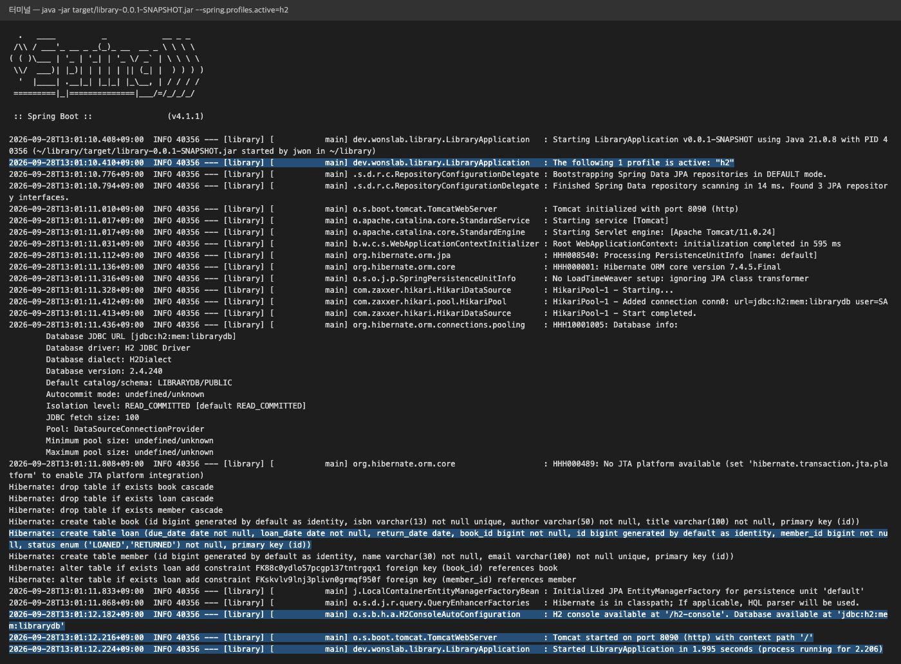
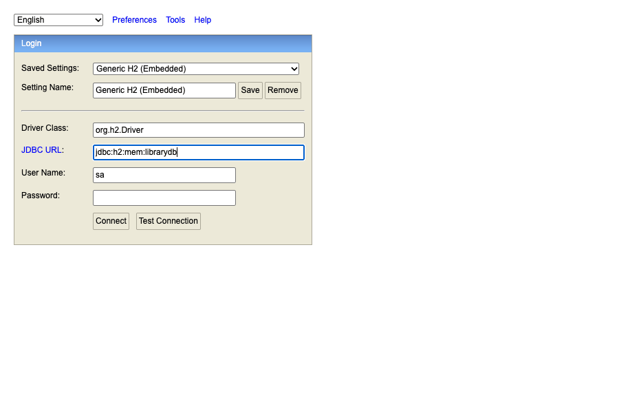
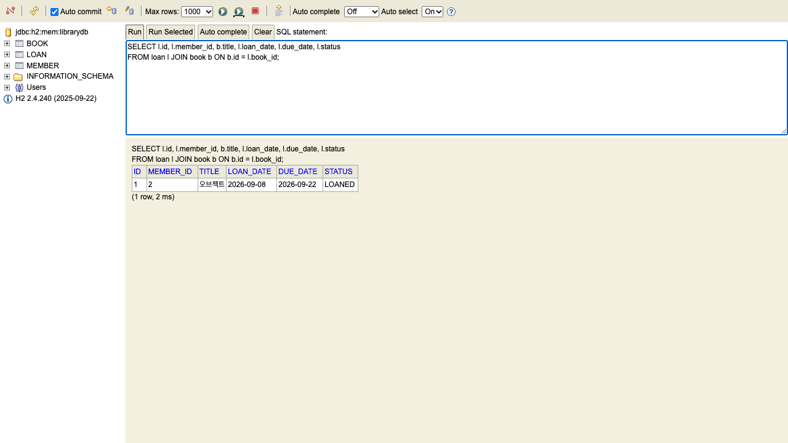
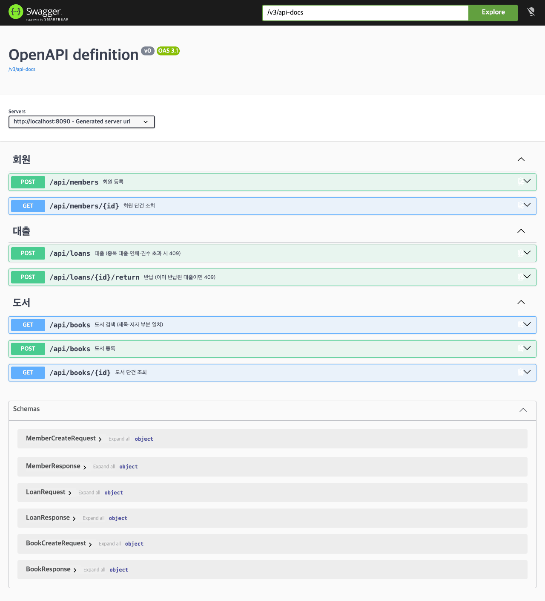
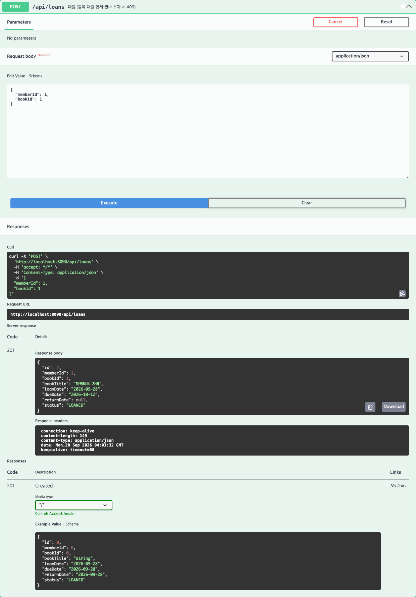
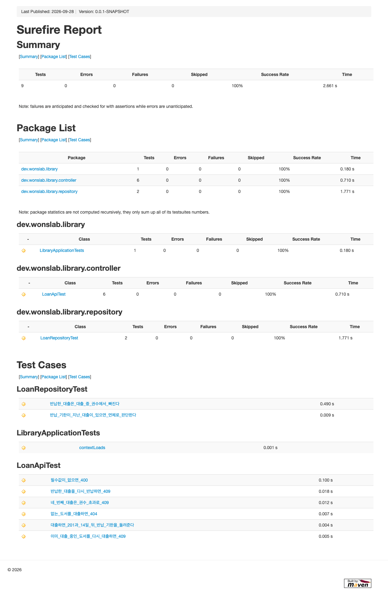

# Spring 실습 과제 — 도서 대여 REST API

> **이 과제의 목표**: ch06~ch09에서 배운 Spring Boot·JPA·예외 처리·테스트를 한 프로젝트로 묶어, **업무 규칙이 있는 REST API**를 처음부터 끝까지 직접 만듭니다. 결과물은 H2 인메모리 DB 위에서 도는 도서 대여 서비스이고, Swagger UI와 curl로 호출하고 테스트로 지킵니다.
>
> **선수 학습**: [[java-study-ch06]](프로젝트 생성·프로파일) · [[java-study-ch07]](JPA·쿼리) · [[java-study-ch09]](테스트). 코스 안내는 [[guide-java-track4-spring-web]]에 있습니다.

---

## 과제 개요

도서관의 대출 창구를 API로 옮깁니다. 사서는 도서를 등록하고, 회원을 가입시키고, 대출·반납을 처리합니다. 단순 CRUD가 아니라 **"연체 중이면 대출 불가" 같은 업무 규칙을 서비스 계층에서 지키고, 규칙 위반을 알맞은 HTTP 상태 코드로 돌려주는 것**이 이 과제의 핵심입니다.

| 항목 | 내용 |
|------|------|
| 결과물 | 도서·회원·대출 3개 도메인의 REST API (엔드포인트 7개) |
| 기술 | Spring Boot 4.1.1 · Java 21 · Maven · Spring Data JPA · H2 · Bean Validation · springdoc-openapi(Swagger UI) |
| 예상 소요 | 4~6시간 (단계별 모범 답안을 보면 2시간) |
| 프로젝트 | `library` (groupId `dev.wonslab`, 기본 패키지 `dev.wonslab.library`) |

### 학습 목표

| # | 목표 | 확인 방법 |
|---|------|----------|
| 1 | controller·service·repository·domain·dto 계층을 나누고 각 계층의 책임을 설명할 수 있습니다 | 패키지 구조 |
| 2 | JPA 엔티티 연관관계(`@ManyToOne`)와 enum 매핑(`@Enumerated(STRING)`)을 쓸 수 있습니다 | H2 콘솔에서 테이블 확인 |
| 3 | 업무 규칙 위반을 예외로 표현하고 전역 핸들러에서 400/404/409로 변환할 수 있습니다 | curl 시나리오 |
| 4 | 프로파일(`application-h2.yml`)로 실행 환경을 분리하고 `data.sql`로 시드 데이터를 넣을 수 있습니다 | 기동 로그·H2 콘솔 |
| 5 | `@DataJpaTest`와 `@SpringBootTest`+MockMvc로 규칙을 테스트할 수 있습니다 | `./mvnw test` 통과 |

---

## 요구사항·업무 규칙

아래 규칙이 이 과제의 채점 대상입니다. 규칙 번호(R1~R7)는 본문 전체에서 같은 뜻으로 씁니다.

| 번호 | 규칙 | 위반 시 응답 | 오류 코드 |
|------|------|------------|----------|
| R1 | ISBN이 같은 도서는 두 번 등록할 수 없습니다 | 409 Conflict | `DUPLICATE_ISBN` |
| R2 | 이메일이 같은 회원은 두 번 가입할 수 없습니다 | 409 Conflict | `DUPLICATE_EMAIL` |
| R3 | 이미 대출 중인 도서는 다시 대출할 수 없다 (중복 대출 금지) | 409 Conflict | `BOOK_ALREADY_LOANED` |
| R4 | 반납 기한이 지난 대출이 하나라도 있는 회원은 새로 대출할 수 없다 (연체 불가) | 409 Conflict | `OVERDUE_MEMBER` |
| R5 | 회원 한 명이 동시에 빌릴 수 있는 도서는 최대 3권이다 (대출 가능 권수) | 409 Conflict | `LOAN_LIMIT_EXCEEDED` |
| R6 | 대출 기간은 14일이다 — 반납 기한 = 대출일 + 14일 | — | — |
| R7 | 이미 반납된 대출은 다시 반납할 수 없습니다 | 409 Conflict | `ALREADY_RETURNED` |

공통 규칙도 함께 지킵니다.

| 상황 | 응답 | 오류 코드 |
|------|------|----------|
| 요청 본문 검증 실패 (빈 제목, ISBN 형식 오류, 이메일 형식 오류, 필수 ID 누락) | 400 Bad Request | `INVALID_INPUT` |
| 없는 도서·회원·대출 ID | 404 Not Found | `BOOK_NOT_FOUND` · `MEMBER_NOT_FOUND` · `LOAN_NOT_FOUND` |

오류 응답은 모두 같은 JSON 모양 `{"status": 409, "code": "BOOK_ALREADY_LOANED", "message": "이미 대출 중인 도서입니다"}`으로 통일합니다. 클라이언트가 `code`만 보고 분기할 수 있게 하기 위해서입니다.

## API 명세

| 기능 | 메서드 | 경로 | 요청 본문 | 성공 응답 |
|------|--------|------|----------|----------|
| 도서 등록 | POST | `/api/books` | `{"isbn","title","author"}` | 201 + 도서 |
| 도서 검색 | GET | `/api/books?keyword=자바` | — | 200 + 도서 목록 (제목·저자 부분 일치, keyword 없으면 전체) |
| 도서 단건 조회 | GET | `/api/books/{id}` | — | 200 + 도서 |
| 회원 등록 | POST | `/api/members` | `{"name","email"}` | 201 + 회원 |
| 회원 단건 조회 | GET | `/api/members/{id}` | — | 200 + 회원 |
| 대출 | POST | `/api/loans` | `{"memberId","bookId"}` | 201 + 대출 |
| 반납 | POST | `/api/loans/{id}/return` | — | 200 + 대출 (`status: RETURNED`) |

반납을 `DELETE`가 아니라 `POST .../return`으로 둔 이유는 반납이 대출 기록을 지우는 일이 아니라 **상태를 바꾸는 행위**이기 때문입니다. 대출 이력은 연체 판단과 통계에 계속 쓰입니다.

---

## 1. 프로젝트 구성

이 단계에서는 빈 프로젝트를 만들고 의존성을 고정합니다. [[java-study-ch06]] 6.1에서 `demo`를 만든 것과 같은 방법으로 start.spring.io에 요청합니다.

```bash
# start.spring.io에 요청해 zip으로 받아 푼다 (한 줄)
curl https://start.spring.io/starter.zip -d type=maven-project -d language=java -d javaVersion=21 -d groupId=dev.wonslab -d artifactId=library -d packageName=dev.wonslab.library -d dependencies=web,data-jpa,validation,h2 -o library.zip
unzip library.zip -d library
cd library
```

> **Windows**: PowerShell에서는 `curl` 대신 **`curl.exe`**로 실행하고, 압축은 `Expand-Archive library.zip -DestinationPath library`로 풉니다. 브라우저에서 [start.spring.io](https://start.spring.io)에 같은 값을 넣고 **Generate**를 눌러도 됩니다.

이 과제는 챕터들과 같은 **Spring Boot 4.1.1**을 기준으로 하며, 생성된 `pom.xml`을 그대로 씁니다. Spring Boot 4부터는 스타터가 기능별로 잘게 나뉘어서, 생성된 `pom.xml`의 의존성 이름이 3.x와 조금 다릅니다.

| 생성된 의존성 (Boot 4.1.1) | 역할 | Boot 3.x에서의 이름 |
|------|------|------|
| `spring-boot-starter-webmvc` | REST 컨트롤러·내장 톰캣 | `spring-boot-starter-web` |
| `spring-boot-starter-data-jpa` | Spring Data JPA + Hibernate | 같음 |
| `spring-boot-starter-validation` | Bean Validation | 같음 |
| `spring-boot-h2console` | H2 웹 콘솔 자동 구성 | 별도 모듈 없음 (코어에 포함) |
| `h2` (runtime) | 인메모리 DB | 같음 |
| `spring-boot-starter-data-jpa-test` 외 `-test` 2개 | `@DataJpaTest`·MockMvc 등 테스트 지원 | `spring-boot-starter-test` 하나 |

여기에 Swagger UI를 띄워 주는 springdoc 의존성 하나만 추가합니다. Boot 4에는 **springdoc 3.x 계열**이 맞습니다(2.x는 Boot 3용). 아래 블록을 `pom.xml`의 `<dependencies>` 안, `spring-boot-starter-webmvc` 의존성 바로 아래에 붙여 넣습니다.

**추가할 내용** (`pom.xml`의 `<dependencies>` 안):

```xml
        <dependency>
            <groupId>org.springdoc</groupId>
            <artifactId>springdoc-openapi-starter-webmvc-ui</artifactId>
            <version>3.1.1</version> <!-- Boot 3.x라면 2.8.x -->
        </dependency>
```

생성기가 넣어 준 `src/main/resources/application.properties`는 지웁니다. 설정은 2단계에서 YAML 파일로 새로 만듭니다.

```bash
rm src/main/resources/application.properties        # Windows: del src\main\resources\application.properties
./mvnw compile                                      # Windows: mvnw.cmd compile
```

```text
예상 결과
[INFO] BUILD SUCCESS
```

과제를 모두 마쳤을 때의 최종 구조는 아래와 같습니다. 이 트리를 지도로 삼아 단계마다 파일을 하나씩 채웁니다. `LibraryApplication.java`와 `LibraryApplicationTests.java`는 생성기가 이미 만들어 두었으므로 그대로 둡니다.

```text
library/
├── pom.xml
└── src/
    ├── main/
    │   ├── java/dev/wonslab/library/
    │   │   ├── LibraryApplication.java          (생성기 제공)
    │   │   ├── domain/        Book, Member, Loan, LoanStatus
    │   │   ├── repository/    BookRepository, MemberRepository, LoanRepository
    │   │   ├── dto/           BookCreateRequest, BookResponse, MemberCreateRequest,
    │   │   │                  MemberResponse, LoanRequest, LoanResponse, ErrorResponse
    │   │   ├── exception/     ErrorCode, LibraryException, GlobalExceptionHandler
    │   │   ├── service/       BookService, MemberService, LoanService
    │   │   └── controller/    BookController, MemberController, LoanController
    │   └── resources/
    │       ├── application.yml
    │       ├── application-h2.yml
    │       └── data.sql
    └── test/java/dev/wonslab/library/
        ├── LibraryApplicationTests.java         (생성기 제공)
        ├── repository/LoanRepositoryTest.java
        └── controller/LoanApiTest.java
```

---

## 2. 설정과 프로파일

코드보다 설정을 먼저 만드는 이유는, 이후 단계마다 `./mvnw compile`과 테스트가 **어떤 DB를 바라보는지** 처음부터 분명히 해 두기 위해서입니다. [[java-study-ch06]] 6.3에서 본 프로파일 분리를 그대로 적용합니다.

| 파일 | 언제 적용되나 | 담는 내용 |
|------|-------------|----------|
| `application.yml` | 항상 (공통) | 포트, Open Session In View 끄기, 시드 데이터 기본 비활성, Swagger 경로 |
| `application-h2.yml` | `h2` 프로파일을 켰을 때만 | H2 URL·계정, DDL 전략, SQL 로그, H2 콘솔, 시드 데이터 활성 |

공통 설정 파일입니다. 포트를 8090으로 두는 이유는 ch06의 `demo`(8080)와 동시에 띄워도 충돌하지 않게 하기 위해서입니다.

**파일**: src/main/resources/application.yml

```yaml
server:
  port: 8090

spring:
  application:
    name: library
  jpa:
    open-in-view: false        # 지연 로딩은 트랜잭션(서비스) 안에서만 — 컨트롤러로 새지 않게
  sql:
    init:
      mode: never              # 시드 데이터는 h2 프로파일에서만 넣는다 (테스트는 빈 DB)

springdoc:
  swagger-ui:
    path: /swagger-ui.html
```

H2 프로파일 파일입니다. `defer-datasource-initialization`은 **Hibernate가 테이블을 만든 뒤에** `data.sql`을 실행하라는 뜻입니다. 이 값이 없으면 테이블이 생기기 전에 INSERT가 실행돼 기동이 실패합니다.

**파일**: src/main/resources/application-h2.yml

```yaml
spring:
  datasource:
    url: jdbc:h2:mem:librarydb
    username: sa
    password:
  jpa:
    hibernate:
      ddl-auto: create-drop
    show-sql: true
    defer-datasource-initialization: true
  sql:
    init:
      mode: always
  h2:
    console:
      enabled: true
      path: /h2-console
```

시드 데이터입니다. 도서 4권과 회원 2명을 넣고, **2번 회원(`이연체`)에게는 반납 기한이 6일 지난 대출**을 하나 걸어 둡니다. R4(연체 불가)를 curl로 바로 확인하기 위한 장치입니다. 날짜는 H2 함수 `DATEADD`로 실행 시점 기준으로 계산하므로 언제 실행해도 연체 상태가 됩니다.

**파일**: src/main/resources/data.sql

```sql
INSERT INTO book (isbn, title, author) VALUES ('9788966262281', '이펙티브 자바', '조슈아 블로크');
INSERT INTO book (isbn, title, author) VALUES ('9788960777330', '자바 ORM 표준 JPA 프로그래밍', '김영한');
INSERT INTO book (isbn, title, author) VALUES ('9788966260959', '클린 코드', '로버트 C. 마틴');
INSERT INTO book (isbn, title, author) VALUES ('9791158391409', '오브젝트', '조영호');

INSERT INTO member (name, email) VALUES ('김자바', 'java@example.com');
INSERT INTO member (name, email) VALUES ('이연체', 'late@example.com');

INSERT INTO loan (member_id, book_id, loan_date, due_date, status)
VALUES (2, 4, DATEADD('DAY', -20, CURRENT_DATE), DATEADD('DAY', -6, CURRENT_DATE), 'LOANED');
```

아직 엔티티가 없으므로 이 단계에서는 앱을 실행하지 않습니다. 테이블은 4단계의 엔티티에서 만들어집니다.

---

## 3. 오류 코드와 예외

**과제**: 코드를 쓰기 전에 **실패하는 경우부터 정합니다**. `exception` 패키지에 오류 코드 enum `ErrorCode`와 예외 클래스 `LibraryException`을 만듭니다. 요구사항 표의 오류 코드가 곧 이 enum의 상수 목록이고, 뒤 단계의 엔티티·서비스는 규칙을 어길 때 이 예외를 던지기만 하면 됩니다.

| 파일 | 요구 사항 |
|------|----------|
| `ErrorCode` | 요구사항 표의 오류 코드 9개 + 각각의 HTTP 상태(`HttpStatus`) + 한글 메시지 |
| `LibraryException` | `ErrorCode`를 담는 `RuntimeException`, 예외 메시지는 `ErrorCode`의 메시지 |

`LibraryException`을 `RuntimeException`으로 만드는 이유는 스프링 `@Transactional`이 **런타임 예외에서만 자동 롤백**하기 때문입니다 ([[concept-transactional-rollback-policy]]). 규칙마다 예외 클래스를 따로 만들지 않고 `ErrorCode` 하나로 구분하면, 규칙이 늘어도 enum에 한 줄만 추가하면 됩니다.

??? example "모범 답안 — exception 패키지 (2개 파일)"

    오류 코드 목록입니다. 요구사항 표의 코드와 1:1로 대응합니다.

    **파일**: src/main/java/dev/wonslab/library/exception/ErrorCode.java

    ```java
    package dev.wonslab.library.exception;

    import org.springframework.http.HttpStatus;

    public enum ErrorCode {
        BOOK_NOT_FOUND(HttpStatus.NOT_FOUND, "도서를 찾을 수 없습니다"),
        MEMBER_NOT_FOUND(HttpStatus.NOT_FOUND, "회원을 찾을 수 없습니다"),
        LOAN_NOT_FOUND(HttpStatus.NOT_FOUND, "대출 기록을 찾을 수 없습니다"),
        DUPLICATE_ISBN(HttpStatus.CONFLICT, "이미 등록된 ISBN입니다"),
        DUPLICATE_EMAIL(HttpStatus.CONFLICT, "이미 가입된 이메일입니다"),
        BOOK_ALREADY_LOANED(HttpStatus.CONFLICT, "이미 대출 중인 도서입니다"),
        OVERDUE_MEMBER(HttpStatus.CONFLICT, "연체 중인 도서가 있어 대출할 수 없습니다"),
        LOAN_LIMIT_EXCEEDED(HttpStatus.CONFLICT, "대출 가능 권수(3권)를 초과했습니다"),
        ALREADY_RETURNED(HttpStatus.CONFLICT, "이미 반납된 대출입니다");

        private final HttpStatus status;
        private final String message;

        ErrorCode(HttpStatus status, String message) {
            this.status = status;
            this.message = message;
        }

        public HttpStatus getStatus() { return status; }
        public String getMessage() { return message; }
    }
    ```

    규칙 위반 예외입니다. 예외 클래스를 규칙마다 만들지 않고, `ErrorCode` 하나로 구분합니다.

    **파일**: src/main/java/dev/wonslab/library/exception/LibraryException.java

    ```java
    package dev.wonslab.library.exception;

    public class LibraryException extends RuntimeException {

        private final ErrorCode errorCode;

        public LibraryException(ErrorCode errorCode) {
            super(errorCode.getMessage());
            this.errorCode = errorCode;
        }

        public ErrorCode getErrorCode() {
            return errorCode;
        }
    }
    ```

생성기가 만든 `LibraryApplication`과 함께 컴파일되는지 확인합니다.

```bash
./mvnw compile        # Windows: mvnw.cmd compile
```

```text
예상 결과
[INFO] BUILD SUCCESS
```

---

## 4. 도메인 엔티티

**과제**: `domain` 패키지에 엔티티 3개와 enum 1개를 만듭니다. 이 단계의 목표는 **테이블 구조를 코드로 선언하고, 상태를 바꾸는 규칙은 엔티티 안에 두는 것**입니다.

| 클래스 | 필드 | 요구 사항 |
|--------|------|----------|
| `Book` | `id`, `isbn`, `title`, `author` | `isbn`은 unique·not null |
| `Member` | `id`, `name`, `email` | `email`은 unique·not null |
| `LoanStatus` | `LOANED`, `RETURNED` | enum |
| `Loan` | `id`, `member`, `book`, `loanDate`, `dueDate`, `returnDate`, `status` | 회원·도서와 `@ManyToOne(LAZY)`, `status`는 문자열로 저장, 생성 시 반납 기한 = 대출일 + 14일(R6), `returnBook()`에서 R7 검사 |

힌트는 세 가지입니다.

- JPA는 기본 생성자가 필요합니다. 외부에서 빈 객체를 만들지 못하게 `protected`로 둡니다.
- `@Enumerated`를 생략하면 enum이 **순서 번호(0, 1)** 로 저장돼, 나중에 상수 순서를 바꾸면 기존 데이터의 뜻이 뒤바뀝니다. 반드시 `EnumType.STRING`을 씁니다 ([[concept-jpa-enum-mapping]]).
- R7(재반납 금지)은 `Loan`의 상태만 보면 판단할 수 있으므로 서비스가 아니라 엔티티 메서드에 둡니다. 위반하면 3단계의 `LibraryException(ErrorCode.ALREADY_RETURNED)`를 던집니다.

??? example "모범 답안 — domain 패키지 (4개 파일)"

    도서 엔티티입니다. 식별자는 DB의 IDENTITY 컬럼에 맡깁니다.

    **파일**: src/main/java/dev/wonslab/library/domain/Book.java

    ```java
    package dev.wonslab.library.domain;

    import jakarta.persistence.Column;
    import jakarta.persistence.Entity;
    import jakarta.persistence.GeneratedValue;
    import jakarta.persistence.GenerationType;
    import jakarta.persistence.Id;

    @Entity
    public class Book {

        @Id
        @GeneratedValue(strategy = GenerationType.IDENTITY)
        private Long id;

        @Column(nullable = false, unique = true, length = 13)
        private String isbn;

        @Column(nullable = false, length = 100)
        private String title;

        @Column(nullable = false, length = 50)
        private String author;

        protected Book() {
        }

        public Book(String isbn, String title, String author) {
            this.isbn = isbn;
            this.title = title;
            this.author = author;
        }

        public Long getId() { return id; }
        public String getIsbn() { return isbn; }
        public String getTitle() { return title; }
        public String getAuthor() { return author; }
    }
    ```

    회원 엔티티입니다. 구조는 `Book`과 같습니다.

    **파일**: src/main/java/dev/wonslab/library/domain/Member.java

    ```java
    package dev.wonslab.library.domain;

    import jakarta.persistence.Column;
    import jakarta.persistence.Entity;
    import jakarta.persistence.GeneratedValue;
    import jakarta.persistence.GenerationType;
    import jakarta.persistence.Id;

    @Entity
    public class Member {

        @Id
        @GeneratedValue(strategy = GenerationType.IDENTITY)
        private Long id;

        @Column(nullable = false, length = 30)
        private String name;

        @Column(nullable = false, unique = true, length = 100)
        private String email;

        protected Member() {
        }

        public Member(String name, String email) {
            this.name = name;
            this.email = email;
        }

        public Long getId() { return id; }
        public String getName() { return name; }
        public String getEmail() { return email; }
    }
    ```

    대출 상태 enum입니다. 연체는 별도 상태로 저장하지 않고 "대출 중 + 기한 경과"로 계산합니다. 매일 상태를 바꾸는 배치가 필요 없어지기 때문입니다.

    **파일**: src/main/java/dev/wonslab/library/domain/LoanStatus.java

    ```java
    package dev.wonslab.library.domain;

    public enum LoanStatus {
        LOANED,
        RETURNED
    }
    ```

    대출 엔티티입니다. 대출 기간(R6)과 회원당 최대 권수(R5)를 상수로 두고, 재반납 금지(R7)를 `returnBook()` 안에서 검사합니다.

    **파일**: src/main/java/dev/wonslab/library/domain/Loan.java

    ```java
    package dev.wonslab.library.domain;

    import dev.wonslab.library.exception.ErrorCode;
    import dev.wonslab.library.exception.LibraryException;
    import jakarta.persistence.Column;
    import jakarta.persistence.Entity;
    import jakarta.persistence.EnumType;
    import jakarta.persistence.Enumerated;
    import jakarta.persistence.FetchType;
    import jakarta.persistence.GeneratedValue;
    import jakarta.persistence.GenerationType;
    import jakarta.persistence.Id;
    import jakarta.persistence.JoinColumn;
    import jakarta.persistence.ManyToOne;
    import java.time.LocalDate;

    @Entity
    public class Loan {

        public static final int LOAN_DAYS = 14;
        public static final int MAX_LOANS_PER_MEMBER = 3;

        @Id
        @GeneratedValue(strategy = GenerationType.IDENTITY)
        private Long id;

        @ManyToOne(fetch = FetchType.LAZY, optional = false)
        @JoinColumn(name = "member_id")
        private Member member;

        @ManyToOne(fetch = FetchType.LAZY, optional = false)
        @JoinColumn(name = "book_id")
        private Book book;

        @Column(nullable = false)
        private LocalDate loanDate;

        @Column(nullable = false)
        private LocalDate dueDate;

        private LocalDate returnDate;

        @Enumerated(EnumType.STRING)
        @Column(nullable = false, length = 20)
        private LoanStatus status;

        protected Loan() {
        }

        public Loan(Member member, Book book, LocalDate today) {
            this.member = member;
            this.book = book;
            this.loanDate = today;
            this.dueDate = today.plusDays(LOAN_DAYS);
            this.status = LoanStatus.LOANED;
        }

        public void returnBook(LocalDate today) {
            if (status == LoanStatus.RETURNED) {
                throw new LibraryException(ErrorCode.ALREADY_RETURNED);
            }
            this.status = LoanStatus.RETURNED;
            this.returnDate = today;
        }

        public Long getId() { return id; }
        public Member getMember() { return member; }
        public Book getBook() { return book; }
        public LocalDate getLoanDate() { return loanDate; }
        public LocalDate getDueDate() { return dueDate; }
        public LocalDate getReturnDate() { return returnDate; }
        public LoanStatus getStatus() { return status; }
    }
    ```

엔티티까지 컴파일되는지 확인합니다.

```bash
./mvnw compile        # Windows: mvnw.cmd compile
```

```text
예상 결과
[INFO] BUILD SUCCESS
```

---

## 5. 리포지토리

**과제**: `repository` 패키지에 Spring Data JPA 인터페이스 3개를 만듭니다. 이 단계의 목표는 **업무 규칙 검사에 필요한 질문을 메서드 이름으로 표현하는 것**입니다. 쿼리를 직접 쓰지 않고, 메서드 이름 규칙(쿼리 메서드)으로 Spring Data가 JPQL을 만들게 합니다.

| 규칙 | 서비스가 던질 질문 | 쿼리 메서드 |
|------|------------------|------------|
| R1 | 이 ISBN이 이미 있는가? | `BookRepository.existsByIsbn` |
| 검색 | 제목이나 저자에 키워드가 들어간 도서는? | `BookRepository.findByTitleContainingOrAuthorContaining` |
| R2 | 이 이메일이 이미 있는가? | `MemberRepository.existsByEmail` |
| R3 | 이 도서가 지금 대출 중인가? | `LoanRepository.existsByBookIdAndStatus` |
| R4 | 이 회원에게 기한이 오늘보다 이전인 대출 중 기록이 있는가? | `LoanRepository.existsByMemberIdAndStatusAndDueDateBefore` |
| R5 | 이 회원이 지금 몇 권을 빌렸는가? | `LoanRepository.countByMemberIdAndStatus` |

`MemberId`처럼 연관 엔티티의 필드를 이어 쓰면 `loan.member.id`로 해석됩니다.

??? example "모범 답안 — repository 패키지 (3개 파일)"

    도서 리포지토리입니다.

    **파일**: src/main/java/dev/wonslab/library/repository/BookRepository.java

    ```java
    package dev.wonslab.library.repository;

    import dev.wonslab.library.domain.Book;
    import java.util.List;
    import org.springframework.data.jpa.repository.JpaRepository;

    public interface BookRepository extends JpaRepository<Book, Long> {

        boolean existsByIsbn(String isbn);

        List<Book> findByTitleContainingOrAuthorContaining(String title, String author);
    }
    ```

    회원 리포지토리입니다.

    **파일**: src/main/java/dev/wonslab/library/repository/MemberRepository.java

    ```java
    package dev.wonslab.library.repository;

    import dev.wonslab.library.domain.Member;
    import org.springframework.data.jpa.repository.JpaRepository;

    public interface MemberRepository extends JpaRepository<Member, Long> {

        boolean existsByEmail(String email);
    }
    ```

    대출 리포지토리입니다. R3·R4·R5 검사용 메서드 3개가 핵심입니다.

    **파일**: src/main/java/dev/wonslab/library/repository/LoanRepository.java

    ```java
    package dev.wonslab.library.repository;

    import dev.wonslab.library.domain.Loan;
    import dev.wonslab.library.domain.LoanStatus;
    import java.time.LocalDate;
    import org.springframework.data.jpa.repository.JpaRepository;

    public interface LoanRepository extends JpaRepository<Loan, Long> {

        boolean existsByBookIdAndStatus(Long bookId, LoanStatus status);

        boolean existsByMemberIdAndStatusAndDueDateBefore(Long memberId, LoanStatus status, LocalDate date);

        long countByMemberIdAndStatus(Long memberId, LoanStatus status);
    }
    ```

리포지토리도 컴파일로 확인합니다.

```bash
./mvnw compile        # Windows: mvnw.cmd compile
```

```text
예상 결과
[INFO] BUILD SUCCESS
```

---

## 6. DTO

**과제**: 요청·응답을 담는 `dto` 패키지를 만듭니다. 이 단계의 목표는 **엔티티를 API 밖으로 직접 내보내지 않고, 입력 검증을 선언으로 처리하는 것**입니다.

| 파일 | 요구 사항 |
|------|----------|
| `BookCreateRequest` | `isbn`은 숫자 13자리, `title`(최대 100자)·`author`(최대 50자)는 공백 불가 |
| `MemberCreateRequest` | `name`은 공백 불가(최대 30자), `email`은 이메일 형식 |
| `LoanRequest` | `memberId`·`bookId`는 필수 |
| `BookResponse`·`MemberResponse`·`LoanResponse` | 엔티티를 받아 만드는 정적 팩토리 `from()` |
| `ErrorResponse` | `status`, `code`, `message` |

DTO는 Java `record`로 만듭니다. 검증 애너테이션의 `message`를 직접 적어 두면 PC의 언어 설정과 관계없이 같은 오류 메시지가 나옵니다. 엔티티 대신 DTO를 쓰면 API 응답 모양이 테이블 구조에 끌려가지 않고, 지연 로딩 필드가 JSON 변환 중에 터지는 일도 막을 수 있습니다.

??? example "모범 답안 — dto 패키지 (7개 파일)"

    도서 등록 요청입니다.

    **파일**: src/main/java/dev/wonslab/library/dto/BookCreateRequest.java

    ```java
    package dev.wonslab.library.dto;

    import jakarta.validation.constraints.NotBlank;
    import jakarta.validation.constraints.Pattern;
    import jakarta.validation.constraints.Size;

    public record BookCreateRequest(
            @NotBlank(message = "ISBN은 필수입니다")
            @Pattern(regexp = "\\d{13}", message = "ISBN은 숫자 13자리여야 합니다")
            String isbn,

            @NotBlank(message = "제목은 필수입니다")
            @Size(max = 100, message = "제목은 100자 이하여야 합니다")
            String title,

            @NotBlank(message = "저자는 필수입니다")
            @Size(max = 50, message = "저자는 50자 이하여야 합니다")
            String author) {
    }
    ```

    도서 응답입니다.

    **파일**: src/main/java/dev/wonslab/library/dto/BookResponse.java

    ```java
    package dev.wonslab.library.dto;

    import dev.wonslab.library.domain.Book;

    public record BookResponse(Long id, String isbn, String title, String author) {

        public static BookResponse from(Book book) {
            return new BookResponse(book.getId(), book.getIsbn(), book.getTitle(), book.getAuthor());
        }
    }
    ```

    회원 등록 요청입니다.

    **파일**: src/main/java/dev/wonslab/library/dto/MemberCreateRequest.java

    ```java
    package dev.wonslab.library.dto;

    import jakarta.validation.constraints.Email;
    import jakarta.validation.constraints.NotBlank;
    import jakarta.validation.constraints.Size;

    public record MemberCreateRequest(
            @NotBlank(message = "이름은 필수입니다")
            @Size(max = 30, message = "이름은 30자 이하여야 합니다")
            String name,

            @NotBlank(message = "이메일은 필수입니다")
            @Email(message = "이메일 형식이 아닙니다")
            String email) {
    }
    ```

    회원 응답입니다.

    **파일**: src/main/java/dev/wonslab/library/dto/MemberResponse.java

    ```java
    package dev.wonslab.library.dto;

    import dev.wonslab.library.domain.Member;

    public record MemberResponse(Long id, String name, String email) {

        public static MemberResponse from(Member member) {
            return new MemberResponse(member.getId(), member.getName(), member.getEmail());
        }
    }
    ```

    대출 요청입니다.

    **파일**: src/main/java/dev/wonslab/library/dto/LoanRequest.java

    ```java
    package dev.wonslab.library.dto;

    import jakarta.validation.constraints.NotNull;

    public record LoanRequest(
            @NotNull(message = "회원 ID는 필수입니다") Long memberId,
            @NotNull(message = "도서 ID는 필수입니다") Long bookId) {
    }
    ```

    대출 응답입니다. `getBook().getTitle()`은 지연 로딩된 도서를 실제로 읽으므로, 이 변환은 트랜잭션이 열린 서비스 안에서 해야 합니다.

    **파일**: src/main/java/dev/wonslab/library/dto/LoanResponse.java

    ```java
    package dev.wonslab.library.dto;

    import dev.wonslab.library.domain.Loan;
    import dev.wonslab.library.domain.LoanStatus;
    import java.time.LocalDate;

    public record LoanResponse(
            Long id,
            Long memberId,
            Long bookId,
            String bookTitle,
            LocalDate loanDate,
            LocalDate dueDate,
            LocalDate returnDate,
            LoanStatus status) {

        public static LoanResponse from(Loan loan) {
            return new LoanResponse(
                    loan.getId(),
                    loan.getMember().getId(),
                    loan.getBook().getId(),
                    loan.getBook().getTitle(),
                    loan.getLoanDate(),
                    loan.getDueDate(),
                    loan.getReturnDate(),
                    loan.getStatus());
        }
    }
    ```

    오류 응답입니다. 모든 오류가 이 모양 하나로 나갑니다.

    **파일**: src/main/java/dev/wonslab/library/dto/ErrorResponse.java

    ```java
    package dev.wonslab.library.dto;

    public record ErrorResponse(int status, String code, String message) {
    }
    ```

DTO까지 컴파일되는지 확인합니다.

```bash
./mvnw compile        # Windows: mvnw.cmd compile
```

```text
예상 결과
[INFO] BUILD SUCCESS
```

---

## 7. 서비스 — 업무 규칙 구현

**과제**: `service` 패키지에 서비스 3개를 만듭니다. 이 단계가 과제의 중심입니다. **R1~R5를 서비스 메서드에서 검사하고, 위반하면 `LibraryException`을 던집니다.**

| 서비스 | 메서드 | 검사할 규칙 |
|--------|--------|-----------|
| `BookService` | `register`, `findById`, `search` | R1, 없는 ID는 `BOOK_NOT_FOUND` |
| `MemberService` | `register`, `findById` | R2, 없는 ID는 `MEMBER_NOT_FOUND` |
| `LoanService` | `loan` | 회원·도서 존재 → R3 → R4 → R5 순서 |
| `LoanService` | `returnBook` | 대출 존재 → R7(엔티티가 검사) |

트랜잭션은 클래스에 `@Transactional(readOnly = true)`를 붙이고, 쓰기 메서드에만 `@Transactional`을 다시 붙입니다. 조회가 기본이고 쓰기가 예외라는 것을 코드 모양으로 드러내는 관례입니다. 반납은 `save()`를 부르지 않아도 됩니다 — 트랜잭션 안에서 바뀐 엔티티는 커밋 시점에 JPA가 UPDATE를 보냅니다(변경 감지).

??? example "모범 답안 — service 패키지 (3개 파일)"

    도서 서비스입니다.

    **파일**: src/main/java/dev/wonslab/library/service/BookService.java

    ```java
    package dev.wonslab.library.service;

    import dev.wonslab.library.domain.Book;
    import dev.wonslab.library.dto.BookCreateRequest;
    import dev.wonslab.library.dto.BookResponse;
    import dev.wonslab.library.exception.ErrorCode;
    import dev.wonslab.library.exception.LibraryException;
    import dev.wonslab.library.repository.BookRepository;
    import java.util.List;
    import org.springframework.stereotype.Service;
    import org.springframework.transaction.annotation.Transactional;

    @Service
    @Transactional(readOnly = true)
    public class BookService {

        private final BookRepository bookRepository;

        public BookService(BookRepository bookRepository) {
            this.bookRepository = bookRepository;
        }

        @Transactional
        public BookResponse register(BookCreateRequest request) {
            if (bookRepository.existsByIsbn(request.isbn())) {
                throw new LibraryException(ErrorCode.DUPLICATE_ISBN);
            }
            Book book = bookRepository.save(new Book(request.isbn(), request.title(), request.author()));
            return BookResponse.from(book);
        }

        public BookResponse findById(Long id) {
            return bookRepository.findById(id)
                    .map(BookResponse::from)
                    .orElseThrow(() -> new LibraryException(ErrorCode.BOOK_NOT_FOUND));
        }

        public List<BookResponse> search(String keyword) {
            List<Book> books = (keyword == null || keyword.isBlank())
                    ? bookRepository.findAll()
                    : bookRepository.findByTitleContainingOrAuthorContaining(keyword, keyword);
            return books.stream().map(BookResponse::from).toList();
        }
    }
    ```

    회원 서비스입니다.

    **파일**: src/main/java/dev/wonslab/library/service/MemberService.java

    ```java
    package dev.wonslab.library.service;

    import dev.wonslab.library.domain.Member;
    import dev.wonslab.library.dto.MemberCreateRequest;
    import dev.wonslab.library.dto.MemberResponse;
    import dev.wonslab.library.exception.ErrorCode;
    import dev.wonslab.library.exception.LibraryException;
    import dev.wonslab.library.repository.MemberRepository;
    import org.springframework.stereotype.Service;
    import org.springframework.transaction.annotation.Transactional;

    @Service
    @Transactional(readOnly = true)
    public class MemberService {

        private final MemberRepository memberRepository;

        public MemberService(MemberRepository memberRepository) {
            this.memberRepository = memberRepository;
        }

        @Transactional
        public MemberResponse register(MemberCreateRequest request) {
            if (memberRepository.existsByEmail(request.email())) {
                throw new LibraryException(ErrorCode.DUPLICATE_EMAIL);
            }
            Member member = memberRepository.save(new Member(request.name(), request.email()));
            return MemberResponse.from(member);
        }

        public MemberResponse findById(Long id) {
            return memberRepository.findById(id)
                    .map(MemberResponse::from)
                    .orElseThrow(() -> new LibraryException(ErrorCode.MEMBER_NOT_FOUND));
        }
    }
    ```

    대출 서비스입니다. 규칙 검사 순서가 곧 오류 우선순위입니다 — 존재하지 않는 대상(404)을 먼저 거르고, 그다음 도서 쪽(R3), 회원 쪽(R4·R5) 순서로 봅니다.

    **파일**: src/main/java/dev/wonslab/library/service/LoanService.java

    ```java
    package dev.wonslab.library.service;

    import dev.wonslab.library.domain.Book;
    import dev.wonslab.library.domain.Loan;
    import dev.wonslab.library.domain.LoanStatus;
    import dev.wonslab.library.domain.Member;
    import dev.wonslab.library.dto.LoanRequest;
    import dev.wonslab.library.dto.LoanResponse;
    import dev.wonslab.library.exception.ErrorCode;
    import dev.wonslab.library.exception.LibraryException;
    import dev.wonslab.library.repository.BookRepository;
    import dev.wonslab.library.repository.LoanRepository;
    import dev.wonslab.library.repository.MemberRepository;
    import java.time.LocalDate;
    import org.springframework.stereotype.Service;
    import org.springframework.transaction.annotation.Transactional;

    @Service
    @Transactional(readOnly = true)
    public class LoanService {

        private final LoanRepository loanRepository;
        private final MemberRepository memberRepository;
        private final BookRepository bookRepository;

        public LoanService(LoanRepository loanRepository, MemberRepository memberRepository,
                           BookRepository bookRepository) {
            this.loanRepository = loanRepository;
            this.memberRepository = memberRepository;
            this.bookRepository = bookRepository;
        }

        @Transactional
        public LoanResponse loan(LoanRequest request) {
            Member member = memberRepository.findById(request.memberId())
                    .orElseThrow(() -> new LibraryException(ErrorCode.MEMBER_NOT_FOUND));
            Book book = bookRepository.findById(request.bookId())
                    .orElseThrow(() -> new LibraryException(ErrorCode.BOOK_NOT_FOUND));
            LocalDate today = LocalDate.now();

            if (loanRepository.existsByBookIdAndStatus(book.getId(), LoanStatus.LOANED)) {
                throw new LibraryException(ErrorCode.BOOK_ALREADY_LOANED);             // R3
            }
            if (loanRepository.existsByMemberIdAndStatusAndDueDateBefore(member.getId(), LoanStatus.LOANED, today)) {
                throw new LibraryException(ErrorCode.OVERDUE_MEMBER);                  // R4
            }
            if (loanRepository.countByMemberIdAndStatus(member.getId(), LoanStatus.LOANED) >= Loan.MAX_LOANS_PER_MEMBER) {
                throw new LibraryException(ErrorCode.LOAN_LIMIT_EXCEEDED);             // R5
            }
            return LoanResponse.from(loanRepository.save(new Loan(member, book, today)));
        }

        @Transactional
        public LoanResponse returnBook(Long loanId) {
            Loan loan = loanRepository.findById(loanId)
                    .orElseThrow(() -> new LibraryException(ErrorCode.LOAN_NOT_FOUND));
            loan.returnBook(LocalDate.now());                                          // R7
            return LoanResponse.from(loan);
        }
    }
    ```

서비스까지 컴파일되는지 확인합니다.

```bash
./mvnw compile        # Windows: mvnw.cmd compile
```

```text
예상 결과
[INFO] BUILD SUCCESS
```

---

## 8. 컨트롤러와 전역 예외 처리

**과제**: `controller` 패키지에 컨트롤러 3개를, `exception` 패키지에 `GlobalExceptionHandler`를 만듭니다. 이 단계의 목표는 **HTTP를 서비스 호출로 번역하고, 예외를 상태 코드로 번역하는 일을 한곳에 모으는 것**입니다.

| 할 일 | 요구 사항 |
|-------|----------|
| 컨트롤러 | API 명세 표의 7개 엔드포인트. 등록·대출은 201, 나머지는 200. 요청 본문에 `@Valid` |
| Swagger 문서 | 컨트롤러에 `@Tag`, 메서드에 `@Operation(summary = ...)`로 한글 설명 |
| 전역 핸들러 | `LibraryException` → `ErrorCode`의 상태, `MethodArgumentNotValidException` → 400 `INVALID_INPUT` |

`@RestControllerAdvice`는 모든 컨트롤러에서 새어 나온 예외를 가로채는 클래스입니다. 컨트롤러마다 try-catch를 쓰지 않아도 되고, 오류 응답 모양이 한곳에서 정해집니다. 검증 실패 메시지는 필드 이름순으로 정렬해 이어 붙입니다 — 정렬하지 않으면 실행할 때마다 순서가 바뀌어 테스트하기 어렵습니다.

??? example "모범 답안 — controller 패키지 (3개 파일)"

    도서 컨트롤러입니다. 검색어는 선택 파라미터입니다.

    **파일**: src/main/java/dev/wonslab/library/controller/BookController.java

    ```java
    package dev.wonslab.library.controller;

    import dev.wonslab.library.dto.BookCreateRequest;
    import dev.wonslab.library.dto.BookResponse;
    import dev.wonslab.library.service.BookService;
    import io.swagger.v3.oas.annotations.Operation;
    import io.swagger.v3.oas.annotations.tags.Tag;
    import jakarta.validation.Valid;
    import java.util.List;
    import org.springframework.http.HttpStatus;
    import org.springframework.web.bind.annotation.GetMapping;
    import org.springframework.web.bind.annotation.PathVariable;
    import org.springframework.web.bind.annotation.PostMapping;
    import org.springframework.web.bind.annotation.RequestBody;
    import org.springframework.web.bind.annotation.RequestMapping;
    import org.springframework.web.bind.annotation.RequestParam;
    import org.springframework.web.bind.annotation.ResponseStatus;
    import org.springframework.web.bind.annotation.RestController;

    @Tag(name = "도서")
    @RestController
    @RequestMapping("/api/books")
    public class BookController {

        private final BookService bookService;

        public BookController(BookService bookService) {
            this.bookService = bookService;
        }

        @Operation(summary = "도서 등록")
        @PostMapping
        @ResponseStatus(HttpStatus.CREATED)
        public BookResponse register(@Valid @RequestBody BookCreateRequest request) {
            return bookService.register(request);
        }

        @Operation(summary = "도서 검색 (제목·저자 부분 일치)")
        @GetMapping
        public List<BookResponse> search(@RequestParam(required = false) String keyword) {
            return bookService.search(keyword);
        }

        @Operation(summary = "도서 단건 조회")
        @GetMapping("/{id}")
        public BookResponse findById(@PathVariable Long id) {
            return bookService.findById(id);
        }
    }
    ```

    회원 컨트롤러입니다.

    **파일**: src/main/java/dev/wonslab/library/controller/MemberController.java

    ```java
    package dev.wonslab.library.controller;

    import dev.wonslab.library.dto.MemberCreateRequest;
    import dev.wonslab.library.dto.MemberResponse;
    import dev.wonslab.library.service.MemberService;
    import io.swagger.v3.oas.annotations.Operation;
    import io.swagger.v3.oas.annotations.tags.Tag;
    import jakarta.validation.Valid;
    import org.springframework.http.HttpStatus;
    import org.springframework.web.bind.annotation.GetMapping;
    import org.springframework.web.bind.annotation.PathVariable;
    import org.springframework.web.bind.annotation.PostMapping;
    import org.springframework.web.bind.annotation.RequestBody;
    import org.springframework.web.bind.annotation.RequestMapping;
    import org.springframework.web.bind.annotation.ResponseStatus;
    import org.springframework.web.bind.annotation.RestController;

    @Tag(name = "회원")
    @RestController
    @RequestMapping("/api/members")
    public class MemberController {

        private final MemberService memberService;

        public MemberController(MemberService memberService) {
            this.memberService = memberService;
        }

        @Operation(summary = "회원 등록")
        @PostMapping
        @ResponseStatus(HttpStatus.CREATED)
        public MemberResponse register(@Valid @RequestBody MemberCreateRequest request) {
            return memberService.register(request);
        }

        @Operation(summary = "회원 단건 조회")
        @GetMapping("/{id}")
        public MemberResponse findById(@PathVariable Long id) {
            return memberService.findById(id);
        }
    }
    ```

    대출 컨트롤러입니다.

    **파일**: src/main/java/dev/wonslab/library/controller/LoanController.java

    ```java
    package dev.wonslab.library.controller;

    import dev.wonslab.library.dto.LoanRequest;
    import dev.wonslab.library.dto.LoanResponse;
    import dev.wonslab.library.service.LoanService;
    import io.swagger.v3.oas.annotations.Operation;
    import io.swagger.v3.oas.annotations.tags.Tag;
    import jakarta.validation.Valid;
    import org.springframework.http.HttpStatus;
    import org.springframework.web.bind.annotation.PathVariable;
    import org.springframework.web.bind.annotation.PostMapping;
    import org.springframework.web.bind.annotation.RequestBody;
    import org.springframework.web.bind.annotation.RequestMapping;
    import org.springframework.web.bind.annotation.ResponseStatus;
    import org.springframework.web.bind.annotation.RestController;

    @Tag(name = "대출")
    @RestController
    @RequestMapping("/api/loans")
    public class LoanController {

        private final LoanService loanService;

        public LoanController(LoanService loanService) {
            this.loanService = loanService;
        }

        @Operation(summary = "대출 (중복 대출·연체·권수 초과 시 409)")
        @PostMapping
        @ResponseStatus(HttpStatus.CREATED)
        public LoanResponse loan(@Valid @RequestBody LoanRequest request) {
            return loanService.loan(request);
        }

        @Operation(summary = "반납 (이미 반납된 대출이면 409)")
        @PostMapping("/{id}/return")
        public LoanResponse returnBook(@PathVariable Long id) {
            return loanService.returnBook(id);
        }
    }
    ```

??? example "모범 답안 — GlobalExceptionHandler.java"

    전역 예외 핸들러입니다.

    **파일**: src/main/java/dev/wonslab/library/exception/GlobalExceptionHandler.java

    ```java
    package dev.wonslab.library.exception;

    import dev.wonslab.library.dto.ErrorResponse;
    import java.util.stream.Collectors;
    import org.springframework.http.HttpStatus;
    import org.springframework.http.ResponseEntity;
    import org.springframework.web.bind.MethodArgumentNotValidException;
    import org.springframework.web.bind.annotation.ExceptionHandler;
    import org.springframework.web.bind.annotation.RestControllerAdvice;

    @RestControllerAdvice
    public class GlobalExceptionHandler {

        @ExceptionHandler(LibraryException.class)
        public ResponseEntity<ErrorResponse> handleLibrary(LibraryException e) {
            ErrorCode code = e.getErrorCode();
            return ResponseEntity.status(code.getStatus())
                    .body(new ErrorResponse(code.getStatus().value(), code.name(), code.getMessage()));
        }

        @ExceptionHandler(MethodArgumentNotValidException.class)
        public ResponseEntity<ErrorResponse> handleValidation(MethodArgumentNotValidException e) {
            String message = e.getBindingResult().getFieldErrors().stream()
                    .map(error -> error.getField() + ": " + error.getDefaultMessage())
                    .sorted()
                    .collect(Collectors.joining(", "));
            return ResponseEntity.badRequest()
                    .body(new ErrorResponse(HttpStatus.BAD_REQUEST.value(), "INVALID_INPUT", message));
        }
    }
    ```

모든 코드가 들어갔으므로 이번에는 패키징까지 해 봅니다. 테스트는 10단계에서 작성하므로 여기서는 생성기가 준 `contextLoads` 테스트 1개만 실행됩니다.

```bash
./mvnw package        # Windows: mvnw.cmd package
```

```text
예상 결과
[INFO] Tests run: 1, Failures: 0, Errors: 0, Skipped: 0
[INFO] BUILD SUCCESS
```

---

## 9. H2 프로파일로 실행하고 확인하기

이 단계에서는 완성한 API를 실제로 띄워 네 방향에서 확인합니다 — 기동 로그, H2 콘솔, Swagger UI, 그리고 curl 시나리오입니다.

### 9-1. 실행

`h2` 프로파일을 켜서 실행합니다. 서버가 터미널을 붙잡으므로, 이후 명령은 **새 터미널**에서 실행하고 끝나면 `Ctrl+C`로 내립니다.

```bash
./mvnw spring-boot:run -Dspring-boot.run.profiles=h2        # Windows: mvnw.cmd spring-boot:run -Dspring-boot.run.profiles=h2
```

jar로 실행해도 같습니다. 8단계에서 만든 `target/library-0.0.1-SNAPSHOT.jar`에 프로파일 인자를 넘깁니다.

```bash
java -jar target/library-0.0.1-SNAPSHOT.jar --spring.profiles.active=h2
```

핵심 줄만 추린 기동 로그입니다. 줄 앞의 `...`는 시각·로그 레벨·스레드 열을 생략한 표시이고, 초 단위 숫자는 PC마다 다릅니다.

```text
예상 결과
 :: Spring Boot ::                (v4.1.1)
... dev.wonslab.library.LibraryApplication   : The following 1 profile is active: "h2"
... o.s.boot.tomcat.TomcatWebServer          : Tomcat initialized with port 8090 (http)
Hibernate: create table book (id bigint generated by default as identity, isbn varchar(13) not null unique, author varchar(50) not null, title varchar(100) not null, primary key (id))
Hibernate: create table loan (due_date date not null, loan_date date not null, return_date date, book_id bigint not null, id bigint generated by default as identity, member_id bigint not null, status enum ('LOANED','RETURNED') not null, primary key (id))
... o.s.b.h.a.H2ConsoleAutoConfiguration     : H2 console available at '/h2-console'. Database available at 'jdbc:h2:mem:librarydb'
... o.s.boot.tomcat.TomcatWebServer          : Tomcat started on port 8090 (http) with context path '/'
... dev.wonslab.library.LibraryApplication   : Started LibraryApplication in 1.995 seconds (process running for 2.206)
... o.s.core.events.SpringDocAppInitializer  : SpringDoc /swagger-ui.html endpoint is enabled by default. To disable it in production, set the property 'springdoc.swagger-ui.enabled=false'
```



*그림 1. `h2` 프로파일 기동 로그 — 활성 프로파일, H2 콘솔 주소, 테이블 생성 DDL, 기동 완료 줄*

기동 로그에서 확인할 줄은 네 가지입니다. `The following 1 profile is active: "h2"`는 프로파일이 제대로 켜졌다는 뜻입니다. `H2 console available at '/h2-console'` 줄에는 콘솔에 접속할 JDBC URL이 함께 찍힙니다. `create table loan (...)`은 4단계 엔티티로 Hibernate가 만든 DDL이고, `status enum ('LOANED','RETURNED')`에서 enum이 문자열로 저장된다는 것을 볼 수 있습니다. `Started LibraryApplication` 줄이 나오면 기동이 끝난 것입니다. 그 뒤에 이어지는 springdoc의 `WARN` 두 줄(`/v3/api-docs`, `/swagger-ui.html`이 기본으로 켜져 있다는 안내)은 운영 배포 때 끄라는 권고일 뿐이라 실습에서는 무시해도 됩니다.

### 9-2. H2 콘솔에서 테이블 확인

브라우저에서 `http://localhost:8090/h2-console`을 엽니다. 로그인 화면이 열립니다.



*그림 2. H2 콘솔 로그인 — JDBC URL을 `application-h2.yml`의 값으로 바꾼 상태*

**JDBC URL**을 `application-h2.yml`과 같은 `jdbc:h2:mem:librarydb`로 바꾸고, User Name `sa`, 비밀번호는 비운 채 **Connect**를 누릅니다. 아래 SQL을 실행해 시드 데이터가 들어갔는지 봅니다.

```sql
SELECT l.id, l.member_id, b.title, l.loan_date, l.due_date, l.status
FROM loan l JOIN book b ON b.id = l.book_id;
```



*그림 3. H2 콘솔 — `LOAN`과 `BOOK`을 조인한 조회 결과*

시드 데이터의 연체 대출 1건(2번 회원, `오브젝트`)이 보이면 정상입니다. `DUE_DATE`가 오늘보다 이전이고 `STATUS`가 `LOANED`이므로, 서비스의 R4 검사(`existsByMemberIdAndStatusAndDueDateBefore`)가 이 행을 찾아냅니다. JDBC URL을 기본값(`jdbc:h2:~/test`)으로 두고 접속하면 **다른 빈 DB 파일**에 연결돼 테이블이 보이지 않습니다 — 가장 흔한 실수입니다.

### 9-3. Swagger UI로 호출

`http://localhost:8090/swagger-ui.html`을 엽니다. springdoc이 컨트롤러를 읽어 API 문서 화면을 자동으로 만들어 줍니다.



*그림 4. Swagger UI — `@Tag`로 묶인 도서·회원·대출 3개 그룹과 7개 엔드포인트*

`@Tag(name = "도서")`가 그룹 이름이 되고, `@Operation(summary = ...)`가 각 엔드포인트 옆의 설명이 됩니다. 아래쪽 **Schemas**에는 `record` DTO가 요청·응답 모델로 정리돼 있습니다.

**대출 → POST /api/loans**를 펼치고 **Try it out**을 누른 뒤, 요청 본문에 `{"memberId": 1, "bookId": 1}`을 넣고 **Execute**를 누릅니다.



*그림 5. Swagger UI Try it out — 대출 요청과 201 응답*

화면 아래 **Server response**의 `Code 201`과 응답 본문에서 `dueDate`가 `loanDate`의 14일 뒤(R6)인지 확인합니다. 새 대출의 `id`가 2인 이유는 `data.sql`의 연체 대출이 1번을 먼저 차지했기 때문입니다. Swagger가 보여 주는 `Curl` 칸의 명령은 다음 9-4의 curl 시나리오와 같은 요청입니다.

### 9-4. curl 시나리오 — 대출 → 중복 대출 → 반납

Swagger로 한 건씩 눌러 보는 대신, 업무 규칙을 한 흐름으로 확인하는 시나리오입니다. **서버를 새로 띄운 직후**(시드 데이터만 있는 상태)에 위에서부터 차례로 실행합니다. 9-3에서 Swagger로 대출을 이미 했다면 서버를 재시작하고 시작합니다 — `create-drop` 전략이라 재시작하면 DB가 시드 상태로 돌아갑니다.

> **Windows**: PowerShell에서는 `curl.exe`로 실행하고, JSON 본문의 큰따옴표는 `'{\"memberId\":1,\"bookId\":1}'`처럼 이스케이프합니다. 따옴표가 번거로우면 Git Bash에서 아래 명령을 그대로 실행하거나, 같은 요청을 Swagger UI로 보냅니다.

**① 도서 검색** — 제목·저자에 "자바"가 들어간 도서를 찾습니다. `--data-urlencode`는 한글 검색어를 URL 인코딩해 줍니다.

```bash
curl -s -G http://localhost:8090/api/books --data-urlencode "keyword=자바"
```

```text
예상 결과
[{"id":1,"isbn":"9788966262281","title":"이펙티브 자바","author":"조슈아 블로크"},{"id":2,"isbn":"9788960777330","title":"자바 ORM 표준 JPA 프로그래밍","author":"김영한"}]
```

**② 대출** — 1번 회원이 1번 도서를 빌립니다. `-w`로 응답 끝에 상태 코드를 붙여 출력합니다.

```bash
curl -s -w '\n%{http_code}\n' -X POST http://localhost:8090/api/loans -H 'Content-Type: application/json' -d '{"memberId":1,"bookId":1}'
```

```text
예상 결과
{"id":2,"memberId":1,"bookId":1,"bookTitle":"이펙티브 자바","loanDate":"2026-09-28","dueDate":"2026-10-12","returnDate":null,"status":"LOANED"}
201
```

**③ 중복 대출 (R3)** — 같은 도서를 다시 빌리면 409가 돌아와야 합니다.

```bash
curl -s -w '\n%{http_code}\n' -X POST http://localhost:8090/api/loans -H 'Content-Type: application/json' -d '{"memberId":1,"bookId":1}'
```

```text
예상 결과
{"status":409,"code":"BOOK_ALREADY_LOANED","message":"이미 대출 중인 도서입니다"}
409
```

**④ 연체 회원 대출 (R4)** — 시드 데이터에서 연체 중인 2번 회원이 다른 도서를 빌리려 하면 409입니다.

```bash
curl -s -w '\n%{http_code}\n' -X POST http://localhost:8090/api/loans -H 'Content-Type: application/json' -d '{"memberId":2,"bookId":2}'
```

```text
예상 결과
{"status":409,"code":"OVERDUE_MEMBER","message":"연체 중인 도서가 있어 대출할 수 없습니다"}
409
```

**⑤ 입력 검증 (400)** — `bookId`를 빼고 보내면 Bean Validation이 막습니다.

```bash
curl -s -w '\n%{http_code}\n' -X POST http://localhost:8090/api/loans -H 'Content-Type: application/json' -d '{"memberId":1}'
```

```text
예상 결과
{"status":400,"code":"INVALID_INPUT","message":"bookId: 도서 ID는 필수입니다"}
400
```

**⑥ 반납** — ②에서 만든 2번 대출을 반납합니다. `status`가 `RETURNED`로 바뀌고 `returnDate`가 채워집니다.

```bash
curl -s -w '\n%{http_code}\n' -X POST http://localhost:8090/api/loans/2/return
```

```text
예상 결과
{"id":2,"memberId":1,"bookId":1,"bookTitle":"이펙티브 자바","loanDate":"2026-09-28","dueDate":"2026-10-12","returnDate":"2026-09-28","status":"RETURNED"}
200
```

**⑦ 재반납 (R7)과 없는 대출 (404)** — 같은 대출을 다시 반납하면 409, 없는 대출 번호면 404입니다.

```bash
curl -s -w '\n%{http_code}\n' -X POST http://localhost:8090/api/loans/2/return
curl -s -w '\n%{http_code}\n' -X POST http://localhost:8090/api/loans/999/return
```

```text
예상 결과
{"status":409,"code":"ALREADY_RETURNED","message":"이미 반납된 대출입니다"}
409
{"status":404,"code":"LOAN_NOT_FOUND","message":"대출 기록을 찾을 수 없습니다"}
404
```

날짜 값(`loanDate`·`dueDate`·`returnDate`)은 실행한 날 기준으로 바뀝니다. ③~⑦의 오류 응답이 모두 `status`·`code`·`message` 세 필드로 같은 모양인 것이 전역 핸들러의 효과입니다. 서버 터미널의 `show-sql` 로그를 보면 ⑥ 반납에서 `save()` 호출 없이 `update loan set ...`이 나가는 것(변경 감지)도 확인할 수 있습니다.

---

## 10. 테스트

**과제**: 업무 규칙을 테스트로 고정합니다. 이 단계의 목표는 **"curl로 한 번 확인한 것"을 "언제든 다시 확인되는 것"으로 바꾸는 것**입니다. 두 종류를 씁니다.

| 테스트 | 애너테이션 | 무엇을 띄우나 | 무엇을 검증하나 |
|--------|-----------|-------------|---------------|
| `LoanRepositoryTest` | `@DataJpaTest` | JPA 관련 빈 + 임베디드 H2만 | 쿼리 메서드가 R4·R5 판단에 맞는 값을 돌려주는가 |
| `LoanApiTest` | `@SpringBootTest` + `@AutoConfigureMockMvc` | 애플리케이션 전체 (서버 포트는 열지 않음) | HTTP 요청 → 상태 코드·오류 코드가 명세대로인가 |

테스트는 `h2` 프로파일 없이 실행되므로, 2단계의 공통 설정대로 **시드 데이터 없는 빈 임베디드 DB**에서 시작합니다. 필요한 데이터는 각 테스트가 직접 넣습니다. 두 테스트 클래스 모두 테스트 메서드가 끝나면 트랜잭션을 롤백하므로 테스트끼리 데이터가 섞이지 않습니다 — `@DataJpaTest`는 기본으로, `LoanApiTest`는 클래스에 붙인 `@Transactional`로 롤백합니다.

??? example "모범 답안 — 테스트 2개 파일"

    리포지토리 테스트입니다. `TestEntityManager`로 데이터를 직접 넣고, 반납 기한이 지난 대출을 만들기 위해 과거 날짜로 `Loan`을 생성합니다.

    **파일**: src/test/java/dev/wonslab/library/repository/LoanRepositoryTest.java

    ```java
    package dev.wonslab.library.repository;

    import static org.assertj.core.api.Assertions.assertThat;

    import dev.wonslab.library.domain.Book;
    import dev.wonslab.library.domain.Loan;
    import dev.wonslab.library.domain.LoanStatus;
    import dev.wonslab.library.domain.Member;
    import java.time.LocalDate;
    import org.junit.jupiter.api.Test;
    import org.springframework.beans.factory.annotation.Autowired;
    import org.springframework.boot.data.jpa.test.autoconfigure.DataJpaTest; // Boot 3.x: org.springframework.boot.test.autoconfigure.orm.jpa.DataJpaTest
    import org.springframework.boot.jpa.test.autoconfigure.TestEntityManager; // Boot 3.x: org.springframework.boot.test.autoconfigure.orm.jpa.TestEntityManager

    @DataJpaTest
    class LoanRepositoryTest {

        @Autowired
        TestEntityManager em;

        @Autowired
        LoanRepository loanRepository;

        @Test
        void 반납_기한이_지난_대출이_있으면_연체로_판단한다() {
            Member member = em.persist(new Member("김자바", "java@example.com"));
            Book book = em.persist(new Book("9788966262281", "이펙티브 자바", "조슈아 블로크"));
            LocalDate today = LocalDate.now();
            em.persist(new Loan(member, book, today.minusDays(20)));   // 기한 = 6일 전

            boolean overdue = loanRepository.existsByMemberIdAndStatusAndDueDateBefore(
                    member.getId(), LoanStatus.LOANED, today);

            assertThat(overdue).isTrue();
        }

        @Test
        void 반납한_대출은_대출_중_권수에서_빠진다() {
            Member member = em.persist(new Member("김자바", "java@example.com"));
            Book first = em.persist(new Book("9788966262281", "이펙티브 자바", "조슈아 블로크"));
            Book second = em.persist(new Book("9791158391409", "오브젝트", "조영호"));
            LocalDate today = LocalDate.now();
            em.persist(new Loan(member, first, today));
            Loan returned = em.persist(new Loan(member, second, today));
            returned.returnBook(today);
            em.flush();

            long count = loanRepository.countByMemberIdAndStatus(member.getId(), LoanStatus.LOANED);

            assertThat(count).isEqualTo(1);
        }
    }
    ```

    API 테스트입니다. MockMvc로 실제 HTTP 요청과 같은 경로(필터 → 컨트롤러 → 서비스 → DB → 전역 핸들러)를 태우고, 응답의 상태 코드와 `code` 필드를 검증합니다.

    **파일**: src/test/java/dev/wonslab/library/controller/LoanApiTest.java

    ```java
    package dev.wonslab.library.controller;

    import static org.springframework.test.web.servlet.request.MockMvcRequestBuilders.post;
    import static org.springframework.test.web.servlet.result.MockMvcResultMatchers.jsonPath;
    import static org.springframework.test.web.servlet.result.MockMvcResultMatchers.status;

    import dev.wonslab.library.domain.Book;
    import dev.wonslab.library.domain.Member;
    import dev.wonslab.library.repository.BookRepository;
    import dev.wonslab.library.repository.MemberRepository;
    import java.time.LocalDate;
    import org.junit.jupiter.api.BeforeEach;
    import org.junit.jupiter.api.Test;
    import org.springframework.beans.factory.annotation.Autowired;
    import org.springframework.boot.webmvc.test.autoconfigure.AutoConfigureMockMvc; // Boot 3.x: org.springframework.boot.test.autoconfigure.web.servlet.AutoConfigureMockMvc
    import org.springframework.boot.test.context.SpringBootTest;
    import org.springframework.http.MediaType;
    import org.springframework.test.web.servlet.MockMvc;
    import org.springframework.test.web.servlet.ResultActions;
    import org.springframework.transaction.annotation.Transactional;

    @SpringBootTest
    @AutoConfigureMockMvc
    @Transactional
    class LoanApiTest {

        @Autowired
        MockMvc mockMvc;

        @Autowired
        MemberRepository memberRepository;

        @Autowired
        BookRepository bookRepository;

        Long memberId;
        Long bookId;

        @BeforeEach
        void setUp() {
            memberId = memberRepository.save(new Member("김자바", "java@example.com")).getId();
            bookId = bookRepository.save(new Book("9788966262281", "이펙티브 자바", "조슈아 블로크")).getId();
        }

        private ResultActions loan(Long memberId, Long bookId) throws Exception {
            String body = """
                    {"memberId": %d, "bookId": %d}
                    """.formatted(memberId, bookId);
            return mockMvc.perform(post("/api/loans").contentType(MediaType.APPLICATION_JSON).content(body));
        }

        @Test
        void 대출하면_201과_14일_뒤_반납_기한을_돌려준다() throws Exception {
            loan(memberId, bookId)
                    .andExpect(status().isCreated())
                    .andExpect(jsonPath("$.status").value("LOANED"))
                    .andExpect(jsonPath("$.bookTitle").value("이펙티브 자바"))
                    .andExpect(jsonPath("$.dueDate").value(LocalDate.now().plusDays(14).toString()));
        }

        @Test
        void 이미_대출_중인_도서를_다시_대출하면_409() throws Exception {
            loan(memberId, bookId).andExpect(status().isCreated());

            loan(memberId, bookId)
                    .andExpect(status().isConflict())
                    .andExpect(jsonPath("$.code").value("BOOK_ALREADY_LOANED"));
        }

        @Test
        void 네_번째_대출은_권수_초과로_409() throws Exception {
            for (int i = 1; i <= 3; i++) {
                Long otherBookId = bookRepository.save(new Book("978000000000" + i, "책" + i, "저자")).getId();
                loan(memberId, otherBookId).andExpect(status().isCreated());
            }

            loan(memberId, bookId)
                    .andExpect(status().isConflict())
                    .andExpect(jsonPath("$.code").value("LOAN_LIMIT_EXCEEDED"));
        }

        @Test
        void 반납한_대출을_다시_반납하면_409() throws Exception {
            String response = loan(memberId, bookId).andReturn().getResponse().getContentAsString();
            String loanId = response.replaceAll(".*\"id\":(\\d+).*", "$1");

            mockMvc.perform(post("/api/loans/{id}/return", loanId))
                    .andExpect(status().isOk())
                    .andExpect(jsonPath("$.status").value("RETURNED"));
            mockMvc.perform(post("/api/loans/{id}/return", loanId))
                    .andExpect(status().isConflict())
                    .andExpect(jsonPath("$.code").value("ALREADY_RETURNED"));
        }

        @Test
        void 필수값이_없으면_400() throws Exception {
            mockMvc.perform(post("/api/loans").contentType(MediaType.APPLICATION_JSON).content("{\"memberId\": 1}"))
                    .andExpect(status().isBadRequest())
                    .andExpect(jsonPath("$.code").value("INVALID_INPUT"))
                    .andExpect(jsonPath("$.message").value("bookId: 도서 ID는 필수입니다"));
        }

        @Test
        void 없는_도서를_대출하면_404() throws Exception {
            loan(memberId, 999L)
                    .andExpect(status().isNotFound())
                    .andExpect(jsonPath("$.code").value("BOOK_NOT_FOUND"));
        }
    }
    ```

전체 테스트를 실행합니다. 생성기가 준 `contextLoads` 1개 + 리포지토리 2개 + API 6개로 모두 9개입니다.

```bash
./mvnw test        # Windows: mvnw.cmd test
```

```text
예상 결과
[INFO] Tests run: 2, Failures: 0, Errors: 0, Skipped: 0, Time elapsed: 1.797 s -- in dev.wonslab.library.repository.LoanRepositoryTest
[INFO] Tests run: 6, Failures: 0, Errors: 0, Skipped: 0, Time elapsed: 0.785 s -- in dev.wonslab.library.controller.LoanApiTest
[INFO] Tests run: 1, Failures: 0, Errors: 0, Skipped: 0, Time elapsed: 0.210 s -- in dev.wonslab.library.LibraryApplicationTests
[INFO] Tests run: 9, Failures: 0, Errors: 0, Skipped: 0
[INFO] BUILD SUCCESS
```



*그림 6. Surefire 테스트 리포트 — 3개 클래스, 9개 테스트 모두 통과*

위 리포트는 테스트 결과를 HTML로 정리한 화면입니다. 테스트를 실행한 뒤 `./mvnw surefire-report:report-only`를 실행하면 `target/reports/surefire.html`로 만들어지고, 브라우저로 열어 클래스별 성공·실패와 실행 시간을 볼 수 있습니다. 한글 메서드 이름이 그대로 테스트 이름이 되어, 리포트만 읽어도 어떤 규칙이 지켜지는지 알 수 있습니다.

### 자주 나는 에러 → 원인

| 증상 | 원인 | 해결 |
|------|------|------|
| 기동 시 `Table "BOOK" not found` (data.sql 실행 중) | `defer-datasource-initialization` 누락 — 테이블 생성 전에 INSERT 실행 | `application-h2.yml`에 `spring.jpa.defer-datasource-initialization: true` |
| 테스트가 `Table "BOOK" not found`로 실패 | 공통 설정에 `spring.sql.init.mode: never`가 없어 테스트에서도 `data.sql`이 실행됨 | `application.yml` 확인 |
| `Port 8090 was already in use` | 앞서 띄운 서버가 살아 있음 | 기존 터미널에서 `Ctrl+C`, 또는 `lsof -i :8090`(Windows: `netstat -ano \| findstr 8090`)로 찾아 종료 |
| 대출 응답에서 `LazyInitializationException` | `LoanResponse.from()`을 컨트롤러에서 호출 — `open-in-view: false`라 트랜잭션 밖에서 지연 로딩 불가 | DTO 변환을 서비스 메서드 안으로 옮김 |
| H2 콘솔에 테이블이 없음 | 로그인 화면의 JDBC URL이 기본값 | `jdbc:h2:mem:librarydb`로 변경 |
| 400이어야 하는데 500 | 컨트롤러 파라미터에 `@Valid` 누락, 또는 전역 핸들러가 `dev.wonslab.library` 하위 패키지 밖에 있음 | `@Valid` 추가·패키지 위치 확인 |
| 테스트 컴파일 시 `package org.springframework.boot.test.autoconfigure.orm.jpa does not exist` | Boot 3.x 자료의 import 경로를 그대로 씀 — Boot 4에서 테스트 애너테이션이 기능별 모듈로 이동 | 모범 답안의 import(`org.springframework.boot.data.jpa.test.autoconfigure.DataJpaTest` 등)로 교체. 각 import 옆 주석이 Boot 3.x 경로 |
| DB에 `status`가 0, 1로 저장됨 | `@Enumerated(EnumType.STRING)` 누락 | 애너테이션 추가 ([[concept-jpa-enum-mapping]]) |

---

## 채점 기준·셀프 체크

제출 전에 아래 항목을 스스로 점검합니다. 괄호 안은 배점입니다(100점).

| 영역 | 기준 | 배점 |
|------|------|------|
| 계층 구조 | controller·service·repository·domain·dto·exception 패키지 분리, 컨트롤러에 업무 로직 없음, 엔티티를 응답으로 직접 반환하지 않음 | 15 |
| 업무 규칙 | R1~R7 전부 구현, 위반 시 명세의 상태 코드·오류 코드 | 30 |
| 입력 검증·예외 | Bean Validation 적용, 전역 핸들러로 400/404/409 통일, 오류 응답 모양 일관 | 15 |
| JPA 매핑 | `@ManyToOne(LAZY)`, `@Enumerated(STRING)`, unique 제약, 쓰기 메서드에만 쓰기 트랜잭션 | 15 |
| 실행 환경 | `h2` 프로파일로 기동, `data.sql` 시드, H2 콘솔 접속, Swagger UI 표시 | 10 |
| 테스트 | `@DataJpaTest` 1개 이상, API 테스트로 201·400·404·409 각 1개 이상, `./mvnw test` 통과 | 15 |

- [ ] `./mvnw test`가 `BUILD SUCCESS`로 끝납니다
- [ ] `h2` 프로파일로 기동하고 `http://localhost:8090/swagger-ui.html`에 7개 엔드포인트가 보입니다
- [ ] H2 콘솔에서 `LOAN` 테이블의 `STATUS` 컬럼에 문자열(`LOANED`)이 저장돼 있습니다
- [ ] curl 시나리오 ②~⑦이 201 → 409 → 409 → 400 → 200 → 409·404 순서로 나옵니다
- [ ] 컨트롤러 코드에 `if`로 규칙을 검사하는 줄이 없습니다

---

## 도전 과제

기본 과제를 마쳤다면 아래 중 하나 이상을 골라 확장해 봅니다. 위에 있을수록 쉽습니다.

| # | 과제 | 배우는 것 |
|---|------|----------|
| 1 | `GET /api/members/{id}/loans` — 회원의 대출 목록(대출 중만 / 전체 선택) | 쿼리 메서드·N+1 확인 (`show-sql` 로그에서 SELECT 수 세기) |
| 2 | 반납 기한 연장 `POST /api/loans/{id}/extend` — 연체 중이면 불가, 1회만 허용 | 엔티티에 규칙 추가, 새 오류 코드 |
| 3 | `LocalDate.now()` 대신 `java.time.Clock` 빈을 주입해 "20일 뒤 반납 → 연체" 테스트를 날짜 조작 없이 작성 | 시간 의존성 분리 |
| 4 | 도서 검색에 페이징(`Pageable`) 적용 — `?keyword=자바&page=0&size=2` | Spring Data 페이징 ([[java-study-ch07]]) |
| 5 | 두 요청이 동시에 같은 도서를 대출하면 둘 다 성공할 수 있음을 재현하고 막기 (낙관적 락 `@Version` 또는 DB 제약) | 검사 후 실행(check-then-act) 경쟁 조건 |
| 6 | `application-dev-pg.yml`을 추가해 PostgreSQL로도 실행 — `data.sql`의 `DATEADD`가 그대로 되는지 확인 | 프로파일별 DB 방언 차이 ([[java-study-ch06]] 6.3) |

---

## 관련 페이지

- [[guide-java-track4-spring-web]] — Spring 웹 트랙 코스 안내 (이 과제가 트랙의 종합 실습)
- [[java-study-ch06]] — 프로젝트 생성(6.1)·프로파일 설정(6.3)
- [[java-study-ch07]] — JPA·쿼리·페이징
- [[java-study-ch09]] — 테스트 전략과 curl 수동 검증
- [[entity-spring-boot]] — Spring Boot 자동 구성·스타터
- [[concept-transactional-rollback-policy]] — 런타임 예외만 자동 롤백되는 이유
- [[concept-jpa-enum-mapping]] — `@Enumerated(STRING)`을 써야 하는 이유
